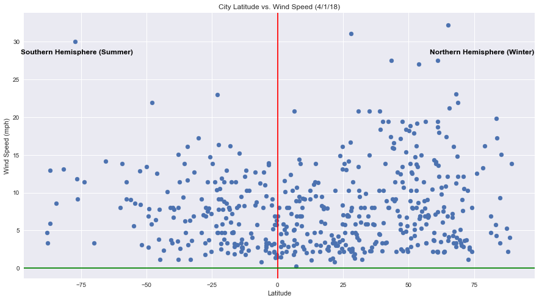

# WeatherPy


### Analysis

* #### Observed Trend 1

    While latitudes 10 through 30 had the highest number of cities reporting no cloud cover, there appears to be no tendency for
    clouds to favor any particular geographic area.


* #### Observed Trend 2

    The temperature clearly rises as you approach the equator in the Northern Hemishpere but this trend isn't as apparent in the
    Southern Hemishpere.  This is due to the fact that when the data was pulled (4/1/2018), it was summer in the Southern
    Hemishpere meaning there was more direct sunlight, making the gradual increase in temperature when moving towards the
    equator less significant.


* #### Observed Trend 3

    The cities randomly selected were relatively calm from a wind standpoint.  Of the 500 cities, only 3 of them (0.6%) reported     wind speeds in excess of 25 miles per hour when queried.


```python
# Import Dependencies
import numpy as np
import pandas as pd
import requests as req
import time as time
import matplotlib.pyplot as plt
import os
import json
from citipy import citipy
%matplotlib inline
```


```python
# Google Places API Key
#api_dir = os.path.dirname(os.path.dirname(os.path.dirname(os.path.dirname(os.path.dirname(os.path.realpath('__file__'))))))
#file_name = os.path.join(api_dir, "Bootcamp", "api_keys.json")
#data = json.load(open(file_name))
#gkey = data['open_weather_map_api_key2']
```


```python
#api_dir = os.path.dirname(os.path.dirname(os.path.dirname(os.path.dirname(os.path.dirname(os.path.realpath('__file__'))))))
#file_name = os.path.join(api_dir, "api_keys.json")
#data = json.load(open(file_name))
file_name = "C:\KUBootCamp\\api_keys.json"
data = json.load(open(file_name))
consumer_key = data['twitter_consumer_key']
consumer_secret = data['twitter_consumer_secret']
access_token = data['twitter_access_token']
access_token_secret = data['twitter_access_token_secret']
gkey = data['openweathermap_api_key']
```


```python


#print(gkey)
```

### Obtain Random Coordinate Pairs


```python
# startingNum is number of cities to process to get 500 finalNum sample
startingNum = 1500
finalNum = 500

#get report date
rDate = pd.to_datetime('today')

print(rDate)
```

    2018-03-31 00:00:00
    


```python
lat = []
lng = []

```


```python
np.random.seed(20180331)
for x in range(startingNum):
    lat.append(np.random.uniform(-90,90))
    lng.append(np.random.uniform(-180,180))
```


```python
df = pd.DataFrame(data=[lat, lng], copy=True)
```


```python
df = df.T

df.columns = ("lat", "lng")
df.lat = df.lat.round(2)
df.lng = df.lng.round(2)
```


```python
df['city'] = ""
df['country'] = ""
df['date'] = ""
df['temp_max'] = ""
df['humidity'] = ""
df['wind_speed'] = ""
df['cloudiness'] = ""
```

### Generate Cities List


```python
for index, row in df.iterrows():
    city = citipy.nearest_city(row['lat'], row['lng'])
    df.set_value(index,'city',city.city_name)
```


```python
len(df)
```


    1500


### Perform API Calls


```python
url = f"http://api.openweathermap.org/data/2.5/weather?units=Imperial&APPID={gkey}&q=london"
response = req.get(url)
print(response.status_code)
```

    200
    


```python
counter = 0
print('Beginning Data Retrieval')
print('----------------------------------------------------------')
for index, row in df.iterrows():
    my_city = (row['city'].replace(" ", "%20"))
    url = f"http://api.openweathermap.org/data/2.5/weather?units=Imperial&APPID={gkey}&q={my_city}"
    
    print(f"Processing City Number: {counter} | {row['city']}")
    print(url)
    print('----------------------------------------------------------')
        
    try:
        info = req.get(url).json()
        temperature_data = (info['main']['temp_max'])
        humidity_data = (info['main']['humidity'])
        wind_speed_data = (info['wind']['speed'])
        cloud_data = (info['clouds']['all'])
        country_data = (info['sys']['country'])
        date1 = (info['dt'])

        df.set_value(index,'temp_max',temperature_data)
        df.set_value(index,'humidity',humidity_data)
        df.set_value(index,'wind_speed',wind_speed_data)
        df.set_value(index,'cloudiness',cloud_data)
        df.set_value(index,'country',country_data)
        df.set_value(index,'date',date1)

    except Exception as e:
        print(f"{row['city']} was skipped")
        print("----------------------")

    counter = counter + 1
```

    Beginning Data Retrieval
    ----------------------------------------------------------
    Processing City Number: 0 | hermanus
    http://api.openweathermap.org/data/2.5/weather?units=Imperial&APPID=63d00f365644037d1c31af254f3ccb49&q=hermanus
    ----------------------------------------------------------
    Processing City Number: 1 | ponta do sol
    http://api.openweathermap.org/data/2.5/weather?units=Imperial&APPID=63d00f365644037d1c31af254f3ccb49&q=ponta%20do%20sol
    ----------------------------------------------------------
    Processing City Number: 2 | illoqqortoormiut
    http://api.openweathermap.org/data/2.5/weather?units=Imperial&APPID=63d00f365644037d1c31af254f3ccb49&q=illoqqortoormiut
    ----------------------------------------------------------
    illoqqortoormiut was skipped
    ----------------------
    Processing City Number: 3 | hilo
    http://api.openweathermap.org/data/2.5/weather?units=Imperial&APPID=63d00f365644037d1c31af254f3ccb49&q=hilo
    ----------------------------------------------------------
    Processing City Number: 4 | kuche
    http://api.openweathermap.org/data/2.5/weather?units=Imperial&APPID=63d00f365644037d1c31af254f3ccb49&q=kuche
    ----------------------------------------------------------
    kuche was skipped
    ----------------------
    Processing City Number: 5 | hobart
    http://api.openweathermap.org/data/2.5/weather?units=Imperial&APPID=63d00f365644037d1c31af254f3ccb49&q=hobart
    ----------------------------------------------------------
    Processing City Number: 6 | albany
    http://api.openweathermap.org/data/2.5/weather?units=Imperial&APPID=63d00f365644037d1c31af254f3ccb49&q=albany
    ----------------------------------------------------------
    Processing City Number: 7 | aksu
    http://api.openweathermap.org/data/2.5/weather?units=Imperial&APPID=63d00f365644037d1c31af254f3ccb49&q=aksu
    ----------------------------------------------------------
    Processing City Number: 8 | hofn
    http://api.openweathermap.org/data/2.5/weather?units=Imperial&APPID=63d00f365644037d1c31af254f3ccb49&q=hofn
    ----------------------------------------------------------
    Processing City Number: 9 | norman wells
    http://api.openweathermap.org/data/2.5/weather?units=Imperial&APPID=63d00f365644037d1c31af254f3ccb49&q=norman%20wells
    ----------------------------------------------------------
    Processing City Number: 10 | kapaa
    http://api.openweathermap.org/data/2.5/weather?units=Imperial&APPID=63d00f365644037d1c31af254f3ccb49&q=kapaa
    ----------------------------------------------------------
    Processing City Number: 11 | asau
    http://api.openweathermap.org/data/2.5/weather?units=Imperial&APPID=63d00f365644037d1c31af254f3ccb49&q=asau
    ----------------------------------------------------------
    asau was skipped
    ----------------------
    Processing City Number: 12 | boralday
    http://api.openweathermap.org/data/2.5/weather?units=Imperial&APPID=63d00f365644037d1c31af254f3ccb49&q=boralday
    ----------------------------------------------------------
    Processing City Number: 13 | georgetown
    http://api.openweathermap.org/data/2.5/weather?units=Imperial&APPID=63d00f365644037d1c31af254f3ccb49&q=georgetown
    ----------------------------------------------------------
    Processing City Number: 14 | ushuaia
    http://api.openweathermap.org/data/2.5/weather?units=Imperial&APPID=63d00f365644037d1c31af254f3ccb49&q=ushuaia
    ----------------------------------------------------------
    Processing City Number: 15 | kaitangata
    http://api.openweathermap.org/data/2.5/weather?units=Imperial&APPID=63d00f365644037d1c31af254f3ccb49&q=kaitangata
    ----------------------------------------------------------
    Processing City Number: 16 | moerai
    http://api.openweathermap.org/data/2.5/weather?units=Imperial&APPID=63d00f365644037d1c31af254f3ccb49&q=moerai
    ----------------------------------------------------------
    Processing City Number: 17 | lebu
    http://api.openweathermap.org/data/2.5/weather?units=Imperial&APPID=63d00f365644037d1c31af254f3ccb49&q=lebu
    ----------------------------------------------------------
    Processing City Number: 18 | maragogi
    http://api.openweathermap.org/data/2.5/weather?units=Imperial&APPID=63d00f365644037d1c31af254f3ccb49&q=maragogi
    ----------------------------------------------------------
    Processing City Number: 19 | carnarvon
    http://api.openweathermap.org/data/2.5/weather?units=Imperial&APPID=63d00f365644037d1c31af254f3ccb49&q=carnarvon
    ----------------------------------------------------------
    Processing City Number: 20 | ushuaia
    http://api.openweathermap.org/data/2.5/weather?units=Imperial&APPID=63d00f365644037d1c31af254f3ccb49&q=ushuaia
    ----------------------------------------------------------
    Processing City Number: 21 | vaini
    http://api.openweathermap.org/data/2.5/weather?units=Imperial&APPID=63d00f365644037d1c31af254f3ccb49&q=vaini
    ----------------------------------------------------------
    Processing City Number: 22 | morondava
    http://api.openweathermap.org/data/2.5/weather?units=Imperial&APPID=63d00f365644037d1c31af254f3ccb49&q=morondava
    ----------------------------------------------------------
    Processing City Number: 23 | zhezkazgan
    http://api.openweathermap.org/data/2.5/weather?units=Imperial&APPID=63d00f365644037d1c31af254f3ccb49&q=zhezkazgan
    ----------------------------------------------------------
    Processing City Number: 24 | tsihombe
    http://api.openweathermap.org/data/2.5/weather?units=Imperial&APPID=63d00f365644037d1c31af254f3ccb49&q=tsihombe
    ----------------------------------------------------------
    tsihombe was skipped
    ----------------------
    Processing City Number: 25 | kapaa
    http://api.openweathermap.org/data/2.5/weather?units=Imperial&APPID=63d00f365644037d1c31af254f3ccb49&q=kapaa
    ----------------------------------------------------------
    Processing City Number: 26 | karratha
    http://api.openweathermap.org/data/2.5/weather?units=Imperial&APPID=63d00f365644037d1c31af254f3ccb49&q=karratha
    ----------------------------------------------------------
    Processing City Number: 27 | sao pedro
    http://api.openweathermap.org/data/2.5/weather?units=Imperial&APPID=63d00f365644037d1c31af254f3ccb49&q=sao%20pedro
    ----------------------------------------------------------
    Processing City Number: 28 | semey
    http://api.openweathermap.org/data/2.5/weather?units=Imperial&APPID=63d00f365644037d1c31af254f3ccb49&q=semey
    ----------------------------------------------------------
    Processing City Number: 29 | punta arenas
    http://api.openweathermap.org/data/2.5/weather?units=Imperial&APPID=63d00f365644037d1c31af254f3ccb49&q=punta%20arenas
    ----------------------------------------------------------
    Processing City Number: 30 | aksha
    http://api.openweathermap.org/data/2.5/weather?units=Imperial&APPID=63d00f365644037d1c31af254f3ccb49&q=aksha
    ----------------------------------------------------------
    Processing City Number: 31 | avarua
    http://api.openweathermap.org/data/2.5/weather?units=Imperial&APPID=63d00f365644037d1c31af254f3ccb49&q=avarua
    ----------------------------------------------------------
    Processing City Number: 32 | albany
    http://api.openweathermap.org/data/2.5/weather?units=Imperial&APPID=63d00f365644037d1c31af254f3ccb49&q=albany
    ----------------------------------------------------------
    Processing City Number: 33 | taolanaro
    http://api.openweathermap.org/data/2.5/weather?units=Imperial&APPID=63d00f365644037d1c31af254f3ccb49&q=taolanaro
    ----------------------------------------------------------
    taolanaro was skipped
    ----------------------
    Processing City Number: 34 | olafsvik
    http://api.openweathermap.org/data/2.5/weather?units=Imperial&APPID=63d00f365644037d1c31af254f3ccb49&q=olafsvik
    ----------------------------------------------------------
    olafsvik was skipped
    ----------------------
    Processing City Number: 35 | hobart
    http://api.openweathermap.org/data/2.5/weather?units=Imperial&APPID=63d00f365644037d1c31af254f3ccb49&q=hobart
    ----------------------------------------------------------
    Processing City Number: 36 | houma
    http://api.openweathermap.org/data/2.5/weather?units=Imperial&APPID=63d00f365644037d1c31af254f3ccb49&q=houma
    ----------------------------------------------------------
    Processing City Number: 37 | yellowknife
    http://api.openweathermap.org/data/2.5/weather?units=Imperial&APPID=63d00f365644037d1c31af254f3ccb49&q=yellowknife
    ----------------------------------------------------------
    Processing City Number: 38 | esperance
    http://api.openweathermap.org/data/2.5/weather?units=Imperial&APPID=63d00f365644037d1c31af254f3ccb49&q=esperance
    ----------------------------------------------------------
    Processing City Number: 39 | omsukchan
    http://api.openweathermap.org/data/2.5/weather?units=Imperial&APPID=63d00f365644037d1c31af254f3ccb49&q=omsukchan
    ----------------------------------------------------------
    Processing City Number: 40 | mataura
    http://api.openweathermap.org/data/2.5/weather?units=Imperial&APPID=63d00f365644037d1c31af254f3ccb49&q=mataura
    ----------------------------------------------------------
    Processing City Number: 41 | gubkinskiy
    http://api.openweathermap.org/data/2.5/weather?units=Imperial&APPID=63d00f365644037d1c31af254f3ccb49&q=gubkinskiy
    ----------------------------------------------------------
    Processing City Number: 42 | longyearbyen
    http://api.openweathermap.org/data/2.5/weather?units=Imperial&APPID=63d00f365644037d1c31af254f3ccb49&q=longyearbyen
    ----------------------------------------------------------
    Processing City Number: 43 | punta arenas
    http://api.openweathermap.org/data/2.5/weather?units=Imperial&APPID=63d00f365644037d1c31af254f3ccb49&q=punta%20arenas
    ----------------------------------------------------------
    Processing City Number: 44 | illoqqortoormiut
    http://api.openweathermap.org/data/2.5/weather?units=Imperial&APPID=63d00f365644037d1c31af254f3ccb49&q=illoqqortoormiut
    ----------------------------------------------------------
    illoqqortoormiut was skipped
    ----------------------
    Processing City Number: 45 | longyearbyen
    http://api.openweathermap.org/data/2.5/weather?units=Imperial&APPID=63d00f365644037d1c31af254f3ccb49&q=longyearbyen
    ----------------------------------------------------------
    Processing City Number: 46 | nguiu
    http://api.openweathermap.org/data/2.5/weather?units=Imperial&APPID=63d00f365644037d1c31af254f3ccb49&q=nguiu
    ----------------------------------------------------------
    nguiu was skipped
    ----------------------
    Processing City Number: 47 | tiksi
    http://api.openweathermap.org/data/2.5/weather?units=Imperial&APPID=63d00f365644037d1c31af254f3ccb49&q=tiksi
    ----------------------------------------------------------
    Processing City Number: 48 | castro
    http://api.openweathermap.org/data/2.5/weather?units=Imperial&APPID=63d00f365644037d1c31af254f3ccb49&q=castro
    ----------------------------------------------------------
    Processing City Number: 49 | burgos
    http://api.openweathermap.org/data/2.5/weather?units=Imperial&APPID=63d00f365644037d1c31af254f3ccb49&q=burgos
    ----------------------------------------------------------
    Processing City Number: 50 | maniitsoq
    http://api.openweathermap.org/data/2.5/weather?units=Imperial&APPID=63d00f365644037d1c31af254f3ccb49&q=maniitsoq
    ----------------------------------------------------------
    Processing City Number: 51 | barrow
    http://api.openweathermap.org/data/2.5/weather?units=Imperial&APPID=63d00f365644037d1c31af254f3ccb49&q=barrow
    ----------------------------------------------------------
    Processing City Number: 52 | atuona
    http://api.openweathermap.org/data/2.5/weather?units=Imperial&APPID=63d00f365644037d1c31af254f3ccb49&q=atuona
    ----------------------------------------------------------
    Processing City Number: 53 | brownfield
    http://api.openweathermap.org/data/2.5/weather?units=Imperial&APPID=63d00f365644037d1c31af254f3ccb49&q=brownfield
    ----------------------------------------------------------
    Processing City Number: 54 | punta arenas
    http://api.openweathermap.org/data/2.5/weather?units=Imperial&APPID=63d00f365644037d1c31af254f3ccb49&q=punta%20arenas
    ----------------------------------------------------------
    Processing City Number: 55 | verkhoyansk
    http://api.openweathermap.org/data/2.5/weather?units=Imperial&APPID=63d00f365644037d1c31af254f3ccb49&q=verkhoyansk
    ----------------------------------------------------------
    Processing City Number: 56 | atuona
    http://api.openweathermap.org/data/2.5/weather?units=Imperial&APPID=63d00f365644037d1c31af254f3ccb49&q=atuona
    ----------------------------------------------------------
    Processing City Number: 57 | jamestown
    http://api.openweathermap.org/data/2.5/weather?units=Imperial&APPID=63d00f365644037d1c31af254f3ccb49&q=jamestown
    ----------------------------------------------------------
    Processing City Number: 58 | isangel
    http://api.openweathermap.org/data/2.5/weather?units=Imperial&APPID=63d00f365644037d1c31af254f3ccb49&q=isangel
    ----------------------------------------------------------
    Processing City Number: 59 | xushan
    http://api.openweathermap.org/data/2.5/weather?units=Imperial&APPID=63d00f365644037d1c31af254f3ccb49&q=xushan
    ----------------------------------------------------------
    Processing City Number: 60 | kapaa
    http://api.openweathermap.org/data/2.5/weather?units=Imperial&APPID=63d00f365644037d1c31af254f3ccb49&q=kapaa
    ----------------------------------------------------------
    Processing City Number: 61 | san isidro
    http://api.openweathermap.org/data/2.5/weather?units=Imperial&APPID=63d00f365644037d1c31af254f3ccb49&q=san%20isidro
    ----------------------------------------------------------
    Processing City Number: 62 | pisco
    http://api.openweathermap.org/data/2.5/weather?units=Imperial&APPID=63d00f365644037d1c31af254f3ccb49&q=pisco
    ----------------------------------------------------------
    Processing City Number: 63 | arraial do cabo
    http://api.openweathermap.org/data/2.5/weather?units=Imperial&APPID=63d00f365644037d1c31af254f3ccb49&q=arraial%20do%20cabo
    ----------------------------------------------------------
    Processing City Number: 64 | georgetown
    http://api.openweathermap.org/data/2.5/weather?units=Imperial&APPID=63d00f365644037d1c31af254f3ccb49&q=georgetown
    ----------------------------------------------------------
    Processing City Number: 65 | mount gambier
    http://api.openweathermap.org/data/2.5/weather?units=Imperial&APPID=63d00f365644037d1c31af254f3ccb49&q=mount%20gambier
    ----------------------------------------------------------
    Processing City Number: 66 | panguipulli
    http://api.openweathermap.org/data/2.5/weather?units=Imperial&APPID=63d00f365644037d1c31af254f3ccb49&q=panguipulli
    ----------------------------------------------------------
    Processing City Number: 67 | puerto ayora
    http://api.openweathermap.org/data/2.5/weather?units=Imperial&APPID=63d00f365644037d1c31af254f3ccb49&q=puerto%20ayora
    ----------------------------------------------------------
    Processing City Number: 68 | necochea
    http://api.openweathermap.org/data/2.5/weather?units=Imperial&APPID=63d00f365644037d1c31af254f3ccb49&q=necochea
    ----------------------------------------------------------
    Processing City Number: 69 | barrow
    http://api.openweathermap.org/data/2.5/weather?units=Imperial&APPID=63d00f365644037d1c31af254f3ccb49&q=barrow
    ----------------------------------------------------------
    Processing City Number: 70 | bambous virieux
    http://api.openweathermap.org/data/2.5/weather?units=Imperial&APPID=63d00f365644037d1c31af254f3ccb49&q=bambous%20virieux
    ----------------------------------------------------------
    Processing City Number: 71 | mahebourg
    http://api.openweathermap.org/data/2.5/weather?units=Imperial&APPID=63d00f365644037d1c31af254f3ccb49&q=mahebourg
    ----------------------------------------------------------
    Processing City Number: 72 | jurado
    http://api.openweathermap.org/data/2.5/weather?units=Imperial&APPID=63d00f365644037d1c31af254f3ccb49&q=jurado
    ----------------------------------------------------------
    jurado was skipped
    ----------------------
    Processing City Number: 73 | punta arenas
    http://api.openweathermap.org/data/2.5/weather?units=Imperial&APPID=63d00f365644037d1c31af254f3ccb49&q=punta%20arenas
    ----------------------------------------------------------
    Processing City Number: 74 | butaritari
    http://api.openweathermap.org/data/2.5/weather?units=Imperial&APPID=63d00f365644037d1c31af254f3ccb49&q=butaritari
    ----------------------------------------------------------
    Processing City Number: 75 | faanui
    http://api.openweathermap.org/data/2.5/weather?units=Imperial&APPID=63d00f365644037d1c31af254f3ccb49&q=faanui
    ----------------------------------------------------------
    Processing City Number: 76 | nador
    http://api.openweathermap.org/data/2.5/weather?units=Imperial&APPID=63d00f365644037d1c31af254f3ccb49&q=nador
    ----------------------------------------------------------
    Processing City Number: 77 | ushuaia
    http://api.openweathermap.org/data/2.5/weather?units=Imperial&APPID=63d00f365644037d1c31af254f3ccb49&q=ushuaia
    ----------------------------------------------------------
    Processing City Number: 78 | provideniya
    http://api.openweathermap.org/data/2.5/weather?units=Imperial&APPID=63d00f365644037d1c31af254f3ccb49&q=provideniya
    ----------------------------------------------------------
    Processing City Number: 79 | rikitea
    http://api.openweathermap.org/data/2.5/weather?units=Imperial&APPID=63d00f365644037d1c31af254f3ccb49&q=rikitea
    ----------------------------------------------------------
    Processing City Number: 80 | port elizabeth
    http://api.openweathermap.org/data/2.5/weather?units=Imperial&APPID=63d00f365644037d1c31af254f3ccb49&q=port%20elizabeth
    ----------------------------------------------------------
    Processing City Number: 81 | east london
    http://api.openweathermap.org/data/2.5/weather?units=Imperial&APPID=63d00f365644037d1c31af254f3ccb49&q=east%20london
    ----------------------------------------------------------
    Processing City Number: 82 | mataura
    http://api.openweathermap.org/data/2.5/weather?units=Imperial&APPID=63d00f365644037d1c31af254f3ccb49&q=mataura
    ----------------------------------------------------------
    Processing City Number: 83 | hermanus
    http://api.openweathermap.org/data/2.5/weather?units=Imperial&APPID=63d00f365644037d1c31af254f3ccb49&q=hermanus
    ----------------------------------------------------------
    Processing City Number: 84 | xichang
    http://api.openweathermap.org/data/2.5/weather?units=Imperial&APPID=63d00f365644037d1c31af254f3ccb49&q=xichang
    ----------------------------------------------------------
    Processing City Number: 85 | ulaangom
    http://api.openweathermap.org/data/2.5/weather?units=Imperial&APPID=63d00f365644037d1c31af254f3ccb49&q=ulaangom
    ----------------------------------------------------------
    Processing City Number: 86 | albany
    http://api.openweathermap.org/data/2.5/weather?units=Imperial&APPID=63d00f365644037d1c31af254f3ccb49&q=albany
    ----------------------------------------------------------
    Processing City Number: 87 | bluff
    http://api.openweathermap.org/data/2.5/weather?units=Imperial&APPID=63d00f365644037d1c31af254f3ccb49&q=bluff
    ----------------------------------------------------------
    Processing City Number: 88 | saldanha
    http://api.openweathermap.org/data/2.5/weather?units=Imperial&APPID=63d00f365644037d1c31af254f3ccb49&q=saldanha
    ----------------------------------------------------------
    Processing City Number: 89 | georgetown
    http://api.openweathermap.org/data/2.5/weather?units=Imperial&APPID=63d00f365644037d1c31af254f3ccb49&q=georgetown
    ----------------------------------------------------------
    Processing City Number: 90 | atuona
    http://api.openweathermap.org/data/2.5/weather?units=Imperial&APPID=63d00f365644037d1c31af254f3ccb49&q=atuona
    ----------------------------------------------------------
    Processing City Number: 91 | andahuaylas
    http://api.openweathermap.org/data/2.5/weather?units=Imperial&APPID=63d00f365644037d1c31af254f3ccb49&q=andahuaylas
    ----------------------------------------------------------
    Processing City Number: 92 | bluff
    http://api.openweathermap.org/data/2.5/weather?units=Imperial&APPID=63d00f365644037d1c31af254f3ccb49&q=bluff
    ----------------------------------------------------------
    Processing City Number: 93 | san patricio
    http://api.openweathermap.org/data/2.5/weather?units=Imperial&APPID=63d00f365644037d1c31af254f3ccb49&q=san%20patricio
    ----------------------------------------------------------
    Processing City Number: 94 | hami
    http://api.openweathermap.org/data/2.5/weather?units=Imperial&APPID=63d00f365644037d1c31af254f3ccb49&q=hami
    ----------------------------------------------------------
    Processing City Number: 95 | ushuaia
    http://api.openweathermap.org/data/2.5/weather?units=Imperial&APPID=63d00f365644037d1c31af254f3ccb49&q=ushuaia
    ----------------------------------------------------------
    Processing City Number: 96 | port elizabeth
    http://api.openweathermap.org/data/2.5/weather?units=Imperial&APPID=63d00f365644037d1c31af254f3ccb49&q=port%20elizabeth
    ----------------------------------------------------------
    Processing City Number: 97 | warrington
    http://api.openweathermap.org/data/2.5/weather?units=Imperial&APPID=63d00f365644037d1c31af254f3ccb49&q=warrington
    ----------------------------------------------------------
    Processing City Number: 98 | busselton
    http://api.openweathermap.org/data/2.5/weather?units=Imperial&APPID=63d00f365644037d1c31af254f3ccb49&q=busselton
    ----------------------------------------------------------
    Processing City Number: 99 | chicama
    http://api.openweathermap.org/data/2.5/weather?units=Imperial&APPID=63d00f365644037d1c31af254f3ccb49&q=chicama
    ----------------------------------------------------------
    Processing City Number: 100 | balkanabat
    http://api.openweathermap.org/data/2.5/weather?units=Imperial&APPID=63d00f365644037d1c31af254f3ccb49&q=balkanabat
    ----------------------------------------------------------
    Processing City Number: 101 | avarua
    http://api.openweathermap.org/data/2.5/weather?units=Imperial&APPID=63d00f365644037d1c31af254f3ccb49&q=avarua
    ----------------------------------------------------------
    Processing City Number: 102 | cotonou
    http://api.openweathermap.org/data/2.5/weather?units=Imperial&APPID=63d00f365644037d1c31af254f3ccb49&q=cotonou
    ----------------------------------------------------------
    Processing City Number: 103 | atuona
    http://api.openweathermap.org/data/2.5/weather?units=Imperial&APPID=63d00f365644037d1c31af254f3ccb49&q=atuona
    ----------------------------------------------------------
    Processing City Number: 104 | vila velha
    http://api.openweathermap.org/data/2.5/weather?units=Imperial&APPID=63d00f365644037d1c31af254f3ccb49&q=vila%20velha
    ----------------------------------------------------------
    Processing City Number: 105 | tsihombe
    http://api.openweathermap.org/data/2.5/weather?units=Imperial&APPID=63d00f365644037d1c31af254f3ccb49&q=tsihombe
    ----------------------------------------------------------
    tsihombe was skipped
    ----------------------
    Processing City Number: 106 | coari
    http://api.openweathermap.org/data/2.5/weather?units=Imperial&APPID=63d00f365644037d1c31af254f3ccb49&q=coari
    ----------------------------------------------------------
    Processing City Number: 107 | narsaq
    http://api.openweathermap.org/data/2.5/weather?units=Imperial&APPID=63d00f365644037d1c31af254f3ccb49&q=narsaq
    ----------------------------------------------------------
    Processing City Number: 108 | riyadh
    http://api.openweathermap.org/data/2.5/weather?units=Imperial&APPID=63d00f365644037d1c31af254f3ccb49&q=riyadh
    ----------------------------------------------------------
    Processing City Number: 109 | tuktoyaktuk
    http://api.openweathermap.org/data/2.5/weather?units=Imperial&APPID=63d00f365644037d1c31af254f3ccb49&q=tuktoyaktuk
    ----------------------------------------------------------
    Processing City Number: 110 | adrar
    http://api.openweathermap.org/data/2.5/weather?units=Imperial&APPID=63d00f365644037d1c31af254f3ccb49&q=adrar
    ----------------------------------------------------------
    Processing City Number: 111 | butaritari
    http://api.openweathermap.org/data/2.5/weather?units=Imperial&APPID=63d00f365644037d1c31af254f3ccb49&q=butaritari
    ----------------------------------------------------------
    Processing City Number: 112 | marsa matruh
    http://api.openweathermap.org/data/2.5/weather?units=Imperial&APPID=63d00f365644037d1c31af254f3ccb49&q=marsa%20matruh
    ----------------------------------------------------------
    Processing City Number: 113 | chokurdakh
    http://api.openweathermap.org/data/2.5/weather?units=Imperial&APPID=63d00f365644037d1c31af254f3ccb49&q=chokurdakh
    ----------------------------------------------------------
    Processing City Number: 114 | ambunti
    http://api.openweathermap.org/data/2.5/weather?units=Imperial&APPID=63d00f365644037d1c31af254f3ccb49&q=ambunti
    ----------------------------------------------------------
    Processing City Number: 115 | atuona
    http://api.openweathermap.org/data/2.5/weather?units=Imperial&APPID=63d00f365644037d1c31af254f3ccb49&q=atuona
    ----------------------------------------------------------
    Processing City Number: 116 | mataura
    http://api.openweathermap.org/data/2.5/weather?units=Imperial&APPID=63d00f365644037d1c31af254f3ccb49&q=mataura
    ----------------------------------------------------------
    Processing City Number: 117 | bethel
    http://api.openweathermap.org/data/2.5/weather?units=Imperial&APPID=63d00f365644037d1c31af254f3ccb49&q=bethel
    ----------------------------------------------------------
    Processing City Number: 118 | victoria
    http://api.openweathermap.org/data/2.5/weather?units=Imperial&APPID=63d00f365644037d1c31af254f3ccb49&q=victoria
    ----------------------------------------------------------
    Processing City Number: 119 | punta arenas
    http://api.openweathermap.org/data/2.5/weather?units=Imperial&APPID=63d00f365644037d1c31af254f3ccb49&q=punta%20arenas
    ----------------------------------------------------------
    Processing City Number: 120 | kuznechnoye
    http://api.openweathermap.org/data/2.5/weather?units=Imperial&APPID=63d00f365644037d1c31af254f3ccb49&q=kuznechnoye
    ----------------------------------------------------------
    Processing City Number: 121 | pokrovsk
    http://api.openweathermap.org/data/2.5/weather?units=Imperial&APPID=63d00f365644037d1c31af254f3ccb49&q=pokrovsk
    ----------------------------------------------------------
    Processing City Number: 122 | bengkulu
    http://api.openweathermap.org/data/2.5/weather?units=Imperial&APPID=63d00f365644037d1c31af254f3ccb49&q=bengkulu
    ----------------------------------------------------------
    bengkulu was skipped
    ----------------------
    Processing City Number: 123 | pacific grove
    http://api.openweathermap.org/data/2.5/weather?units=Imperial&APPID=63d00f365644037d1c31af254f3ccb49&q=pacific%20grove
    ----------------------------------------------------------
    Processing City Number: 124 | taolanaro
    http://api.openweathermap.org/data/2.5/weather?units=Imperial&APPID=63d00f365644037d1c31af254f3ccb49&q=taolanaro
    ----------------------------------------------------------
    taolanaro was skipped
    ----------------------
    Processing City Number: 125 | deputatskiy
    http://api.openweathermap.org/data/2.5/weather?units=Imperial&APPID=63d00f365644037d1c31af254f3ccb49&q=deputatskiy
    ----------------------------------------------------------
    Processing City Number: 126 | udimskiy
    http://api.openweathermap.org/data/2.5/weather?units=Imperial&APPID=63d00f365644037d1c31af254f3ccb49&q=udimskiy
    ----------------------------------------------------------
    Processing City Number: 127 | plettenberg bay
    http://api.openweathermap.org/data/2.5/weather?units=Imperial&APPID=63d00f365644037d1c31af254f3ccb49&q=plettenberg%20bay
    ----------------------------------------------------------
    Processing City Number: 128 | agadir
    http://api.openweathermap.org/data/2.5/weather?units=Imperial&APPID=63d00f365644037d1c31af254f3ccb49&q=agadir
    ----------------------------------------------------------
    Processing City Number: 129 | kasulu
    http://api.openweathermap.org/data/2.5/weather?units=Imperial&APPID=63d00f365644037d1c31af254f3ccb49&q=kasulu
    ----------------------------------------------------------
    Processing City Number: 130 | leningradskiy
    http://api.openweathermap.org/data/2.5/weather?units=Imperial&APPID=63d00f365644037d1c31af254f3ccb49&q=leningradskiy
    ----------------------------------------------------------
    Processing City Number: 131 | avarua
    http://api.openweathermap.org/data/2.5/weather?units=Imperial&APPID=63d00f365644037d1c31af254f3ccb49&q=avarua
    ----------------------------------------------------------
    Processing City Number: 132 | ushuaia
    http://api.openweathermap.org/data/2.5/weather?units=Imperial&APPID=63d00f365644037d1c31af254f3ccb49&q=ushuaia
    ----------------------------------------------------------
    Processing City Number: 133 | naryan-mar
    http://api.openweathermap.org/data/2.5/weather?units=Imperial&APPID=63d00f365644037d1c31af254f3ccb49&q=naryan-mar
    ----------------------------------------------------------
    Processing City Number: 134 | hilo
    http://api.openweathermap.org/data/2.5/weather?units=Imperial&APPID=63d00f365644037d1c31af254f3ccb49&q=hilo
    ----------------------------------------------------------
    Processing City Number: 135 | hermanus
    http://api.openweathermap.org/data/2.5/weather?units=Imperial&APPID=63d00f365644037d1c31af254f3ccb49&q=hermanus
    ----------------------------------------------------------
    Processing City Number: 136 | barrow
    http://api.openweathermap.org/data/2.5/weather?units=Imperial&APPID=63d00f365644037d1c31af254f3ccb49&q=barrow
    ----------------------------------------------------------
    Processing City Number: 137 | provideniya
    http://api.openweathermap.org/data/2.5/weather?units=Imperial&APPID=63d00f365644037d1c31af254f3ccb49&q=provideniya
    ----------------------------------------------------------
    Processing City Number: 138 | cockburn town
    http://api.openweathermap.org/data/2.5/weather?units=Imperial&APPID=63d00f365644037d1c31af254f3ccb49&q=cockburn%20town
    ----------------------------------------------------------
    Processing City Number: 139 | punta arenas
    http://api.openweathermap.org/data/2.5/weather?units=Imperial&APPID=63d00f365644037d1c31af254f3ccb49&q=punta%20arenas
    ----------------------------------------------------------
    Processing City Number: 140 | busselton
    http://api.openweathermap.org/data/2.5/weather?units=Imperial&APPID=63d00f365644037d1c31af254f3ccb49&q=busselton
    ----------------------------------------------------------
    Processing City Number: 141 | hermanus
    http://api.openweathermap.org/data/2.5/weather?units=Imperial&APPID=63d00f365644037d1c31af254f3ccb49&q=hermanus
    ----------------------------------------------------------
    Processing City Number: 142 | saldanha
    http://api.openweathermap.org/data/2.5/weather?units=Imperial&APPID=63d00f365644037d1c31af254f3ccb49&q=saldanha
    ----------------------------------------------------------
    Processing City Number: 143 | at-bashi
    http://api.openweathermap.org/data/2.5/weather?units=Imperial&APPID=63d00f365644037d1c31af254f3ccb49&q=at-bashi
    ----------------------------------------------------------
    Processing City Number: 144 | kruisfontein
    http://api.openweathermap.org/data/2.5/weather?units=Imperial&APPID=63d00f365644037d1c31af254f3ccb49&q=kruisfontein
    ----------------------------------------------------------
    Processing City Number: 145 | dikson
    http://api.openweathermap.org/data/2.5/weather?units=Imperial&APPID=63d00f365644037d1c31af254f3ccb49&q=dikson
    ----------------------------------------------------------
    Processing City Number: 146 | hilo
    http://api.openweathermap.org/data/2.5/weather?units=Imperial&APPID=63d00f365644037d1c31af254f3ccb49&q=hilo
    ----------------------------------------------------------
    Processing City Number: 147 | esperance
    http://api.openweathermap.org/data/2.5/weather?units=Imperial&APPID=63d00f365644037d1c31af254f3ccb49&q=esperance
    ----------------------------------------------------------
    Processing City Number: 148 | mataura
    http://api.openweathermap.org/data/2.5/weather?units=Imperial&APPID=63d00f365644037d1c31af254f3ccb49&q=mataura
    ----------------------------------------------------------
    Processing City Number: 149 | severo-kurilsk
    http://api.openweathermap.org/data/2.5/weather?units=Imperial&APPID=63d00f365644037d1c31af254f3ccb49&q=severo-kurilsk
    ----------------------------------------------------------
    Processing City Number: 150 | hithadhoo
    http://api.openweathermap.org/data/2.5/weather?units=Imperial&APPID=63d00f365644037d1c31af254f3ccb49&q=hithadhoo
    ----------------------------------------------------------
    Processing City Number: 151 | albany
    http://api.openweathermap.org/data/2.5/weather?units=Imperial&APPID=63d00f365644037d1c31af254f3ccb49&q=albany
    ----------------------------------------------------------
    Processing City Number: 152 | buta
    http://api.openweathermap.org/data/2.5/weather?units=Imperial&APPID=63d00f365644037d1c31af254f3ccb49&q=buta
    ----------------------------------------------------------
    Processing City Number: 153 | upernavik
    http://api.openweathermap.org/data/2.5/weather?units=Imperial&APPID=63d00f365644037d1c31af254f3ccb49&q=upernavik
    ----------------------------------------------------------
    Processing City Number: 154 | luderitz
    http://api.openweathermap.org/data/2.5/weather?units=Imperial&APPID=63d00f365644037d1c31af254f3ccb49&q=luderitz
    ----------------------------------------------------------
    Processing City Number: 155 | busselton
    http://api.openweathermap.org/data/2.5/weather?units=Imperial&APPID=63d00f365644037d1c31af254f3ccb49&q=busselton
    ----------------------------------------------------------
    Processing City Number: 156 | hobart
    http://api.openweathermap.org/data/2.5/weather?units=Imperial&APPID=63d00f365644037d1c31af254f3ccb49&q=hobart
    ----------------------------------------------------------
    Processing City Number: 157 | port alfred
    http://api.openweathermap.org/data/2.5/weather?units=Imperial&APPID=63d00f365644037d1c31af254f3ccb49&q=port%20alfred
    ----------------------------------------------------------
    Processing City Number: 158 | mentok
    http://api.openweathermap.org/data/2.5/weather?units=Imperial&APPID=63d00f365644037d1c31af254f3ccb49&q=mentok
    ----------------------------------------------------------
    mentok was skipped
    ----------------------
    Processing City Number: 159 | pingliang
    http://api.openweathermap.org/data/2.5/weather?units=Imperial&APPID=63d00f365644037d1c31af254f3ccb49&q=pingliang
    ----------------------------------------------------------
    Processing City Number: 160 | narsaq
    http://api.openweathermap.org/data/2.5/weather?units=Imperial&APPID=63d00f365644037d1c31af254f3ccb49&q=narsaq
    ----------------------------------------------------------
    Processing City Number: 161 | komsomolskiy
    http://api.openweathermap.org/data/2.5/weather?units=Imperial&APPID=63d00f365644037d1c31af254f3ccb49&q=komsomolskiy
    ----------------------------------------------------------
    Processing City Number: 162 | mataura
    http://api.openweathermap.org/data/2.5/weather?units=Imperial&APPID=63d00f365644037d1c31af254f3ccb49&q=mataura
    ----------------------------------------------------------
    Processing City Number: 163 | leningradskiy
    http://api.openweathermap.org/data/2.5/weather?units=Imperial&APPID=63d00f365644037d1c31af254f3ccb49&q=leningradskiy
    ----------------------------------------------------------
    Processing City Number: 164 | barrow
    http://api.openweathermap.org/data/2.5/weather?units=Imperial&APPID=63d00f365644037d1c31af254f3ccb49&q=barrow
    ----------------------------------------------------------
    Processing City Number: 165 | vaini
    http://api.openweathermap.org/data/2.5/weather?units=Imperial&APPID=63d00f365644037d1c31af254f3ccb49&q=vaini
    ----------------------------------------------------------
    Processing City Number: 166 | lagoa
    http://api.openweathermap.org/data/2.5/weather?units=Imperial&APPID=63d00f365644037d1c31af254f3ccb49&q=lagoa
    ----------------------------------------------------------
    Processing City Number: 167 | ahipara
    http://api.openweathermap.org/data/2.5/weather?units=Imperial&APPID=63d00f365644037d1c31af254f3ccb49&q=ahipara
    ----------------------------------------------------------
    Processing City Number: 168 | cape town
    http://api.openweathermap.org/data/2.5/weather?units=Imperial&APPID=63d00f365644037d1c31af254f3ccb49&q=cape%20town
    ----------------------------------------------------------
    Processing City Number: 169 | rikitea
    http://api.openweathermap.org/data/2.5/weather?units=Imperial&APPID=63d00f365644037d1c31af254f3ccb49&q=rikitea
    ----------------------------------------------------------
    Processing City Number: 170 | kodiak
    http://api.openweathermap.org/data/2.5/weather?units=Imperial&APPID=63d00f365644037d1c31af254f3ccb49&q=kodiak
    ----------------------------------------------------------
    Processing City Number: 171 | ushuaia
    http://api.openweathermap.org/data/2.5/weather?units=Imperial&APPID=63d00f365644037d1c31af254f3ccb49&q=ushuaia
    ----------------------------------------------------------
    Processing City Number: 172 | tezu
    http://api.openweathermap.org/data/2.5/weather?units=Imperial&APPID=63d00f365644037d1c31af254f3ccb49&q=tezu
    ----------------------------------------------------------
    Processing City Number: 173 | tuktoyaktuk
    http://api.openweathermap.org/data/2.5/weather?units=Imperial&APPID=63d00f365644037d1c31af254f3ccb49&q=tuktoyaktuk
    ----------------------------------------------------------
    Processing City Number: 174 | vaini
    http://api.openweathermap.org/data/2.5/weather?units=Imperial&APPID=63d00f365644037d1c31af254f3ccb49&q=vaini
    ----------------------------------------------------------
    Processing City Number: 175 | san jose pinula
    http://api.openweathermap.org/data/2.5/weather?units=Imperial&APPID=63d00f365644037d1c31af254f3ccb49&q=san%20jose%20pinula
    ----------------------------------------------------------
    Processing City Number: 176 | acapulco
    http://api.openweathermap.org/data/2.5/weather?units=Imperial&APPID=63d00f365644037d1c31af254f3ccb49&q=acapulco
    ----------------------------------------------------------
    Processing City Number: 177 | saldanha
    http://api.openweathermap.org/data/2.5/weather?units=Imperial&APPID=63d00f365644037d1c31af254f3ccb49&q=saldanha
    ----------------------------------------------------------
    Processing City Number: 178 | bathsheba
    http://api.openweathermap.org/data/2.5/weather?units=Imperial&APPID=63d00f365644037d1c31af254f3ccb49&q=bathsheba
    ----------------------------------------------------------
    Processing City Number: 179 | tasiilaq
    http://api.openweathermap.org/data/2.5/weather?units=Imperial&APPID=63d00f365644037d1c31af254f3ccb49&q=tasiilaq
    ----------------------------------------------------------
    Processing City Number: 180 | hermanus
    http://api.openweathermap.org/data/2.5/weather?units=Imperial&APPID=63d00f365644037d1c31af254f3ccb49&q=hermanus
    ----------------------------------------------------------
    Processing City Number: 181 | busselton
    http://api.openweathermap.org/data/2.5/weather?units=Imperial&APPID=63d00f365644037d1c31af254f3ccb49&q=busselton
    ----------------------------------------------------------
    Processing City Number: 182 | den helder
    http://api.openweathermap.org/data/2.5/weather?units=Imperial&APPID=63d00f365644037d1c31af254f3ccb49&q=den%20helder
    ----------------------------------------------------------
    Processing City Number: 183 | ushuaia
    http://api.openweathermap.org/data/2.5/weather?units=Imperial&APPID=63d00f365644037d1c31af254f3ccb49&q=ushuaia
    ----------------------------------------------------------
    Processing City Number: 184 | amderma
    http://api.openweathermap.org/data/2.5/weather?units=Imperial&APPID=63d00f365644037d1c31af254f3ccb49&q=amderma
    ----------------------------------------------------------
    amderma was skipped
    ----------------------
    Processing City Number: 185 | hilo
    http://api.openweathermap.org/data/2.5/weather?units=Imperial&APPID=63d00f365644037d1c31af254f3ccb49&q=hilo
    ----------------------------------------------------------
    Processing City Number: 186 | mataura
    http://api.openweathermap.org/data/2.5/weather?units=Imperial&APPID=63d00f365644037d1c31af254f3ccb49&q=mataura
    ----------------------------------------------------------
    Processing City Number: 187 | saint george
    http://api.openweathermap.org/data/2.5/weather?units=Imperial&APPID=63d00f365644037d1c31af254f3ccb49&q=saint%20george
    ----------------------------------------------------------
    Processing City Number: 188 | busselton
    http://api.openweathermap.org/data/2.5/weather?units=Imperial&APPID=63d00f365644037d1c31af254f3ccb49&q=busselton
    ----------------------------------------------------------
    Processing City Number: 189 | kaitangata
    http://api.openweathermap.org/data/2.5/weather?units=Imperial&APPID=63d00f365644037d1c31af254f3ccb49&q=kaitangata
    ----------------------------------------------------------
    Processing City Number: 190 | severo-kurilsk
    http://api.openweathermap.org/data/2.5/weather?units=Imperial&APPID=63d00f365644037d1c31af254f3ccb49&q=severo-kurilsk
    ----------------------------------------------------------
    Processing City Number: 191 | kaitangata
    http://api.openweathermap.org/data/2.5/weather?units=Imperial&APPID=63d00f365644037d1c31af254f3ccb49&q=kaitangata
    ----------------------------------------------------------
    Processing City Number: 192 | kulhudhuffushi
    http://api.openweathermap.org/data/2.5/weather?units=Imperial&APPID=63d00f365644037d1c31af254f3ccb49&q=kulhudhuffushi
    ----------------------------------------------------------
    Processing City Number: 193 | sorong
    http://api.openweathermap.org/data/2.5/weather?units=Imperial&APPID=63d00f365644037d1c31af254f3ccb49&q=sorong
    ----------------------------------------------------------
    Processing City Number: 194 | hofn
    http://api.openweathermap.org/data/2.5/weather?units=Imperial&APPID=63d00f365644037d1c31af254f3ccb49&q=hofn
    ----------------------------------------------------------
    Processing City Number: 195 | faya
    http://api.openweathermap.org/data/2.5/weather?units=Imperial&APPID=63d00f365644037d1c31af254f3ccb49&q=faya
    ----------------------------------------------------------
    Processing City Number: 196 | vestmanna
    http://api.openweathermap.org/data/2.5/weather?units=Imperial&APPID=63d00f365644037d1c31af254f3ccb49&q=vestmanna
    ----------------------------------------------------------
    Processing City Number: 197 | port hawkesbury
    http://api.openweathermap.org/data/2.5/weather?units=Imperial&APPID=63d00f365644037d1c31af254f3ccb49&q=port%20hawkesbury
    ----------------------------------------------------------
    Processing City Number: 198 | ilulissat
    http://api.openweathermap.org/data/2.5/weather?units=Imperial&APPID=63d00f365644037d1c31af254f3ccb49&q=ilulissat
    ----------------------------------------------------------
    Processing City Number: 199 | hithadhoo
    http://api.openweathermap.org/data/2.5/weather?units=Imperial&APPID=63d00f365644037d1c31af254f3ccb49&q=hithadhoo
    ----------------------------------------------------------
    Processing City Number: 200 | ushuaia
    http://api.openweathermap.org/data/2.5/weather?units=Imperial&APPID=63d00f365644037d1c31af254f3ccb49&q=ushuaia
    ----------------------------------------------------------
    Processing City Number: 201 | kenai
    http://api.openweathermap.org/data/2.5/weather?units=Imperial&APPID=63d00f365644037d1c31af254f3ccb49&q=kenai
    ----------------------------------------------------------
    Processing City Number: 202 | port alfred
    http://api.openweathermap.org/data/2.5/weather?units=Imperial&APPID=63d00f365644037d1c31af254f3ccb49&q=port%20alfred
    ----------------------------------------------------------
    Processing City Number: 203 | shingu
    http://api.openweathermap.org/data/2.5/weather?units=Imperial&APPID=63d00f365644037d1c31af254f3ccb49&q=shingu
    ----------------------------------------------------------
    Processing City Number: 204 | albany
    http://api.openweathermap.org/data/2.5/weather?units=Imperial&APPID=63d00f365644037d1c31af254f3ccb49&q=albany
    ----------------------------------------------------------
    Processing City Number: 205 | severo-kurilsk
    http://api.openweathermap.org/data/2.5/weather?units=Imperial&APPID=63d00f365644037d1c31af254f3ccb49&q=severo-kurilsk
    ----------------------------------------------------------
    Processing City Number: 206 | hilo
    http://api.openweathermap.org/data/2.5/weather?units=Imperial&APPID=63d00f365644037d1c31af254f3ccb49&q=hilo
    ----------------------------------------------------------
    Processing City Number: 207 | kapaa
    http://api.openweathermap.org/data/2.5/weather?units=Imperial&APPID=63d00f365644037d1c31af254f3ccb49&q=kapaa
    ----------------------------------------------------------
    Processing City Number: 208 | syke
    http://api.openweathermap.org/data/2.5/weather?units=Imperial&APPID=63d00f365644037d1c31af254f3ccb49&q=syke
    ----------------------------------------------------------
    Processing City Number: 209 | nikolskoye
    http://api.openweathermap.org/data/2.5/weather?units=Imperial&APPID=63d00f365644037d1c31af254f3ccb49&q=nikolskoye
    ----------------------------------------------------------
    Processing City Number: 210 | kadykchan
    http://api.openweathermap.org/data/2.5/weather?units=Imperial&APPID=63d00f365644037d1c31af254f3ccb49&q=kadykchan
    ----------------------------------------------------------
    kadykchan was skipped
    ----------------------
    Processing City Number: 211 | kilindoni
    http://api.openweathermap.org/data/2.5/weather?units=Imperial&APPID=63d00f365644037d1c31af254f3ccb49&q=kilindoni
    ----------------------------------------------------------
    Processing City Number: 212 | jalalpur
    http://api.openweathermap.org/data/2.5/weather?units=Imperial&APPID=63d00f365644037d1c31af254f3ccb49&q=jalalpur
    ----------------------------------------------------------
    Processing City Number: 213 | rikitea
    http://api.openweathermap.org/data/2.5/weather?units=Imperial&APPID=63d00f365644037d1c31af254f3ccb49&q=rikitea
    ----------------------------------------------------------
    Processing City Number: 214 | yellowknife
    http://api.openweathermap.org/data/2.5/weather?units=Imperial&APPID=63d00f365644037d1c31af254f3ccb49&q=yellowknife
    ----------------------------------------------------------
    Processing City Number: 215 | rocha
    http://api.openweathermap.org/data/2.5/weather?units=Imperial&APPID=63d00f365644037d1c31af254f3ccb49&q=rocha
    ----------------------------------------------------------
    Processing City Number: 216 | kamenskoye
    http://api.openweathermap.org/data/2.5/weather?units=Imperial&APPID=63d00f365644037d1c31af254f3ccb49&q=kamenskoye
    ----------------------------------------------------------
    kamenskoye was skipped
    ----------------------
    Processing City Number: 217 | jamestown
    http://api.openweathermap.org/data/2.5/weather?units=Imperial&APPID=63d00f365644037d1c31af254f3ccb49&q=jamestown
    ----------------------------------------------------------
    Processing City Number: 218 | hastings
    http://api.openweathermap.org/data/2.5/weather?units=Imperial&APPID=63d00f365644037d1c31af254f3ccb49&q=hastings
    ----------------------------------------------------------
    Processing City Number: 219 | vaini
    http://api.openweathermap.org/data/2.5/weather?units=Imperial&APPID=63d00f365644037d1c31af254f3ccb49&q=vaini
    ----------------------------------------------------------
    Processing City Number: 220 | bredasdorp
    http://api.openweathermap.org/data/2.5/weather?units=Imperial&APPID=63d00f365644037d1c31af254f3ccb49&q=bredasdorp
    ----------------------------------------------------------
    Processing City Number: 221 | atuona
    http://api.openweathermap.org/data/2.5/weather?units=Imperial&APPID=63d00f365644037d1c31af254f3ccb49&q=atuona
    ----------------------------------------------------------
    Processing City Number: 222 | geraldton
    http://api.openweathermap.org/data/2.5/weather?units=Imperial&APPID=63d00f365644037d1c31af254f3ccb49&q=geraldton
    ----------------------------------------------------------
    Processing City Number: 223 | rikitea
    http://api.openweathermap.org/data/2.5/weather?units=Imperial&APPID=63d00f365644037d1c31af254f3ccb49&q=rikitea
    ----------------------------------------------------------
    Processing City Number: 224 | kropotkin
    http://api.openweathermap.org/data/2.5/weather?units=Imperial&APPID=63d00f365644037d1c31af254f3ccb49&q=kropotkin
    ----------------------------------------------------------
    Processing City Number: 225 | bredasdorp
    http://api.openweathermap.org/data/2.5/weather?units=Imperial&APPID=63d00f365644037d1c31af254f3ccb49&q=bredasdorp
    ----------------------------------------------------------
    Processing City Number: 226 | taolanaro
    http://api.openweathermap.org/data/2.5/weather?units=Imperial&APPID=63d00f365644037d1c31af254f3ccb49&q=taolanaro
    ----------------------------------------------------------
    taolanaro was skipped
    ----------------------
    Processing City Number: 227 | vestmanna
    http://api.openweathermap.org/data/2.5/weather?units=Imperial&APPID=63d00f365644037d1c31af254f3ccb49&q=vestmanna
    ----------------------------------------------------------
    Processing City Number: 228 | arraial do cabo
    http://api.openweathermap.org/data/2.5/weather?units=Imperial&APPID=63d00f365644037d1c31af254f3ccb49&q=arraial%20do%20cabo
    ----------------------------------------------------------
    Processing City Number: 229 | wanaka
    http://api.openweathermap.org/data/2.5/weather?units=Imperial&APPID=63d00f365644037d1c31af254f3ccb49&q=wanaka
    ----------------------------------------------------------
    Processing City Number: 230 | flin flon
    http://api.openweathermap.org/data/2.5/weather?units=Imperial&APPID=63d00f365644037d1c31af254f3ccb49&q=flin%20flon
    ----------------------------------------------------------
    Processing City Number: 231 | tiksi
    http://api.openweathermap.org/data/2.5/weather?units=Imperial&APPID=63d00f365644037d1c31af254f3ccb49&q=tiksi
    ----------------------------------------------------------
    Processing City Number: 232 | hithadhoo
    http://api.openweathermap.org/data/2.5/weather?units=Imperial&APPID=63d00f365644037d1c31af254f3ccb49&q=hithadhoo
    ----------------------------------------------------------
    Processing City Number: 233 | wakema
    http://api.openweathermap.org/data/2.5/weather?units=Imperial&APPID=63d00f365644037d1c31af254f3ccb49&q=wakema
    ----------------------------------------------------------
    Processing City Number: 234 | jamestown
    http://api.openweathermap.org/data/2.5/weather?units=Imperial&APPID=63d00f365644037d1c31af254f3ccb49&q=jamestown
    ----------------------------------------------------------
    Processing City Number: 235 | atuona
    http://api.openweathermap.org/data/2.5/weather?units=Imperial&APPID=63d00f365644037d1c31af254f3ccb49&q=atuona
    ----------------------------------------------------------
    Processing City Number: 236 | geraldton
    http://api.openweathermap.org/data/2.5/weather?units=Imperial&APPID=63d00f365644037d1c31af254f3ccb49&q=geraldton
    ----------------------------------------------------------
    Processing City Number: 237 | cabedelo
    http://api.openweathermap.org/data/2.5/weather?units=Imperial&APPID=63d00f365644037d1c31af254f3ccb49&q=cabedelo
    ----------------------------------------------------------
    Processing City Number: 238 | esperance
    http://api.openweathermap.org/data/2.5/weather?units=Imperial&APPID=63d00f365644037d1c31af254f3ccb49&q=esperance
    ----------------------------------------------------------
    Processing City Number: 239 | sakakah
    http://api.openweathermap.org/data/2.5/weather?units=Imperial&APPID=63d00f365644037d1c31af254f3ccb49&q=sakakah
    ----------------------------------------------------------
    sakakah was skipped
    ----------------------
    Processing City Number: 240 | shingu
    http://api.openweathermap.org/data/2.5/weather?units=Imperial&APPID=63d00f365644037d1c31af254f3ccb49&q=shingu
    ----------------------------------------------------------
    Processing City Number: 241 | busselton
    http://api.openweathermap.org/data/2.5/weather?units=Imperial&APPID=63d00f365644037d1c31af254f3ccb49&q=busselton
    ----------------------------------------------------------
    Processing City Number: 242 | puerto ayora
    http://api.openweathermap.org/data/2.5/weather?units=Imperial&APPID=63d00f365644037d1c31af254f3ccb49&q=puerto%20ayora
    ----------------------------------------------------------
    Processing City Number: 243 | ushuaia
    http://api.openweathermap.org/data/2.5/weather?units=Imperial&APPID=63d00f365644037d1c31af254f3ccb49&q=ushuaia
    ----------------------------------------------------------
    Processing City Number: 244 | busselton
    http://api.openweathermap.org/data/2.5/weather?units=Imperial&APPID=63d00f365644037d1c31af254f3ccb49&q=busselton
    ----------------------------------------------------------
    Processing City Number: 245 | busselton
    http://api.openweathermap.org/data/2.5/weather?units=Imperial&APPID=63d00f365644037d1c31af254f3ccb49&q=busselton
    ----------------------------------------------------------
    Processing City Number: 246 | mys shmidta
    http://api.openweathermap.org/data/2.5/weather?units=Imperial&APPID=63d00f365644037d1c31af254f3ccb49&q=mys%20shmidta
    ----------------------------------------------------------
    mys shmidta was skipped
    ----------------------
    Processing City Number: 247 | severo-yeniseyskiy
    http://api.openweathermap.org/data/2.5/weather?units=Imperial&APPID=63d00f365644037d1c31af254f3ccb49&q=severo-yeniseyskiy
    ----------------------------------------------------------
    Processing City Number: 248 | saint anthony
    http://api.openweathermap.org/data/2.5/weather?units=Imperial&APPID=63d00f365644037d1c31af254f3ccb49&q=saint%20anthony
    ----------------------------------------------------------
    Processing City Number: 249 | albany
    http://api.openweathermap.org/data/2.5/weather?units=Imperial&APPID=63d00f365644037d1c31af254f3ccb49&q=albany
    ----------------------------------------------------------
    Processing City Number: 250 | upernavik
    http://api.openweathermap.org/data/2.5/weather?units=Imperial&APPID=63d00f365644037d1c31af254f3ccb49&q=upernavik
    ----------------------------------------------------------
    Processing City Number: 251 | norman wells
    http://api.openweathermap.org/data/2.5/weather?units=Imperial&APPID=63d00f365644037d1c31af254f3ccb49&q=norman%20wells
    ----------------------------------------------------------
    Processing City Number: 252 | carnarvon
    http://api.openweathermap.org/data/2.5/weather?units=Imperial&APPID=63d00f365644037d1c31af254f3ccb49&q=carnarvon
    ----------------------------------------------------------
    Processing City Number: 253 | east london
    http://api.openweathermap.org/data/2.5/weather?units=Imperial&APPID=63d00f365644037d1c31af254f3ccb49&q=east%20london
    ----------------------------------------------------------
    Processing City Number: 254 | albany
    http://api.openweathermap.org/data/2.5/weather?units=Imperial&APPID=63d00f365644037d1c31af254f3ccb49&q=albany
    ----------------------------------------------------------
    Processing City Number: 255 | saint anthony
    http://api.openweathermap.org/data/2.5/weather?units=Imperial&APPID=63d00f365644037d1c31af254f3ccb49&q=saint%20anthony
    ----------------------------------------------------------
    Processing City Number: 256 | aklavik
    http://api.openweathermap.org/data/2.5/weather?units=Imperial&APPID=63d00f365644037d1c31af254f3ccb49&q=aklavik
    ----------------------------------------------------------
    Processing City Number: 257 | airai
    http://api.openweathermap.org/data/2.5/weather?units=Imperial&APPID=63d00f365644037d1c31af254f3ccb49&q=airai
    ----------------------------------------------------------
    Processing City Number: 258 | ushuaia
    http://api.openweathermap.org/data/2.5/weather?units=Imperial&APPID=63d00f365644037d1c31af254f3ccb49&q=ushuaia
    ----------------------------------------------------------
    Processing City Number: 259 | mataura
    http://api.openweathermap.org/data/2.5/weather?units=Imperial&APPID=63d00f365644037d1c31af254f3ccb49&q=mataura
    ----------------------------------------------------------
    Processing City Number: 260 | hay river
    http://api.openweathermap.org/data/2.5/weather?units=Imperial&APPID=63d00f365644037d1c31af254f3ccb49&q=hay%20river
    ----------------------------------------------------------
    Processing City Number: 261 | manokwari
    http://api.openweathermap.org/data/2.5/weather?units=Imperial&APPID=63d00f365644037d1c31af254f3ccb49&q=manokwari
    ----------------------------------------------------------
    Processing City Number: 262 | kapaa
    http://api.openweathermap.org/data/2.5/weather?units=Imperial&APPID=63d00f365644037d1c31af254f3ccb49&q=kapaa
    ----------------------------------------------------------
    Processing City Number: 263 | albany
    http://api.openweathermap.org/data/2.5/weather?units=Imperial&APPID=63d00f365644037d1c31af254f3ccb49&q=albany
    ----------------------------------------------------------
    Processing City Number: 264 | port elizabeth
    http://api.openweathermap.org/data/2.5/weather?units=Imperial&APPID=63d00f365644037d1c31af254f3ccb49&q=port%20elizabeth
    ----------------------------------------------------------
    Processing City Number: 265 | tiksi
    http://api.openweathermap.org/data/2.5/weather?units=Imperial&APPID=63d00f365644037d1c31af254f3ccb49&q=tiksi
    ----------------------------------------------------------
    Processing City Number: 266 | rolim de moura
    http://api.openweathermap.org/data/2.5/weather?units=Imperial&APPID=63d00f365644037d1c31af254f3ccb49&q=rolim%20de%20moura
    ----------------------------------------------------------
    rolim de moura was skipped
    ----------------------
    Processing City Number: 267 | namibe
    http://api.openweathermap.org/data/2.5/weather?units=Imperial&APPID=63d00f365644037d1c31af254f3ccb49&q=namibe
    ----------------------------------------------------------
    Processing City Number: 268 | kaitangata
    http://api.openweathermap.org/data/2.5/weather?units=Imperial&APPID=63d00f365644037d1c31af254f3ccb49&q=kaitangata
    ----------------------------------------------------------
    Processing City Number: 269 | erenhot
    http://api.openweathermap.org/data/2.5/weather?units=Imperial&APPID=63d00f365644037d1c31af254f3ccb49&q=erenhot
    ----------------------------------------------------------
    Processing City Number: 270 | rikitea
    http://api.openweathermap.org/data/2.5/weather?units=Imperial&APPID=63d00f365644037d1c31af254f3ccb49&q=rikitea
    ----------------------------------------------------------
    Processing City Number: 271 | sadao
    http://api.openweathermap.org/data/2.5/weather?units=Imperial&APPID=63d00f365644037d1c31af254f3ccb49&q=sadao
    ----------------------------------------------------------
    Processing City Number: 272 | vaini
    http://api.openweathermap.org/data/2.5/weather?units=Imperial&APPID=63d00f365644037d1c31af254f3ccb49&q=vaini
    ----------------------------------------------------------
    Processing City Number: 273 | taolanaro
    http://api.openweathermap.org/data/2.5/weather?units=Imperial&APPID=63d00f365644037d1c31af254f3ccb49&q=taolanaro
    ----------------------------------------------------------
    taolanaro was skipped
    ----------------------
    Processing City Number: 274 | belyy yar
    http://api.openweathermap.org/data/2.5/weather?units=Imperial&APPID=63d00f365644037d1c31af254f3ccb49&q=belyy%20yar
    ----------------------------------------------------------
    Processing City Number: 275 | sentyabrskiy
    http://api.openweathermap.org/data/2.5/weather?units=Imperial&APPID=63d00f365644037d1c31af254f3ccb49&q=sentyabrskiy
    ----------------------------------------------------------
    sentyabrskiy was skipped
    ----------------------
    Processing City Number: 276 | ushuaia
    http://api.openweathermap.org/data/2.5/weather?units=Imperial&APPID=63d00f365644037d1c31af254f3ccb49&q=ushuaia
    ----------------------------------------------------------
    Processing City Number: 277 | ushuaia
    http://api.openweathermap.org/data/2.5/weather?units=Imperial&APPID=63d00f365644037d1c31af254f3ccb49&q=ushuaia
    ----------------------------------------------------------
    Processing City Number: 278 | komsomolskiy
    http://api.openweathermap.org/data/2.5/weather?units=Imperial&APPID=63d00f365644037d1c31af254f3ccb49&q=komsomolskiy
    ----------------------------------------------------------
    Processing City Number: 279 | dikson
    http://api.openweathermap.org/data/2.5/weather?units=Imperial&APPID=63d00f365644037d1c31af254f3ccb49&q=dikson
    ----------------------------------------------------------
    Processing City Number: 280 | severo-kurilsk
    http://api.openweathermap.org/data/2.5/weather?units=Imperial&APPID=63d00f365644037d1c31af254f3ccb49&q=severo-kurilsk
    ----------------------------------------------------------
    Processing City Number: 281 | los llanos de aridane
    http://api.openweathermap.org/data/2.5/weather?units=Imperial&APPID=63d00f365644037d1c31af254f3ccb49&q=los%20llanos%20de%20aridane
    ----------------------------------------------------------
    Processing City Number: 282 | belaya gora
    http://api.openweathermap.org/data/2.5/weather?units=Imperial&APPID=63d00f365644037d1c31af254f3ccb49&q=belaya%20gora
    ----------------------------------------------------------
    Processing City Number: 283 | marcona
    http://api.openweathermap.org/data/2.5/weather?units=Imperial&APPID=63d00f365644037d1c31af254f3ccb49&q=marcona
    ----------------------------------------------------------
    marcona was skipped
    ----------------------
    Processing City Number: 284 | atuona
    http://api.openweathermap.org/data/2.5/weather?units=Imperial&APPID=63d00f365644037d1c31af254f3ccb49&q=atuona
    ----------------------------------------------------------
    Processing City Number: 285 | ardistan
    http://api.openweathermap.org/data/2.5/weather?units=Imperial&APPID=63d00f365644037d1c31af254f3ccb49&q=ardistan
    ----------------------------------------------------------
    ardistan was skipped
    ----------------------
    Processing City Number: 286 | garowe
    http://api.openweathermap.org/data/2.5/weather?units=Imperial&APPID=63d00f365644037d1c31af254f3ccb49&q=garowe
    ----------------------------------------------------------
    Processing City Number: 287 | new norfolk
    http://api.openweathermap.org/data/2.5/weather?units=Imperial&APPID=63d00f365644037d1c31af254f3ccb49&q=new%20norfolk
    ----------------------------------------------------------
    Processing City Number: 288 | grand gaube
    http://api.openweathermap.org/data/2.5/weather?units=Imperial&APPID=63d00f365644037d1c31af254f3ccb49&q=grand%20gaube
    ----------------------------------------------------------
    Processing City Number: 289 | new norfolk
    http://api.openweathermap.org/data/2.5/weather?units=Imperial&APPID=63d00f365644037d1c31af254f3ccb49&q=new%20norfolk
    ----------------------------------------------------------
    Processing City Number: 290 | souillac
    http://api.openweathermap.org/data/2.5/weather?units=Imperial&APPID=63d00f365644037d1c31af254f3ccb49&q=souillac
    ----------------------------------------------------------
    Processing City Number: 291 | neuquen
    http://api.openweathermap.org/data/2.5/weather?units=Imperial&APPID=63d00f365644037d1c31af254f3ccb49&q=neuquen
    ----------------------------------------------------------
    Processing City Number: 292 | mataura
    http://api.openweathermap.org/data/2.5/weather?units=Imperial&APPID=63d00f365644037d1c31af254f3ccb49&q=mataura
    ----------------------------------------------------------
    Processing City Number: 293 | cimarron hills
    http://api.openweathermap.org/data/2.5/weather?units=Imperial&APPID=63d00f365644037d1c31af254f3ccb49&q=cimarron%20hills
    ----------------------------------------------------------
    Processing City Number: 294 | mataura
    http://api.openweathermap.org/data/2.5/weather?units=Imperial&APPID=63d00f365644037d1c31af254f3ccb49&q=mataura
    ----------------------------------------------------------
    Processing City Number: 295 | flin flon
    http://api.openweathermap.org/data/2.5/weather?units=Imperial&APPID=63d00f365644037d1c31af254f3ccb49&q=flin%20flon
    ----------------------------------------------------------
    Processing City Number: 296 | ushuaia
    http://api.openweathermap.org/data/2.5/weather?units=Imperial&APPID=63d00f365644037d1c31af254f3ccb49&q=ushuaia
    ----------------------------------------------------------
    Processing City Number: 297 | taolanaro
    http://api.openweathermap.org/data/2.5/weather?units=Imperial&APPID=63d00f365644037d1c31af254f3ccb49&q=taolanaro
    ----------------------------------------------------------
    taolanaro was skipped
    ----------------------
    Processing City Number: 298 | nome
    http://api.openweathermap.org/data/2.5/weather?units=Imperial&APPID=63d00f365644037d1c31af254f3ccb49&q=nome
    ----------------------------------------------------------
    Processing City Number: 299 | port elizabeth
    http://api.openweathermap.org/data/2.5/weather?units=Imperial&APPID=63d00f365644037d1c31af254f3ccb49&q=port%20elizabeth
    ----------------------------------------------------------
    Processing City Number: 300 | rocha
    http://api.openweathermap.org/data/2.5/weather?units=Imperial&APPID=63d00f365644037d1c31af254f3ccb49&q=rocha
    ----------------------------------------------------------
    Processing City Number: 301 | bengkulu
    http://api.openweathermap.org/data/2.5/weather?units=Imperial&APPID=63d00f365644037d1c31af254f3ccb49&q=bengkulu
    ----------------------------------------------------------
    bengkulu was skipped
    ----------------------
    Processing City Number: 302 | cape town
    http://api.openweathermap.org/data/2.5/weather?units=Imperial&APPID=63d00f365644037d1c31af254f3ccb49&q=cape%20town
    ----------------------------------------------------------
    Processing City Number: 303 | arraial do cabo
    http://api.openweathermap.org/data/2.5/weather?units=Imperial&APPID=63d00f365644037d1c31af254f3ccb49&q=arraial%20do%20cabo
    ----------------------------------------------------------
    Processing City Number: 304 | punta arenas
    http://api.openweathermap.org/data/2.5/weather?units=Imperial&APPID=63d00f365644037d1c31af254f3ccb49&q=punta%20arenas
    ----------------------------------------------------------
    Processing City Number: 305 | hobart
    http://api.openweathermap.org/data/2.5/weather?units=Imperial&APPID=63d00f365644037d1c31af254f3ccb49&q=hobart
    ----------------------------------------------------------
    Processing City Number: 306 | provideniya
    http://api.openweathermap.org/data/2.5/weather?units=Imperial&APPID=63d00f365644037d1c31af254f3ccb49&q=provideniya
    ----------------------------------------------------------
    Processing City Number: 307 | beitbridge
    http://api.openweathermap.org/data/2.5/weather?units=Imperial&APPID=63d00f365644037d1c31af254f3ccb49&q=beitbridge
    ----------------------------------------------------------
    Processing City Number: 308 | butaritari
    http://api.openweathermap.org/data/2.5/weather?units=Imperial&APPID=63d00f365644037d1c31af254f3ccb49&q=butaritari
    ----------------------------------------------------------
    Processing City Number: 309 | atuona
    http://api.openweathermap.org/data/2.5/weather?units=Imperial&APPID=63d00f365644037d1c31af254f3ccb49&q=atuona
    ----------------------------------------------------------
    Processing City Number: 310 | saskylakh
    http://api.openweathermap.org/data/2.5/weather?units=Imperial&APPID=63d00f365644037d1c31af254f3ccb49&q=saskylakh
    ----------------------------------------------------------
    Processing City Number: 311 | fortuna
    http://api.openweathermap.org/data/2.5/weather?units=Imperial&APPID=63d00f365644037d1c31af254f3ccb49&q=fortuna
    ----------------------------------------------------------
    Processing City Number: 312 | teahupoo
    http://api.openweathermap.org/data/2.5/weather?units=Imperial&APPID=63d00f365644037d1c31af254f3ccb49&q=teahupoo
    ----------------------------------------------------------
    Processing City Number: 313 | punta arenas
    http://api.openweathermap.org/data/2.5/weather?units=Imperial&APPID=63d00f365644037d1c31af254f3ccb49&q=punta%20arenas
    ----------------------------------------------------------
    Processing City Number: 314 | castro
    http://api.openweathermap.org/data/2.5/weather?units=Imperial&APPID=63d00f365644037d1c31af254f3ccb49&q=castro
    ----------------------------------------------------------
    Processing City Number: 315 | ushuaia
    http://api.openweathermap.org/data/2.5/weather?units=Imperial&APPID=63d00f365644037d1c31af254f3ccb49&q=ushuaia
    ----------------------------------------------------------
    Processing City Number: 316 | olafsvik
    http://api.openweathermap.org/data/2.5/weather?units=Imperial&APPID=63d00f365644037d1c31af254f3ccb49&q=olafsvik
    ----------------------------------------------------------
    olafsvik was skipped
    ----------------------
    Processing City Number: 317 | baykit
    http://api.openweathermap.org/data/2.5/weather?units=Imperial&APPID=63d00f365644037d1c31af254f3ccb49&q=baykit
    ----------------------------------------------------------
    Processing City Number: 318 | ushuaia
    http://api.openweathermap.org/data/2.5/weather?units=Imperial&APPID=63d00f365644037d1c31af254f3ccb49&q=ushuaia
    ----------------------------------------------------------
    Processing City Number: 319 | marsh harbour
    http://api.openweathermap.org/data/2.5/weather?units=Imperial&APPID=63d00f365644037d1c31af254f3ccb49&q=marsh%20harbour
    ----------------------------------------------------------
    Processing City Number: 320 | ushuaia
    http://api.openweathermap.org/data/2.5/weather?units=Imperial&APPID=63d00f365644037d1c31af254f3ccb49&q=ushuaia
    ----------------------------------------------------------
    Processing City Number: 321 | castro
    http://api.openweathermap.org/data/2.5/weather?units=Imperial&APPID=63d00f365644037d1c31af254f3ccb49&q=castro
    ----------------------------------------------------------
    Processing City Number: 322 | vaitupu
    http://api.openweathermap.org/data/2.5/weather?units=Imperial&APPID=63d00f365644037d1c31af254f3ccb49&q=vaitupu
    ----------------------------------------------------------
    vaitupu was skipped
    ----------------------
    Processing City Number: 323 | ancud
    http://api.openweathermap.org/data/2.5/weather?units=Imperial&APPID=63d00f365644037d1c31af254f3ccb49&q=ancud
    ----------------------------------------------------------
    Processing City Number: 324 | zachagansk
    http://api.openweathermap.org/data/2.5/weather?units=Imperial&APPID=63d00f365644037d1c31af254f3ccb49&q=zachagansk
    ----------------------------------------------------------
    zachagansk was skipped
    ----------------------
    Processing City Number: 325 | cape town
    http://api.openweathermap.org/data/2.5/weather?units=Imperial&APPID=63d00f365644037d1c31af254f3ccb49&q=cape%20town
    ----------------------------------------------------------
    Processing City Number: 326 | bambous virieux
    http://api.openweathermap.org/data/2.5/weather?units=Imperial&APPID=63d00f365644037d1c31af254f3ccb49&q=bambous%20virieux
    ----------------------------------------------------------
    Processing City Number: 327 | rikitea
    http://api.openweathermap.org/data/2.5/weather?units=Imperial&APPID=63d00f365644037d1c31af254f3ccb49&q=rikitea
    ----------------------------------------------------------
    Processing City Number: 328 | kindu
    http://api.openweathermap.org/data/2.5/weather?units=Imperial&APPID=63d00f365644037d1c31af254f3ccb49&q=kindu
    ----------------------------------------------------------
    Processing City Number: 329 | bredasdorp
    http://api.openweathermap.org/data/2.5/weather?units=Imperial&APPID=63d00f365644037d1c31af254f3ccb49&q=bredasdorp
    ----------------------------------------------------------
    Processing City Number: 330 | hilo
    http://api.openweathermap.org/data/2.5/weather?units=Imperial&APPID=63d00f365644037d1c31af254f3ccb49&q=hilo
    ----------------------------------------------------------
    Processing City Number: 331 | puerto ayora
    http://api.openweathermap.org/data/2.5/weather?units=Imperial&APPID=63d00f365644037d1c31af254f3ccb49&q=puerto%20ayora
    ----------------------------------------------------------
    Processing City Number: 332 | kruisfontein
    http://api.openweathermap.org/data/2.5/weather?units=Imperial&APPID=63d00f365644037d1c31af254f3ccb49&q=kruisfontein
    ----------------------------------------------------------
    Processing City Number: 333 | barentsburg
    http://api.openweathermap.org/data/2.5/weather?units=Imperial&APPID=63d00f365644037d1c31af254f3ccb49&q=barentsburg
    ----------------------------------------------------------
    barentsburg was skipped
    ----------------------
    Processing City Number: 334 | ushuaia
    http://api.openweathermap.org/data/2.5/weather?units=Imperial&APPID=63d00f365644037d1c31af254f3ccb49&q=ushuaia
    ----------------------------------------------------------
    Processing City Number: 335 | hervey bay
    http://api.openweathermap.org/data/2.5/weather?units=Imperial&APPID=63d00f365644037d1c31af254f3ccb49&q=hervey%20bay
    ----------------------------------------------------------
    Processing City Number: 336 | port-cartier
    http://api.openweathermap.org/data/2.5/weather?units=Imperial&APPID=63d00f365644037d1c31af254f3ccb49&q=port-cartier
    ----------------------------------------------------------
    Processing City Number: 337 | dvinskoy
    http://api.openweathermap.org/data/2.5/weather?units=Imperial&APPID=63d00f365644037d1c31af254f3ccb49&q=dvinskoy
    ----------------------------------------------------------
    Processing City Number: 338 | wilmington island
    http://api.openweathermap.org/data/2.5/weather?units=Imperial&APPID=63d00f365644037d1c31af254f3ccb49&q=wilmington%20island
    ----------------------------------------------------------
    Processing City Number: 339 | pouembout
    http://api.openweathermap.org/data/2.5/weather?units=Imperial&APPID=63d00f365644037d1c31af254f3ccb49&q=pouembout
    ----------------------------------------------------------
    Processing City Number: 340 | gimli
    http://api.openweathermap.org/data/2.5/weather?units=Imperial&APPID=63d00f365644037d1c31af254f3ccb49&q=gimli
    ----------------------------------------------------------
    Processing City Number: 341 | tasiilaq
    http://api.openweathermap.org/data/2.5/weather?units=Imperial&APPID=63d00f365644037d1c31af254f3ccb49&q=tasiilaq
    ----------------------------------------------------------
    Processing City Number: 342 | viedma
    http://api.openweathermap.org/data/2.5/weather?units=Imperial&APPID=63d00f365644037d1c31af254f3ccb49&q=viedma
    ----------------------------------------------------------
    Processing City Number: 343 | shimoda
    http://api.openweathermap.org/data/2.5/weather?units=Imperial&APPID=63d00f365644037d1c31af254f3ccb49&q=shimoda
    ----------------------------------------------------------
    Processing City Number: 344 | dzilam gonzalez
    http://api.openweathermap.org/data/2.5/weather?units=Imperial&APPID=63d00f365644037d1c31af254f3ccb49&q=dzilam%20gonzalez
    ----------------------------------------------------------
    Processing City Number: 345 | matara
    http://api.openweathermap.org/data/2.5/weather?units=Imperial&APPID=63d00f365644037d1c31af254f3ccb49&q=matara
    ----------------------------------------------------------
    Processing City Number: 346 | rikitea
    http://api.openweathermap.org/data/2.5/weather?units=Imperial&APPID=63d00f365644037d1c31af254f3ccb49&q=rikitea
    ----------------------------------------------------------
    Processing City Number: 347 | yerbogachen
    http://api.openweathermap.org/data/2.5/weather?units=Imperial&APPID=63d00f365644037d1c31af254f3ccb49&q=yerbogachen
    ----------------------------------------------------------
    Processing City Number: 348 | yellowknife
    http://api.openweathermap.org/data/2.5/weather?units=Imperial&APPID=63d00f365644037d1c31af254f3ccb49&q=yellowknife
    ----------------------------------------------------------
    Processing City Number: 349 | haines junction
    http://api.openweathermap.org/data/2.5/weather?units=Imperial&APPID=63d00f365644037d1c31af254f3ccb49&q=haines%20junction
    ----------------------------------------------------------
    Processing City Number: 350 | heerenveen
    http://api.openweathermap.org/data/2.5/weather?units=Imperial&APPID=63d00f365644037d1c31af254f3ccb49&q=heerenveen
    ----------------------------------------------------------
    Processing City Number: 351 | rikitea
    http://api.openweathermap.org/data/2.5/weather?units=Imperial&APPID=63d00f365644037d1c31af254f3ccb49&q=rikitea
    ----------------------------------------------------------
    Processing City Number: 352 | mar del plata
    http://api.openweathermap.org/data/2.5/weather?units=Imperial&APPID=63d00f365644037d1c31af254f3ccb49&q=mar%20del%20plata
    ----------------------------------------------------------
    Processing City Number: 353 | georgetown
    http://api.openweathermap.org/data/2.5/weather?units=Imperial&APPID=63d00f365644037d1c31af254f3ccb49&q=georgetown
    ----------------------------------------------------------
    Processing City Number: 354 | cape town
    http://api.openweathermap.org/data/2.5/weather?units=Imperial&APPID=63d00f365644037d1c31af254f3ccb49&q=cape%20town
    ----------------------------------------------------------
    Processing City Number: 355 | illoqqortoormiut
    http://api.openweathermap.org/data/2.5/weather?units=Imperial&APPID=63d00f365644037d1c31af254f3ccb49&q=illoqqortoormiut
    ----------------------------------------------------------
    illoqqortoormiut was skipped
    ----------------------
    Processing City Number: 356 | georgetown
    http://api.openweathermap.org/data/2.5/weather?units=Imperial&APPID=63d00f365644037d1c31af254f3ccb49&q=georgetown
    ----------------------------------------------------------
    Processing City Number: 357 | altamira
    http://api.openweathermap.org/data/2.5/weather?units=Imperial&APPID=63d00f365644037d1c31af254f3ccb49&q=altamira
    ----------------------------------------------------------
    Processing City Number: 358 | punta arenas
    http://api.openweathermap.org/data/2.5/weather?units=Imperial&APPID=63d00f365644037d1c31af254f3ccb49&q=punta%20arenas
    ----------------------------------------------------------
    Processing City Number: 359 | pangnirtung
    http://api.openweathermap.org/data/2.5/weather?units=Imperial&APPID=63d00f365644037d1c31af254f3ccb49&q=pangnirtung
    ----------------------------------------------------------
    Processing City Number: 360 | sosnovo-ozerskoye
    http://api.openweathermap.org/data/2.5/weather?units=Imperial&APPID=63d00f365644037d1c31af254f3ccb49&q=sosnovo-ozerskoye
    ----------------------------------------------------------
    Processing City Number: 361 | chokurdakh
    http://api.openweathermap.org/data/2.5/weather?units=Imperial&APPID=63d00f365644037d1c31af254f3ccb49&q=chokurdakh
    ----------------------------------------------------------
    Processing City Number: 362 | vanimo
    http://api.openweathermap.org/data/2.5/weather?units=Imperial&APPID=63d00f365644037d1c31af254f3ccb49&q=vanimo
    ----------------------------------------------------------
    Processing City Number: 363 | tabou
    http://api.openweathermap.org/data/2.5/weather?units=Imperial&APPID=63d00f365644037d1c31af254f3ccb49&q=tabou
    ----------------------------------------------------------
    Processing City Number: 364 | tilichiki
    http://api.openweathermap.org/data/2.5/weather?units=Imperial&APPID=63d00f365644037d1c31af254f3ccb49&q=tilichiki
    ----------------------------------------------------------
    Processing City Number: 365 | yigou
    http://api.openweathermap.org/data/2.5/weather?units=Imperial&APPID=63d00f365644037d1c31af254f3ccb49&q=yigou
    ----------------------------------------------------------
    Processing City Number: 366 | albany
    http://api.openweathermap.org/data/2.5/weather?units=Imperial&APPID=63d00f365644037d1c31af254f3ccb49&q=albany
    ----------------------------------------------------------
    Processing City Number: 367 | gat
    http://api.openweathermap.org/data/2.5/weather?units=Imperial&APPID=63d00f365644037d1c31af254f3ccb49&q=gat
    ----------------------------------------------------------
    Processing City Number: 368 | dikson
    http://api.openweathermap.org/data/2.5/weather?units=Imperial&APPID=63d00f365644037d1c31af254f3ccb49&q=dikson
    ----------------------------------------------------------
    Processing City Number: 369 | bubaque
    http://api.openweathermap.org/data/2.5/weather?units=Imperial&APPID=63d00f365644037d1c31af254f3ccb49&q=bubaque
    ----------------------------------------------------------
    Processing City Number: 370 | fortuna
    http://api.openweathermap.org/data/2.5/weather?units=Imperial&APPID=63d00f365644037d1c31af254f3ccb49&q=fortuna
    ----------------------------------------------------------
    Processing City Number: 371 | tura
    http://api.openweathermap.org/data/2.5/weather?units=Imperial&APPID=63d00f365644037d1c31af254f3ccb49&q=tura
    ----------------------------------------------------------
    Processing City Number: 372 | albany
    http://api.openweathermap.org/data/2.5/weather?units=Imperial&APPID=63d00f365644037d1c31af254f3ccb49&q=albany
    ----------------------------------------------------------
    Processing City Number: 373 | khatanga
    http://api.openweathermap.org/data/2.5/weather?units=Imperial&APPID=63d00f365644037d1c31af254f3ccb49&q=khatanga
    ----------------------------------------------------------
    Processing City Number: 374 | tsihombe
    http://api.openweathermap.org/data/2.5/weather?units=Imperial&APPID=63d00f365644037d1c31af254f3ccb49&q=tsihombe
    ----------------------------------------------------------
    tsihombe was skipped
    ----------------------
    Processing City Number: 375 | east stroudsburg
    http://api.openweathermap.org/data/2.5/weather?units=Imperial&APPID=63d00f365644037d1c31af254f3ccb49&q=east%20stroudsburg
    ----------------------------------------------------------
    Processing City Number: 376 | punta arenas
    http://api.openweathermap.org/data/2.5/weather?units=Imperial&APPID=63d00f365644037d1c31af254f3ccb49&q=punta%20arenas
    ----------------------------------------------------------
    Processing City Number: 377 | angra
    http://api.openweathermap.org/data/2.5/weather?units=Imperial&APPID=63d00f365644037d1c31af254f3ccb49&q=angra
    ----------------------------------------------------------
    angra was skipped
    ----------------------
    Processing City Number: 378 | new norfolk
    http://api.openweathermap.org/data/2.5/weather?units=Imperial&APPID=63d00f365644037d1c31af254f3ccb49&q=new%20norfolk
    ----------------------------------------------------------
    Processing City Number: 379 | sentyabrskiy
    http://api.openweathermap.org/data/2.5/weather?units=Imperial&APPID=63d00f365644037d1c31af254f3ccb49&q=sentyabrskiy
    ----------------------------------------------------------
    sentyabrskiy was skipped
    ----------------------
    Processing City Number: 380 | satinka
    http://api.openweathermap.org/data/2.5/weather?units=Imperial&APPID=63d00f365644037d1c31af254f3ccb49&q=satinka
    ----------------------------------------------------------
    Processing City Number: 381 | jacmel
    http://api.openweathermap.org/data/2.5/weather?units=Imperial&APPID=63d00f365644037d1c31af254f3ccb49&q=jacmel
    ----------------------------------------------------------
    Processing City Number: 382 | saint-augustin
    http://api.openweathermap.org/data/2.5/weather?units=Imperial&APPID=63d00f365644037d1c31af254f3ccb49&q=saint-augustin
    ----------------------------------------------------------
    Processing City Number: 383 | ugoofaaru
    http://api.openweathermap.org/data/2.5/weather?units=Imperial&APPID=63d00f365644037d1c31af254f3ccb49&q=ugoofaaru
    ----------------------------------------------------------
    Processing City Number: 384 | wulanhaote
    http://api.openweathermap.org/data/2.5/weather?units=Imperial&APPID=63d00f365644037d1c31af254f3ccb49&q=wulanhaote
    ----------------------------------------------------------
    wulanhaote was skipped
    ----------------------
    Processing City Number: 385 | esperance
    http://api.openweathermap.org/data/2.5/weather?units=Imperial&APPID=63d00f365644037d1c31af254f3ccb49&q=esperance
    ----------------------------------------------------------
    Processing City Number: 386 | hithadhoo
    http://api.openweathermap.org/data/2.5/weather?units=Imperial&APPID=63d00f365644037d1c31af254f3ccb49&q=hithadhoo
    ----------------------------------------------------------
    Processing City Number: 387 | attawapiskat
    http://api.openweathermap.org/data/2.5/weather?units=Imperial&APPID=63d00f365644037d1c31af254f3ccb49&q=attawapiskat
    ----------------------------------------------------------
    attawapiskat was skipped
    ----------------------
    Processing City Number: 388 | carnarvon
    http://api.openweathermap.org/data/2.5/weather?units=Imperial&APPID=63d00f365644037d1c31af254f3ccb49&q=carnarvon
    ----------------------------------------------------------
    Processing City Number: 389 | saryg-sep
    http://api.openweathermap.org/data/2.5/weather?units=Imperial&APPID=63d00f365644037d1c31af254f3ccb49&q=saryg-sep
    ----------------------------------------------------------
    Processing City Number: 390 | abapo
    http://api.openweathermap.org/data/2.5/weather?units=Imperial&APPID=63d00f365644037d1c31af254f3ccb49&q=abapo
    ----------------------------------------------------------
    Processing City Number: 391 | muddebihal
    http://api.openweathermap.org/data/2.5/weather?units=Imperial&APPID=63d00f365644037d1c31af254f3ccb49&q=muddebihal
    ----------------------------------------------------------
    Processing City Number: 392 | tadine
    http://api.openweathermap.org/data/2.5/weather?units=Imperial&APPID=63d00f365644037d1c31af254f3ccb49&q=tadine
    ----------------------------------------------------------
    Processing City Number: 393 | norman wells
    http://api.openweathermap.org/data/2.5/weather?units=Imperial&APPID=63d00f365644037d1c31af254f3ccb49&q=norman%20wells
    ----------------------------------------------------------
    Processing City Number: 394 | nadym
    http://api.openweathermap.org/data/2.5/weather?units=Imperial&APPID=63d00f365644037d1c31af254f3ccb49&q=nadym
    ----------------------------------------------------------
    Processing City Number: 395 | yellowknife
    http://api.openweathermap.org/data/2.5/weather?units=Imperial&APPID=63d00f365644037d1c31af254f3ccb49&q=yellowknife
    ----------------------------------------------------------
    Processing City Number: 396 | qaanaaq
    http://api.openweathermap.org/data/2.5/weather?units=Imperial&APPID=63d00f365644037d1c31af254f3ccb49&q=qaanaaq
    ----------------------------------------------------------
    Processing City Number: 397 | rikitea
    http://api.openweathermap.org/data/2.5/weather?units=Imperial&APPID=63d00f365644037d1c31af254f3ccb49&q=rikitea
    ----------------------------------------------------------
    Processing City Number: 398 | sao filipe
    http://api.openweathermap.org/data/2.5/weather?units=Imperial&APPID=63d00f365644037d1c31af254f3ccb49&q=sao%20filipe
    ----------------------------------------------------------
    Processing City Number: 399 | hofn
    http://api.openweathermap.org/data/2.5/weather?units=Imperial&APPID=63d00f365644037d1c31af254f3ccb49&q=hofn
    ----------------------------------------------------------
    Processing City Number: 400 | yeppoon
    http://api.openweathermap.org/data/2.5/weather?units=Imperial&APPID=63d00f365644037d1c31af254f3ccb49&q=yeppoon
    ----------------------------------------------------------
    Processing City Number: 401 | mount gambier
    http://api.openweathermap.org/data/2.5/weather?units=Imperial&APPID=63d00f365644037d1c31af254f3ccb49&q=mount%20gambier
    ----------------------------------------------------------
    Processing City Number: 402 | vysokogornyy
    http://api.openweathermap.org/data/2.5/weather?units=Imperial&APPID=63d00f365644037d1c31af254f3ccb49&q=vysokogornyy
    ----------------------------------------------------------
    Processing City Number: 403 | verkhoyansk
    http://api.openweathermap.org/data/2.5/weather?units=Imperial&APPID=63d00f365644037d1c31af254f3ccb49&q=verkhoyansk
    ----------------------------------------------------------
    Processing City Number: 404 | busselton
    http://api.openweathermap.org/data/2.5/weather?units=Imperial&APPID=63d00f365644037d1c31af254f3ccb49&q=busselton
    ----------------------------------------------------------
    Processing City Number: 405 | hobart
    http://api.openweathermap.org/data/2.5/weather?units=Imperial&APPID=63d00f365644037d1c31af254f3ccb49&q=hobart
    ----------------------------------------------------------
    Processing City Number: 406 | jamestown
    http://api.openweathermap.org/data/2.5/weather?units=Imperial&APPID=63d00f365644037d1c31af254f3ccb49&q=jamestown
    ----------------------------------------------------------
    Processing City Number: 407 | zaozerne
    http://api.openweathermap.org/data/2.5/weather?units=Imperial&APPID=63d00f365644037d1c31af254f3ccb49&q=zaozerne
    ----------------------------------------------------------
    Processing City Number: 408 | victoria
    http://api.openweathermap.org/data/2.5/weather?units=Imperial&APPID=63d00f365644037d1c31af254f3ccb49&q=victoria
    ----------------------------------------------------------
    Processing City Number: 409 | elizabethton
    http://api.openweathermap.org/data/2.5/weather?units=Imperial&APPID=63d00f365644037d1c31af254f3ccb49&q=elizabethton
    ----------------------------------------------------------
    Processing City Number: 410 | ushuaia
    http://api.openweathermap.org/data/2.5/weather?units=Imperial&APPID=63d00f365644037d1c31af254f3ccb49&q=ushuaia
    ----------------------------------------------------------
    Processing City Number: 411 | provideniya
    http://api.openweathermap.org/data/2.5/weather?units=Imperial&APPID=63d00f365644037d1c31af254f3ccb49&q=provideniya
    ----------------------------------------------------------
    Processing City Number: 412 | bredasdorp
    http://api.openweathermap.org/data/2.5/weather?units=Imperial&APPID=63d00f365644037d1c31af254f3ccb49&q=bredasdorp
    ----------------------------------------------------------
    Processing City Number: 413 | hilo
    http://api.openweathermap.org/data/2.5/weather?units=Imperial&APPID=63d00f365644037d1c31af254f3ccb49&q=hilo
    ----------------------------------------------------------
    Processing City Number: 414 | caravelas
    http://api.openweathermap.org/data/2.5/weather?units=Imperial&APPID=63d00f365644037d1c31af254f3ccb49&q=caravelas
    ----------------------------------------------------------
    Processing City Number: 415 | haines junction
    http://api.openweathermap.org/data/2.5/weather?units=Imperial&APPID=63d00f365644037d1c31af254f3ccb49&q=haines%20junction
    ----------------------------------------------------------
    Processing City Number: 416 | mataura
    http://api.openweathermap.org/data/2.5/weather?units=Imperial&APPID=63d00f365644037d1c31af254f3ccb49&q=mataura
    ----------------------------------------------------------
    Processing City Number: 417 | rikitea
    http://api.openweathermap.org/data/2.5/weather?units=Imperial&APPID=63d00f365644037d1c31af254f3ccb49&q=rikitea
    ----------------------------------------------------------
    Processing City Number: 418 | urdzhar
    http://api.openweathermap.org/data/2.5/weather?units=Imperial&APPID=63d00f365644037d1c31af254f3ccb49&q=urdzhar
    ----------------------------------------------------------
    urdzhar was skipped
    ----------------------
    Processing City Number: 419 | guerrero negro
    http://api.openweathermap.org/data/2.5/weather?units=Imperial&APPID=63d00f365644037d1c31af254f3ccb49&q=guerrero%20negro
    ----------------------------------------------------------
    Processing City Number: 420 | nyurba
    http://api.openweathermap.org/data/2.5/weather?units=Imperial&APPID=63d00f365644037d1c31af254f3ccb49&q=nyurba
    ----------------------------------------------------------
    Processing City Number: 421 | kirakira
    http://api.openweathermap.org/data/2.5/weather?units=Imperial&APPID=63d00f365644037d1c31af254f3ccb49&q=kirakira
    ----------------------------------------------------------
    Processing City Number: 422 | port elizabeth
    http://api.openweathermap.org/data/2.5/weather?units=Imperial&APPID=63d00f365644037d1c31af254f3ccb49&q=port%20elizabeth
    ----------------------------------------------------------
    Processing City Number: 423 | chuy
    http://api.openweathermap.org/data/2.5/weather?units=Imperial&APPID=63d00f365644037d1c31af254f3ccb49&q=chuy
    ----------------------------------------------------------
    Processing City Number: 424 | mataura
    http://api.openweathermap.org/data/2.5/weather?units=Imperial&APPID=63d00f365644037d1c31af254f3ccb49&q=mataura
    ----------------------------------------------------------
    Processing City Number: 425 | bengkulu
    http://api.openweathermap.org/data/2.5/weather?units=Imperial&APPID=63d00f365644037d1c31af254f3ccb49&q=bengkulu
    ----------------------------------------------------------
    bengkulu was skipped
    ----------------------
    Processing City Number: 426 | punta arenas
    http://api.openweathermap.org/data/2.5/weather?units=Imperial&APPID=63d00f365644037d1c31af254f3ccb49&q=punta%20arenas
    ----------------------------------------------------------
    Processing City Number: 427 | mehamn
    http://api.openweathermap.org/data/2.5/weather?units=Imperial&APPID=63d00f365644037d1c31af254f3ccb49&q=mehamn
    ----------------------------------------------------------
    Processing City Number: 428 | vaini
    http://api.openweathermap.org/data/2.5/weather?units=Imperial&APPID=63d00f365644037d1c31af254f3ccb49&q=vaini
    ----------------------------------------------------------
    Processing City Number: 429 | aitape
    http://api.openweathermap.org/data/2.5/weather?units=Imperial&APPID=63d00f365644037d1c31af254f3ccb49&q=aitape
    ----------------------------------------------------------
    Processing City Number: 430 | mataura
    http://api.openweathermap.org/data/2.5/weather?units=Imperial&APPID=63d00f365644037d1c31af254f3ccb49&q=mataura
    ----------------------------------------------------------
    Processing City Number: 431 | olafsvik
    http://api.openweathermap.org/data/2.5/weather?units=Imperial&APPID=63d00f365644037d1c31af254f3ccb49&q=olafsvik
    ----------------------------------------------------------
    olafsvik was skipped
    ----------------------
    Processing City Number: 432 | georgetown
    http://api.openweathermap.org/data/2.5/weather?units=Imperial&APPID=63d00f365644037d1c31af254f3ccb49&q=georgetown
    ----------------------------------------------------------
    Processing City Number: 433 | grandview
    http://api.openweathermap.org/data/2.5/weather?units=Imperial&APPID=63d00f365644037d1c31af254f3ccb49&q=grandview
    ----------------------------------------------------------
    Processing City Number: 434 | bayangol
    http://api.openweathermap.org/data/2.5/weather?units=Imperial&APPID=63d00f365644037d1c31af254f3ccb49&q=bayangol
    ----------------------------------------------------------
    Processing City Number: 435 | mataura
    http://api.openweathermap.org/data/2.5/weather?units=Imperial&APPID=63d00f365644037d1c31af254f3ccb49&q=mataura
    ----------------------------------------------------------
    Processing City Number: 436 | nikolskoye
    http://api.openweathermap.org/data/2.5/weather?units=Imperial&APPID=63d00f365644037d1c31af254f3ccb49&q=nikolskoye
    ----------------------------------------------------------
    Processing City Number: 437 | te anau
    http://api.openweathermap.org/data/2.5/weather?units=Imperial&APPID=63d00f365644037d1c31af254f3ccb49&q=te%20anau
    ----------------------------------------------------------
    Processing City Number: 438 | sitka
    http://api.openweathermap.org/data/2.5/weather?units=Imperial&APPID=63d00f365644037d1c31af254f3ccb49&q=sitka
    ----------------------------------------------------------
    Processing City Number: 439 | ushuaia
    http://api.openweathermap.org/data/2.5/weather?units=Imperial&APPID=63d00f365644037d1c31af254f3ccb49&q=ushuaia
    ----------------------------------------------------------
    Processing City Number: 440 | coolum beach
    http://api.openweathermap.org/data/2.5/weather?units=Imperial&APPID=63d00f365644037d1c31af254f3ccb49&q=coolum%20beach
    ----------------------------------------------------------
    Processing City Number: 441 | aklavik
    http://api.openweathermap.org/data/2.5/weather?units=Imperial&APPID=63d00f365644037d1c31af254f3ccb49&q=aklavik
    ----------------------------------------------------------
    Processing City Number: 442 | hulan ergi
    http://api.openweathermap.org/data/2.5/weather?units=Imperial&APPID=63d00f365644037d1c31af254f3ccb49&q=hulan%20ergi
    ----------------------------------------------------------
    Processing City Number: 443 | taolanaro
    http://api.openweathermap.org/data/2.5/weather?units=Imperial&APPID=63d00f365644037d1c31af254f3ccb49&q=taolanaro
    ----------------------------------------------------------
    taolanaro was skipped
    ----------------------
    Processing City Number: 444 | naberera
    http://api.openweathermap.org/data/2.5/weather?units=Imperial&APPID=63d00f365644037d1c31af254f3ccb49&q=naberera
    ----------------------------------------------------------
    Processing City Number: 445 | rikitea
    http://api.openweathermap.org/data/2.5/weather?units=Imperial&APPID=63d00f365644037d1c31af254f3ccb49&q=rikitea
    ----------------------------------------------------------
    Processing City Number: 446 | bluff
    http://api.openweathermap.org/data/2.5/weather?units=Imperial&APPID=63d00f365644037d1c31af254f3ccb49&q=bluff
    ----------------------------------------------------------
    Processing City Number: 447 | alekseyevsk
    http://api.openweathermap.org/data/2.5/weather?units=Imperial&APPID=63d00f365644037d1c31af254f3ccb49&q=alekseyevsk
    ----------------------------------------------------------
    Processing City Number: 448 | butaritari
    http://api.openweathermap.org/data/2.5/weather?units=Imperial&APPID=63d00f365644037d1c31af254f3ccb49&q=butaritari
    ----------------------------------------------------------
    Processing City Number: 449 | poladpur
    http://api.openweathermap.org/data/2.5/weather?units=Imperial&APPID=63d00f365644037d1c31af254f3ccb49&q=poladpur
    ----------------------------------------------------------
    Processing City Number: 450 | hilo
    http://api.openweathermap.org/data/2.5/weather?units=Imperial&APPID=63d00f365644037d1c31af254f3ccb49&q=hilo
    ----------------------------------------------------------
    Processing City Number: 451 | severo-kurilsk
    http://api.openweathermap.org/data/2.5/weather?units=Imperial&APPID=63d00f365644037d1c31af254f3ccb49&q=severo-kurilsk
    ----------------------------------------------------------
    Processing City Number: 452 | sedelnikovo
    http://api.openweathermap.org/data/2.5/weather?units=Imperial&APPID=63d00f365644037d1c31af254f3ccb49&q=sedelnikovo
    ----------------------------------------------------------
    sedelnikovo was skipped
    ----------------------
    Processing City Number: 453 | hobart
    http://api.openweathermap.org/data/2.5/weather?units=Imperial&APPID=63d00f365644037d1c31af254f3ccb49&q=hobart
    ----------------------------------------------------------
    Processing City Number: 454 | barkot
    http://api.openweathermap.org/data/2.5/weather?units=Imperial&APPID=63d00f365644037d1c31af254f3ccb49&q=barkot
    ----------------------------------------------------------
    Processing City Number: 455 | blythe
    http://api.openweathermap.org/data/2.5/weather?units=Imperial&APPID=63d00f365644037d1c31af254f3ccb49&q=blythe
    ----------------------------------------------------------
    Processing City Number: 456 | ostrovnoy
    http://api.openweathermap.org/data/2.5/weather?units=Imperial&APPID=63d00f365644037d1c31af254f3ccb49&q=ostrovnoy
    ----------------------------------------------------------
    Processing City Number: 457 | georgetown
    http://api.openweathermap.org/data/2.5/weather?units=Imperial&APPID=63d00f365644037d1c31af254f3ccb49&q=georgetown
    ----------------------------------------------------------
    Processing City Number: 458 | progreso
    http://api.openweathermap.org/data/2.5/weather?units=Imperial&APPID=63d00f365644037d1c31af254f3ccb49&q=progreso
    ----------------------------------------------------------
    Processing City Number: 459 | teeli
    http://api.openweathermap.org/data/2.5/weather?units=Imperial&APPID=63d00f365644037d1c31af254f3ccb49&q=teeli
    ----------------------------------------------------------
    Processing City Number: 460 | sao jose da coroa grande
    http://api.openweathermap.org/data/2.5/weather?units=Imperial&APPID=63d00f365644037d1c31af254f3ccb49&q=sao%20jose%20da%20coroa%20grande
    ----------------------------------------------------------
    Processing City Number: 461 | butaritari
    http://api.openweathermap.org/data/2.5/weather?units=Imperial&APPID=63d00f365644037d1c31af254f3ccb49&q=butaritari
    ----------------------------------------------------------
    Processing City Number: 462 | vaitupu
    http://api.openweathermap.org/data/2.5/weather?units=Imperial&APPID=63d00f365644037d1c31af254f3ccb49&q=vaitupu
    ----------------------------------------------------------
    vaitupu was skipped
    ----------------------
    Processing City Number: 463 | thinadhoo
    http://api.openweathermap.org/data/2.5/weather?units=Imperial&APPID=63d00f365644037d1c31af254f3ccb49&q=thinadhoo
    ----------------------------------------------------------
    Processing City Number: 464 | nishihara
    http://api.openweathermap.org/data/2.5/weather?units=Imperial&APPID=63d00f365644037d1c31af254f3ccb49&q=nishihara
    ----------------------------------------------------------
    Processing City Number: 465 | skala
    http://api.openweathermap.org/data/2.5/weather?units=Imperial&APPID=63d00f365644037d1c31af254f3ccb49&q=skala
    ----------------------------------------------------------
    Processing City Number: 466 | cidreira
    http://api.openweathermap.org/data/2.5/weather?units=Imperial&APPID=63d00f365644037d1c31af254f3ccb49&q=cidreira
    ----------------------------------------------------------
    Processing City Number: 467 | kearney
    http://api.openweathermap.org/data/2.5/weather?units=Imperial&APPID=63d00f365644037d1c31af254f3ccb49&q=kearney
    ----------------------------------------------------------
    Processing City Number: 468 | hermanus
    http://api.openweathermap.org/data/2.5/weather?units=Imperial&APPID=63d00f365644037d1c31af254f3ccb49&q=hermanus
    ----------------------------------------------------------
    Processing City Number: 469 | rikitea
    http://api.openweathermap.org/data/2.5/weather?units=Imperial&APPID=63d00f365644037d1c31af254f3ccb49&q=rikitea
    ----------------------------------------------------------
    Processing City Number: 470 | grindavik
    http://api.openweathermap.org/data/2.5/weather?units=Imperial&APPID=63d00f365644037d1c31af254f3ccb49&q=grindavik
    ----------------------------------------------------------
    Processing City Number: 471 | safwah
    http://api.openweathermap.org/data/2.5/weather?units=Imperial&APPID=63d00f365644037d1c31af254f3ccb49&q=safwah
    ----------------------------------------------------------
    safwah was skipped
    ----------------------
    Processing City Number: 472 | griffith
    http://api.openweathermap.org/data/2.5/weather?units=Imperial&APPID=63d00f365644037d1c31af254f3ccb49&q=griffith
    ----------------------------------------------------------
    Processing City Number: 473 | kapaa
    http://api.openweathermap.org/data/2.5/weather?units=Imperial&APPID=63d00f365644037d1c31af254f3ccb49&q=kapaa
    ----------------------------------------------------------
    Processing City Number: 474 | porto novo
    http://api.openweathermap.org/data/2.5/weather?units=Imperial&APPID=63d00f365644037d1c31af254f3ccb49&q=porto%20novo
    ----------------------------------------------------------
    Processing City Number: 475 | ushuaia
    http://api.openweathermap.org/data/2.5/weather?units=Imperial&APPID=63d00f365644037d1c31af254f3ccb49&q=ushuaia
    ----------------------------------------------------------
    Processing City Number: 476 | souillac
    http://api.openweathermap.org/data/2.5/weather?units=Imperial&APPID=63d00f365644037d1c31af254f3ccb49&q=souillac
    ----------------------------------------------------------
    Processing City Number: 477 | yelizovo
    http://api.openweathermap.org/data/2.5/weather?units=Imperial&APPID=63d00f365644037d1c31af254f3ccb49&q=yelizovo
    ----------------------------------------------------------
    Processing City Number: 478 | medicine hat
    http://api.openweathermap.org/data/2.5/weather?units=Imperial&APPID=63d00f365644037d1c31af254f3ccb49&q=medicine%20hat
    ----------------------------------------------------------
    Processing City Number: 479 | talcahuano
    http://api.openweathermap.org/data/2.5/weather?units=Imperial&APPID=63d00f365644037d1c31af254f3ccb49&q=talcahuano
    ----------------------------------------------------------
    Processing City Number: 480 | barrow
    http://api.openweathermap.org/data/2.5/weather?units=Imperial&APPID=63d00f365644037d1c31af254f3ccb49&q=barrow
    ----------------------------------------------------------
    Processing City Number: 481 | bredasdorp
    http://api.openweathermap.org/data/2.5/weather?units=Imperial&APPID=63d00f365644037d1c31af254f3ccb49&q=bredasdorp
    ----------------------------------------------------------
    Processing City Number: 482 | atuona
    http://api.openweathermap.org/data/2.5/weather?units=Imperial&APPID=63d00f365644037d1c31af254f3ccb49&q=atuona
    ----------------------------------------------------------
    Processing City Number: 483 | bredasdorp
    http://api.openweathermap.org/data/2.5/weather?units=Imperial&APPID=63d00f365644037d1c31af254f3ccb49&q=bredasdorp
    ----------------------------------------------------------
    Processing City Number: 484 | samusu
    http://api.openweathermap.org/data/2.5/weather?units=Imperial&APPID=63d00f365644037d1c31af254f3ccb49&q=samusu
    ----------------------------------------------------------
    samusu was skipped
    ----------------------
    Processing City Number: 485 | ribeira grande
    http://api.openweathermap.org/data/2.5/weather?units=Imperial&APPID=63d00f365644037d1c31af254f3ccb49&q=ribeira%20grande
    ----------------------------------------------------------
    Processing City Number: 486 | ahipara
    http://api.openweathermap.org/data/2.5/weather?units=Imperial&APPID=63d00f365644037d1c31af254f3ccb49&q=ahipara
    ----------------------------------------------------------
    Processing City Number: 487 | lorengau
    http://api.openweathermap.org/data/2.5/weather?units=Imperial&APPID=63d00f365644037d1c31af254f3ccb49&q=lorengau
    ----------------------------------------------------------
    Processing City Number: 488 | tarakan
    http://api.openweathermap.org/data/2.5/weather?units=Imperial&APPID=63d00f365644037d1c31af254f3ccb49&q=tarakan
    ----------------------------------------------------------
    Processing City Number: 489 | torbay
    http://api.openweathermap.org/data/2.5/weather?units=Imperial&APPID=63d00f365644037d1c31af254f3ccb49&q=torbay
    ----------------------------------------------------------
    Processing City Number: 490 | gwembe
    http://api.openweathermap.org/data/2.5/weather?units=Imperial&APPID=63d00f365644037d1c31af254f3ccb49&q=gwembe
    ----------------------------------------------------------
    Processing City Number: 491 | hithadhoo
    http://api.openweathermap.org/data/2.5/weather?units=Imperial&APPID=63d00f365644037d1c31af254f3ccb49&q=hithadhoo
    ----------------------------------------------------------
    Processing City Number: 492 | dikson
    http://api.openweathermap.org/data/2.5/weather?units=Imperial&APPID=63d00f365644037d1c31af254f3ccb49&q=dikson
    ----------------------------------------------------------
    Processing City Number: 493 | narsaq
    http://api.openweathermap.org/data/2.5/weather?units=Imperial&APPID=63d00f365644037d1c31af254f3ccb49&q=narsaq
    ----------------------------------------------------------
    Processing City Number: 494 | sao filipe
    http://api.openweathermap.org/data/2.5/weather?units=Imperial&APPID=63d00f365644037d1c31af254f3ccb49&q=sao%20filipe
    ----------------------------------------------------------
    Processing City Number: 495 | rawson
    http://api.openweathermap.org/data/2.5/weather?units=Imperial&APPID=63d00f365644037d1c31af254f3ccb49&q=rawson
    ----------------------------------------------------------
    Processing City Number: 496 | lompoc
    http://api.openweathermap.org/data/2.5/weather?units=Imperial&APPID=63d00f365644037d1c31af254f3ccb49&q=lompoc
    ----------------------------------------------------------
    Processing City Number: 497 | kenai
    http://api.openweathermap.org/data/2.5/weather?units=Imperial&APPID=63d00f365644037d1c31af254f3ccb49&q=kenai
    ----------------------------------------------------------
    Processing City Number: 498 | noumea
    http://api.openweathermap.org/data/2.5/weather?units=Imperial&APPID=63d00f365644037d1c31af254f3ccb49&q=noumea
    ----------------------------------------------------------
    Processing City Number: 499 | petropavlovsk-kamchatskiy
    http://api.openweathermap.org/data/2.5/weather?units=Imperial&APPID=63d00f365644037d1c31af254f3ccb49&q=petropavlovsk-kamchatskiy
    ----------------------------------------------------------
    Processing City Number: 500 | yichun
    http://api.openweathermap.org/data/2.5/weather?units=Imperial&APPID=63d00f365644037d1c31af254f3ccb49&q=yichun
    ----------------------------------------------------------
    Processing City Number: 501 | bilibino
    http://api.openweathermap.org/data/2.5/weather?units=Imperial&APPID=63d00f365644037d1c31af254f3ccb49&q=bilibino
    ----------------------------------------------------------
    Processing City Number: 502 | gat
    http://api.openweathermap.org/data/2.5/weather?units=Imperial&APPID=63d00f365644037d1c31af254f3ccb49&q=gat
    ----------------------------------------------------------
    Processing City Number: 503 | tiksi
    http://api.openweathermap.org/data/2.5/weather?units=Imperial&APPID=63d00f365644037d1c31af254f3ccb49&q=tiksi
    ----------------------------------------------------------
    Processing City Number: 504 | kapaa
    http://api.openweathermap.org/data/2.5/weather?units=Imperial&APPID=63d00f365644037d1c31af254f3ccb49&q=kapaa
    ----------------------------------------------------------
    Processing City Number: 505 | provideniya
    http://api.openweathermap.org/data/2.5/weather?units=Imperial&APPID=63d00f365644037d1c31af254f3ccb49&q=provideniya
    ----------------------------------------------------------
    Processing City Number: 506 | cabo san lucas
    http://api.openweathermap.org/data/2.5/weather?units=Imperial&APPID=63d00f365644037d1c31af254f3ccb49&q=cabo%20san%20lucas
    ----------------------------------------------------------
    Processing City Number: 507 | hobart
    http://api.openweathermap.org/data/2.5/weather?units=Imperial&APPID=63d00f365644037d1c31af254f3ccb49&q=hobart
    ----------------------------------------------------------
    Processing City Number: 508 | khonuu
    http://api.openweathermap.org/data/2.5/weather?units=Imperial&APPID=63d00f365644037d1c31af254f3ccb49&q=khonuu
    ----------------------------------------------------------
    khonuu was skipped
    ----------------------
    Processing City Number: 509 | victoria
    http://api.openweathermap.org/data/2.5/weather?units=Imperial&APPID=63d00f365644037d1c31af254f3ccb49&q=victoria
    ----------------------------------------------------------
    Processing City Number: 510 | punta arenas
    http://api.openweathermap.org/data/2.5/weather?units=Imperial&APPID=63d00f365644037d1c31af254f3ccb49&q=punta%20arenas
    ----------------------------------------------------------
    Processing City Number: 511 | sergeyevka
    http://api.openweathermap.org/data/2.5/weather?units=Imperial&APPID=63d00f365644037d1c31af254f3ccb49&q=sergeyevka
    ----------------------------------------------------------
    Processing City Number: 512 | tumannyy
    http://api.openweathermap.org/data/2.5/weather?units=Imperial&APPID=63d00f365644037d1c31af254f3ccb49&q=tumannyy
    ----------------------------------------------------------
    tumannyy was skipped
    ----------------------
    Processing City Number: 513 | rikitea
    http://api.openweathermap.org/data/2.5/weather?units=Imperial&APPID=63d00f365644037d1c31af254f3ccb49&q=rikitea
    ----------------------------------------------------------
    Processing City Number: 514 | kapaa
    http://api.openweathermap.org/data/2.5/weather?units=Imperial&APPID=63d00f365644037d1c31af254f3ccb49&q=kapaa
    ----------------------------------------------------------
    Processing City Number: 515 | arraial do cabo
    http://api.openweathermap.org/data/2.5/weather?units=Imperial&APPID=63d00f365644037d1c31af254f3ccb49&q=arraial%20do%20cabo
    ----------------------------------------------------------
    Processing City Number: 516 | georgetown
    http://api.openweathermap.org/data/2.5/weather?units=Imperial&APPID=63d00f365644037d1c31af254f3ccb49&q=georgetown
    ----------------------------------------------------------
    Processing City Number: 517 | saskylakh
    http://api.openweathermap.org/data/2.5/weather?units=Imperial&APPID=63d00f365644037d1c31af254f3ccb49&q=saskylakh
    ----------------------------------------------------------
    Processing City Number: 518 | victoria
    http://api.openweathermap.org/data/2.5/weather?units=Imperial&APPID=63d00f365644037d1c31af254f3ccb49&q=victoria
    ----------------------------------------------------------
    Processing City Number: 519 | rikitea
    http://api.openweathermap.org/data/2.5/weather?units=Imperial&APPID=63d00f365644037d1c31af254f3ccb49&q=rikitea
    ----------------------------------------------------------
    Processing City Number: 520 | butaritari
    http://api.openweathermap.org/data/2.5/weather?units=Imperial&APPID=63d00f365644037d1c31af254f3ccb49&q=butaritari
    ----------------------------------------------------------
    Processing City Number: 521 | new norfolk
    http://api.openweathermap.org/data/2.5/weather?units=Imperial&APPID=63d00f365644037d1c31af254f3ccb49&q=new%20norfolk
    ----------------------------------------------------------
    Processing City Number: 522 | parana
    http://api.openweathermap.org/data/2.5/weather?units=Imperial&APPID=63d00f365644037d1c31af254f3ccb49&q=parana
    ----------------------------------------------------------
    Processing City Number: 523 | ancud
    http://api.openweathermap.org/data/2.5/weather?units=Imperial&APPID=63d00f365644037d1c31af254f3ccb49&q=ancud
    ----------------------------------------------------------
    Processing City Number: 524 | upernavik
    http://api.openweathermap.org/data/2.5/weather?units=Imperial&APPID=63d00f365644037d1c31af254f3ccb49&q=upernavik
    ----------------------------------------------------------
    Processing City Number: 525 | kahului
    http://api.openweathermap.org/data/2.5/weather?units=Imperial&APPID=63d00f365644037d1c31af254f3ccb49&q=kahului
    ----------------------------------------------------------
    Processing City Number: 526 | jambi
    http://api.openweathermap.org/data/2.5/weather?units=Imperial&APPID=63d00f365644037d1c31af254f3ccb49&q=jambi
    ----------------------------------------------------------
    Processing City Number: 527 | rikitea
    http://api.openweathermap.org/data/2.5/weather?units=Imperial&APPID=63d00f365644037d1c31af254f3ccb49&q=rikitea
    ----------------------------------------------------------
    Processing City Number: 528 | kuytun
    http://api.openweathermap.org/data/2.5/weather?units=Imperial&APPID=63d00f365644037d1c31af254f3ccb49&q=kuytun
    ----------------------------------------------------------
    Processing City Number: 529 | puerto ayora
    http://api.openweathermap.org/data/2.5/weather?units=Imperial&APPID=63d00f365644037d1c31af254f3ccb49&q=puerto%20ayora
    ----------------------------------------------------------
    Processing City Number: 530 | hobyo
    http://api.openweathermap.org/data/2.5/weather?units=Imperial&APPID=63d00f365644037d1c31af254f3ccb49&q=hobyo
    ----------------------------------------------------------
    Processing City Number: 531 | pevek
    http://api.openweathermap.org/data/2.5/weather?units=Imperial&APPID=63d00f365644037d1c31af254f3ccb49&q=pevek
    ----------------------------------------------------------
    Processing City Number: 532 | ullapool
    http://api.openweathermap.org/data/2.5/weather?units=Imperial&APPID=63d00f365644037d1c31af254f3ccb49&q=ullapool
    ----------------------------------------------------------
    Processing City Number: 533 | mandalgovi
    http://api.openweathermap.org/data/2.5/weather?units=Imperial&APPID=63d00f365644037d1c31af254f3ccb49&q=mandalgovi
    ----------------------------------------------------------
    Processing City Number: 534 | port alfred
    http://api.openweathermap.org/data/2.5/weather?units=Imperial&APPID=63d00f365644037d1c31af254f3ccb49&q=port%20alfred
    ----------------------------------------------------------
    Processing City Number: 535 | marawi
    http://api.openweathermap.org/data/2.5/weather?units=Imperial&APPID=63d00f365644037d1c31af254f3ccb49&q=marawi
    ----------------------------------------------------------
    Processing City Number: 536 | barbacena
    http://api.openweathermap.org/data/2.5/weather?units=Imperial&APPID=63d00f365644037d1c31af254f3ccb49&q=barbacena
    ----------------------------------------------------------
    Processing City Number: 537 | kanniyakumari
    http://api.openweathermap.org/data/2.5/weather?units=Imperial&APPID=63d00f365644037d1c31af254f3ccb49&q=kanniyakumari
    ----------------------------------------------------------
    Processing City Number: 538 | thompson
    http://api.openweathermap.org/data/2.5/weather?units=Imperial&APPID=63d00f365644037d1c31af254f3ccb49&q=thompson
    ----------------------------------------------------------
    Processing City Number: 539 | port alfred
    http://api.openweathermap.org/data/2.5/weather?units=Imperial&APPID=63d00f365644037d1c31af254f3ccb49&q=port%20alfred
    ----------------------------------------------------------
    Processing City Number: 540 | punta arenas
    http://api.openweathermap.org/data/2.5/weather?units=Imperial&APPID=63d00f365644037d1c31af254f3ccb49&q=punta%20arenas
    ----------------------------------------------------------
    Processing City Number: 541 | stamford
    http://api.openweathermap.org/data/2.5/weather?units=Imperial&APPID=63d00f365644037d1c31af254f3ccb49&q=stamford
    ----------------------------------------------------------
    Processing City Number: 542 | doha
    http://api.openweathermap.org/data/2.5/weather?units=Imperial&APPID=63d00f365644037d1c31af254f3ccb49&q=doha
    ----------------------------------------------------------
    Processing City Number: 543 | ahipara
    http://api.openweathermap.org/data/2.5/weather?units=Imperial&APPID=63d00f365644037d1c31af254f3ccb49&q=ahipara
    ----------------------------------------------------------
    Processing City Number: 544 | kavieng
    http://api.openweathermap.org/data/2.5/weather?units=Imperial&APPID=63d00f365644037d1c31af254f3ccb49&q=kavieng
    ----------------------------------------------------------
    Processing City Number: 545 | saint-philippe
    http://api.openweathermap.org/data/2.5/weather?units=Imperial&APPID=63d00f365644037d1c31af254f3ccb49&q=saint-philippe
    ----------------------------------------------------------
    Processing City Number: 546 | artyk
    http://api.openweathermap.org/data/2.5/weather?units=Imperial&APPID=63d00f365644037d1c31af254f3ccb49&q=artyk
    ----------------------------------------------------------
    artyk was skipped
    ----------------------
    Processing City Number: 547 | chokurdakh
    http://api.openweathermap.org/data/2.5/weather?units=Imperial&APPID=63d00f365644037d1c31af254f3ccb49&q=chokurdakh
    ----------------------------------------------------------
    Processing City Number: 548 | palabuhanratu
    http://api.openweathermap.org/data/2.5/weather?units=Imperial&APPID=63d00f365644037d1c31af254f3ccb49&q=palabuhanratu
    ----------------------------------------------------------
    palabuhanratu was skipped
    ----------------------
    Processing City Number: 549 | parana
    http://api.openweathermap.org/data/2.5/weather?units=Imperial&APPID=63d00f365644037d1c31af254f3ccb49&q=parana
    ----------------------------------------------------------
    Processing City Number: 550 | vaini
    http://api.openweathermap.org/data/2.5/weather?units=Imperial&APPID=63d00f365644037d1c31af254f3ccb49&q=vaini
    ----------------------------------------------------------
    Processing City Number: 551 | qandahar
    http://api.openweathermap.org/data/2.5/weather?units=Imperial&APPID=63d00f365644037d1c31af254f3ccb49&q=qandahar
    ----------------------------------------------------------
    qandahar was skipped
    ----------------------
    Processing City Number: 552 | albany
    http://api.openweathermap.org/data/2.5/weather?units=Imperial&APPID=63d00f365644037d1c31af254f3ccb49&q=albany
    ----------------------------------------------------------
    Processing City Number: 553 | beboto
    http://api.openweathermap.org/data/2.5/weather?units=Imperial&APPID=63d00f365644037d1c31af254f3ccb49&q=beboto
    ----------------------------------------------------------
    Processing City Number: 554 | saldanha
    http://api.openweathermap.org/data/2.5/weather?units=Imperial&APPID=63d00f365644037d1c31af254f3ccb49&q=saldanha
    ----------------------------------------------------------
    Processing City Number: 555 | cape town
    http://api.openweathermap.org/data/2.5/weather?units=Imperial&APPID=63d00f365644037d1c31af254f3ccb49&q=cape%20town
    ----------------------------------------------------------
    Processing City Number: 556 | ushuaia
    http://api.openweathermap.org/data/2.5/weather?units=Imperial&APPID=63d00f365644037d1c31af254f3ccb49&q=ushuaia
    ----------------------------------------------------------
    Processing City Number: 557 | itapirapua
    http://api.openweathermap.org/data/2.5/weather?units=Imperial&APPID=63d00f365644037d1c31af254f3ccb49&q=itapirapua
    ----------------------------------------------------------
    Processing City Number: 558 | lorengau
    http://api.openweathermap.org/data/2.5/weather?units=Imperial&APPID=63d00f365644037d1c31af254f3ccb49&q=lorengau
    ----------------------------------------------------------
    Processing City Number: 559 | busselton
    http://api.openweathermap.org/data/2.5/weather?units=Imperial&APPID=63d00f365644037d1c31af254f3ccb49&q=busselton
    ----------------------------------------------------------
    Processing City Number: 560 | ushuaia
    http://api.openweathermap.org/data/2.5/weather?units=Imperial&APPID=63d00f365644037d1c31af254f3ccb49&q=ushuaia
    ----------------------------------------------------------
    Processing City Number: 561 | ondjiva
    http://api.openweathermap.org/data/2.5/weather?units=Imperial&APPID=63d00f365644037d1c31af254f3ccb49&q=ondjiva
    ----------------------------------------------------------
    Processing City Number: 562 | saint-pierre
    http://api.openweathermap.org/data/2.5/weather?units=Imperial&APPID=63d00f365644037d1c31af254f3ccb49&q=saint-pierre
    ----------------------------------------------------------
    Processing City Number: 563 | saint-philippe
    http://api.openweathermap.org/data/2.5/weather?units=Imperial&APPID=63d00f365644037d1c31af254f3ccb49&q=saint-philippe
    ----------------------------------------------------------
    Processing City Number: 564 | cumaribo
    http://api.openweathermap.org/data/2.5/weather?units=Imperial&APPID=63d00f365644037d1c31af254f3ccb49&q=cumaribo
    ----------------------------------------------------------
    cumaribo was skipped
    ----------------------
    Processing City Number: 565 | cape town
    http://api.openweathermap.org/data/2.5/weather?units=Imperial&APPID=63d00f365644037d1c31af254f3ccb49&q=cape%20town
    ----------------------------------------------------------
    Processing City Number: 566 | punta arenas
    http://api.openweathermap.org/data/2.5/weather?units=Imperial&APPID=63d00f365644037d1c31af254f3ccb49&q=punta%20arenas
    ----------------------------------------------------------
    Processing City Number: 567 | mataura
    http://api.openweathermap.org/data/2.5/weather?units=Imperial&APPID=63d00f365644037d1c31af254f3ccb49&q=mataura
    ----------------------------------------------------------
    Processing City Number: 568 | busselton
    http://api.openweathermap.org/data/2.5/weather?units=Imperial&APPID=63d00f365644037d1c31af254f3ccb49&q=busselton
    ----------------------------------------------------------
    Processing City Number: 569 | quatre cocos
    http://api.openweathermap.org/data/2.5/weather?units=Imperial&APPID=63d00f365644037d1c31af254f3ccb49&q=quatre%20cocos
    ----------------------------------------------------------
    Processing City Number: 570 | busselton
    http://api.openweathermap.org/data/2.5/weather?units=Imperial&APPID=63d00f365644037d1c31af254f3ccb49&q=busselton
    ----------------------------------------------------------
    Processing City Number: 571 | auki
    http://api.openweathermap.org/data/2.5/weather?units=Imperial&APPID=63d00f365644037d1c31af254f3ccb49&q=auki
    ----------------------------------------------------------
    Processing City Number: 572 | san cristobal
    http://api.openweathermap.org/data/2.5/weather?units=Imperial&APPID=63d00f365644037d1c31af254f3ccb49&q=san%20cristobal
    ----------------------------------------------------------
    Processing City Number: 573 | nanchang
    http://api.openweathermap.org/data/2.5/weather?units=Imperial&APPID=63d00f365644037d1c31af254f3ccb49&q=nanchang
    ----------------------------------------------------------
    Processing City Number: 574 | hobart
    http://api.openweathermap.org/data/2.5/weather?units=Imperial&APPID=63d00f365644037d1c31af254f3ccb49&q=hobart
    ----------------------------------------------------------
    Processing City Number: 575 | hvide sande
    http://api.openweathermap.org/data/2.5/weather?units=Imperial&APPID=63d00f365644037d1c31af254f3ccb49&q=hvide%20sande
    ----------------------------------------------------------
    Processing City Number: 576 | rikitea
    http://api.openweathermap.org/data/2.5/weather?units=Imperial&APPID=63d00f365644037d1c31af254f3ccb49&q=rikitea
    ----------------------------------------------------------
    Processing City Number: 577 | ojos de agua
    http://api.openweathermap.org/data/2.5/weather?units=Imperial&APPID=63d00f365644037d1c31af254f3ccb49&q=ojos%20de%20agua
    ----------------------------------------------------------
    Processing City Number: 578 | yumbe
    http://api.openweathermap.org/data/2.5/weather?units=Imperial&APPID=63d00f365644037d1c31af254f3ccb49&q=yumbe
    ----------------------------------------------------------
    Processing City Number: 579 | tautira
    http://api.openweathermap.org/data/2.5/weather?units=Imperial&APPID=63d00f365644037d1c31af254f3ccb49&q=tautira
    ----------------------------------------------------------
    Processing City Number: 580 | inhambane
    http://api.openweathermap.org/data/2.5/weather?units=Imperial&APPID=63d00f365644037d1c31af254f3ccb49&q=inhambane
    ----------------------------------------------------------
    Processing City Number: 581 | rikitea
    http://api.openweathermap.org/data/2.5/weather?units=Imperial&APPID=63d00f365644037d1c31af254f3ccb49&q=rikitea
    ----------------------------------------------------------
    Processing City Number: 582 | jamestown
    http://api.openweathermap.org/data/2.5/weather?units=Imperial&APPID=63d00f365644037d1c31af254f3ccb49&q=jamestown
    ----------------------------------------------------------
    Processing City Number: 583 | sitka
    http://api.openweathermap.org/data/2.5/weather?units=Imperial&APPID=63d00f365644037d1c31af254f3ccb49&q=sitka
    ----------------------------------------------------------
    Processing City Number: 584 | hilo
    http://api.openweathermap.org/data/2.5/weather?units=Imperial&APPID=63d00f365644037d1c31af254f3ccb49&q=hilo
    ----------------------------------------------------------
    Processing City Number: 585 | kulhudhuffushi
    http://api.openweathermap.org/data/2.5/weather?units=Imperial&APPID=63d00f365644037d1c31af254f3ccb49&q=kulhudhuffushi
    ----------------------------------------------------------
    Processing City Number: 586 | dibaya
    http://api.openweathermap.org/data/2.5/weather?units=Imperial&APPID=63d00f365644037d1c31af254f3ccb49&q=dibaya
    ----------------------------------------------------------
    dibaya was skipped
    ----------------------
    Processing City Number: 587 | rikitea
    http://api.openweathermap.org/data/2.5/weather?units=Imperial&APPID=63d00f365644037d1c31af254f3ccb49&q=rikitea
    ----------------------------------------------------------
    Processing City Number: 588 | talnakh
    http://api.openweathermap.org/data/2.5/weather?units=Imperial&APPID=63d00f365644037d1c31af254f3ccb49&q=talnakh
    ----------------------------------------------------------
    Processing City Number: 589 | chiang khong
    http://api.openweathermap.org/data/2.5/weather?units=Imperial&APPID=63d00f365644037d1c31af254f3ccb49&q=chiang%20khong
    ----------------------------------------------------------
    Processing City Number: 590 | new norfolk
    http://api.openweathermap.org/data/2.5/weather?units=Imperial&APPID=63d00f365644037d1c31af254f3ccb49&q=new%20norfolk
    ----------------------------------------------------------
    Processing City Number: 591 | saskylakh
    http://api.openweathermap.org/data/2.5/weather?units=Imperial&APPID=63d00f365644037d1c31af254f3ccb49&q=saskylakh
    ----------------------------------------------------------
    Processing City Number: 592 | thompson
    http://api.openweathermap.org/data/2.5/weather?units=Imperial&APPID=63d00f365644037d1c31af254f3ccb49&q=thompson
    ----------------------------------------------------------
    Processing City Number: 593 | abu samrah
    http://api.openweathermap.org/data/2.5/weather?units=Imperial&APPID=63d00f365644037d1c31af254f3ccb49&q=abu%20samrah
    ----------------------------------------------------------
    Processing City Number: 594 | grindavik
    http://api.openweathermap.org/data/2.5/weather?units=Imperial&APPID=63d00f365644037d1c31af254f3ccb49&q=grindavik
    ----------------------------------------------------------
    Processing City Number: 595 | hobyo
    http://api.openweathermap.org/data/2.5/weather?units=Imperial&APPID=63d00f365644037d1c31af254f3ccb49&q=hobyo
    ----------------------------------------------------------
    Processing City Number: 596 | port alfred
    http://api.openweathermap.org/data/2.5/weather?units=Imperial&APPID=63d00f365644037d1c31af254f3ccb49&q=port%20alfred
    ----------------------------------------------------------
    Processing City Number: 597 | yellowknife
    http://api.openweathermap.org/data/2.5/weather?units=Imperial&APPID=63d00f365644037d1c31af254f3ccb49&q=yellowknife
    ----------------------------------------------------------
    Processing City Number: 598 | nizhneyansk
    http://api.openweathermap.org/data/2.5/weather?units=Imperial&APPID=63d00f365644037d1c31af254f3ccb49&q=nizhneyansk
    ----------------------------------------------------------
    nizhneyansk was skipped
    ----------------------
    Processing City Number: 599 | margate
    http://api.openweathermap.org/data/2.5/weather?units=Imperial&APPID=63d00f365644037d1c31af254f3ccb49&q=margate
    ----------------------------------------------------------
    Processing City Number: 600 | shu
    http://api.openweathermap.org/data/2.5/weather?units=Imperial&APPID=63d00f365644037d1c31af254f3ccb49&q=shu
    ----------------------------------------------------------
    Processing City Number: 601 | tsabong
    http://api.openweathermap.org/data/2.5/weather?units=Imperial&APPID=63d00f365644037d1c31af254f3ccb49&q=tsabong
    ----------------------------------------------------------
    Processing City Number: 602 | atuona
    http://api.openweathermap.org/data/2.5/weather?units=Imperial&APPID=63d00f365644037d1c31af254f3ccb49&q=atuona
    ----------------------------------------------------------
    Processing City Number: 603 | ketchikan
    http://api.openweathermap.org/data/2.5/weather?units=Imperial&APPID=63d00f365644037d1c31af254f3ccb49&q=ketchikan
    ----------------------------------------------------------
    Processing City Number: 604 | ushuaia
    http://api.openweathermap.org/data/2.5/weather?units=Imperial&APPID=63d00f365644037d1c31af254f3ccb49&q=ushuaia
    ----------------------------------------------------------
    Processing City Number: 605 | bathsheba
    http://api.openweathermap.org/data/2.5/weather?units=Imperial&APPID=63d00f365644037d1c31af254f3ccb49&q=bathsheba
    ----------------------------------------------------------
    Processing City Number: 606 | igrim
    http://api.openweathermap.org/data/2.5/weather?units=Imperial&APPID=63d00f365644037d1c31af254f3ccb49&q=igrim
    ----------------------------------------------------------
    Processing City Number: 607 | puerto ayora
    http://api.openweathermap.org/data/2.5/weather?units=Imperial&APPID=63d00f365644037d1c31af254f3ccb49&q=puerto%20ayora
    ----------------------------------------------------------
    Processing City Number: 608 | saint-philippe
    http://api.openweathermap.org/data/2.5/weather?units=Imperial&APPID=63d00f365644037d1c31af254f3ccb49&q=saint-philippe
    ----------------------------------------------------------
    Processing City Number: 609 | cidreira
    http://api.openweathermap.org/data/2.5/weather?units=Imperial&APPID=63d00f365644037d1c31af254f3ccb49&q=cidreira
    ----------------------------------------------------------
    Processing City Number: 610 | mataura
    http://api.openweathermap.org/data/2.5/weather?units=Imperial&APPID=63d00f365644037d1c31af254f3ccb49&q=mataura
    ----------------------------------------------------------
    Processing City Number: 611 | clonakilty
    http://api.openweathermap.org/data/2.5/weather?units=Imperial&APPID=63d00f365644037d1c31af254f3ccb49&q=clonakilty
    ----------------------------------------------------------
    Processing City Number: 612 | roma
    http://api.openweathermap.org/data/2.5/weather?units=Imperial&APPID=63d00f365644037d1c31af254f3ccb49&q=roma
    ----------------------------------------------------------
    Processing City Number: 613 | vaini
    http://api.openweathermap.org/data/2.5/weather?units=Imperial&APPID=63d00f365644037d1c31af254f3ccb49&q=vaini
    ----------------------------------------------------------
    Processing City Number: 614 | punta arenas
    http://api.openweathermap.org/data/2.5/weather?units=Imperial&APPID=63d00f365644037d1c31af254f3ccb49&q=punta%20arenas
    ----------------------------------------------------------
    Processing City Number: 615 | saint-philippe
    http://api.openweathermap.org/data/2.5/weather?units=Imperial&APPID=63d00f365644037d1c31af254f3ccb49&q=saint-philippe
    ----------------------------------------------------------
    Processing City Number: 616 | rikitea
    http://api.openweathermap.org/data/2.5/weather?units=Imperial&APPID=63d00f365644037d1c31af254f3ccb49&q=rikitea
    ----------------------------------------------------------
    Processing City Number: 617 | jamestown
    http://api.openweathermap.org/data/2.5/weather?units=Imperial&APPID=63d00f365644037d1c31af254f3ccb49&q=jamestown
    ----------------------------------------------------------
    Processing City Number: 618 | jamestown
    http://api.openweathermap.org/data/2.5/weather?units=Imperial&APPID=63d00f365644037d1c31af254f3ccb49&q=jamestown
    ----------------------------------------------------------
    Processing City Number: 619 | mataura
    http://api.openweathermap.org/data/2.5/weather?units=Imperial&APPID=63d00f365644037d1c31af254f3ccb49&q=mataura
    ----------------------------------------------------------
    Processing City Number: 620 | ushuaia
    http://api.openweathermap.org/data/2.5/weather?units=Imperial&APPID=63d00f365644037d1c31af254f3ccb49&q=ushuaia
    ----------------------------------------------------------
    Processing City Number: 621 | ilulissat
    http://api.openweathermap.org/data/2.5/weather?units=Imperial&APPID=63d00f365644037d1c31af254f3ccb49&q=ilulissat
    ----------------------------------------------------------
    Processing City Number: 622 | kununurra
    http://api.openweathermap.org/data/2.5/weather?units=Imperial&APPID=63d00f365644037d1c31af254f3ccb49&q=kununurra
    ----------------------------------------------------------
    Processing City Number: 623 | nome
    http://api.openweathermap.org/data/2.5/weather?units=Imperial&APPID=63d00f365644037d1c31af254f3ccb49&q=nome
    ----------------------------------------------------------
    Processing City Number: 624 | la ronge
    http://api.openweathermap.org/data/2.5/weather?units=Imperial&APPID=63d00f365644037d1c31af254f3ccb49&q=la%20ronge
    ----------------------------------------------------------
    Processing City Number: 625 | shakawe
    http://api.openweathermap.org/data/2.5/weather?units=Imperial&APPID=63d00f365644037d1c31af254f3ccb49&q=shakawe
    ----------------------------------------------------------
    Processing City Number: 626 | kodiak
    http://api.openweathermap.org/data/2.5/weather?units=Imperial&APPID=63d00f365644037d1c31af254f3ccb49&q=kodiak
    ----------------------------------------------------------
    Processing City Number: 627 | vaitape
    http://api.openweathermap.org/data/2.5/weather?units=Imperial&APPID=63d00f365644037d1c31af254f3ccb49&q=vaitape
    ----------------------------------------------------------
    Processing City Number: 628 | faanui
    http://api.openweathermap.org/data/2.5/weather?units=Imperial&APPID=63d00f365644037d1c31af254f3ccb49&q=faanui
    ----------------------------------------------------------
    Processing City Number: 629 | punta arenas
    http://api.openweathermap.org/data/2.5/weather?units=Imperial&APPID=63d00f365644037d1c31af254f3ccb49&q=punta%20arenas
    ----------------------------------------------------------
    Processing City Number: 630 | pochutla
    http://api.openweathermap.org/data/2.5/weather?units=Imperial&APPID=63d00f365644037d1c31af254f3ccb49&q=pochutla
    ----------------------------------------------------------
    Processing City Number: 631 | cape town
    http://api.openweathermap.org/data/2.5/weather?units=Imperial&APPID=63d00f365644037d1c31af254f3ccb49&q=cape%20town
    ----------------------------------------------------------
    Processing City Number: 632 | vaini
    http://api.openweathermap.org/data/2.5/weather?units=Imperial&APPID=63d00f365644037d1c31af254f3ccb49&q=vaini
    ----------------------------------------------------------
    Processing City Number: 633 | tignere
    http://api.openweathermap.org/data/2.5/weather?units=Imperial&APPID=63d00f365644037d1c31af254f3ccb49&q=tignere
    ----------------------------------------------------------
    Processing City Number: 634 | mount isa
    http://api.openweathermap.org/data/2.5/weather?units=Imperial&APPID=63d00f365644037d1c31af254f3ccb49&q=mount%20isa
    ----------------------------------------------------------
    Processing City Number: 635 | sola
    http://api.openweathermap.org/data/2.5/weather?units=Imperial&APPID=63d00f365644037d1c31af254f3ccb49&q=sola
    ----------------------------------------------------------
    Processing City Number: 636 | mahebourg
    http://api.openweathermap.org/data/2.5/weather?units=Imperial&APPID=63d00f365644037d1c31af254f3ccb49&q=mahebourg
    ----------------------------------------------------------
    Processing City Number: 637 | geraldton
    http://api.openweathermap.org/data/2.5/weather?units=Imperial&APPID=63d00f365644037d1c31af254f3ccb49&q=geraldton
    ----------------------------------------------------------
    Processing City Number: 638 | illoqqortoormiut
    http://api.openweathermap.org/data/2.5/weather?units=Imperial&APPID=63d00f365644037d1c31af254f3ccb49&q=illoqqortoormiut
    ----------------------------------------------------------
    illoqqortoormiut was skipped
    ----------------------
    Processing City Number: 639 | saleaula
    http://api.openweathermap.org/data/2.5/weather?units=Imperial&APPID=63d00f365644037d1c31af254f3ccb49&q=saleaula
    ----------------------------------------------------------
    saleaula was skipped
    ----------------------
    Processing City Number: 640 | avera
    http://api.openweathermap.org/data/2.5/weather?units=Imperial&APPID=63d00f365644037d1c31af254f3ccb49&q=avera
    ----------------------------------------------------------
    Processing City Number: 641 | jamestown
    http://api.openweathermap.org/data/2.5/weather?units=Imperial&APPID=63d00f365644037d1c31af254f3ccb49&q=jamestown
    ----------------------------------------------------------
    Processing City Number: 642 | bluff
    http://api.openweathermap.org/data/2.5/weather?units=Imperial&APPID=63d00f365644037d1c31af254f3ccb49&q=bluff
    ----------------------------------------------------------
    Processing City Number: 643 | sao filipe
    http://api.openweathermap.org/data/2.5/weather?units=Imperial&APPID=63d00f365644037d1c31af254f3ccb49&q=sao%20filipe
    ----------------------------------------------------------
    Processing City Number: 644 | luderitz
    http://api.openweathermap.org/data/2.5/weather?units=Imperial&APPID=63d00f365644037d1c31af254f3ccb49&q=luderitz
    ----------------------------------------------------------
    Processing City Number: 645 | rikitea
    http://api.openweathermap.org/data/2.5/weather?units=Imperial&APPID=63d00f365644037d1c31af254f3ccb49&q=rikitea
    ----------------------------------------------------------
    Processing City Number: 646 | new norfolk
    http://api.openweathermap.org/data/2.5/weather?units=Imperial&APPID=63d00f365644037d1c31af254f3ccb49&q=new%20norfolk
    ----------------------------------------------------------
    Processing City Number: 647 | catuday
    http://api.openweathermap.org/data/2.5/weather?units=Imperial&APPID=63d00f365644037d1c31af254f3ccb49&q=catuday
    ----------------------------------------------------------
    Processing City Number: 648 | carnarvon
    http://api.openweathermap.org/data/2.5/weather?units=Imperial&APPID=63d00f365644037d1c31af254f3ccb49&q=carnarvon
    ----------------------------------------------------------
    Processing City Number: 649 | kapaa
    http://api.openweathermap.org/data/2.5/weather?units=Imperial&APPID=63d00f365644037d1c31af254f3ccb49&q=kapaa
    ----------------------------------------------------------
    Processing City Number: 650 | mar del plata
    http://api.openweathermap.org/data/2.5/weather?units=Imperial&APPID=63d00f365644037d1c31af254f3ccb49&q=mar%20del%20plata
    ----------------------------------------------------------
    Processing City Number: 651 | tual
    http://api.openweathermap.org/data/2.5/weather?units=Imperial&APPID=63d00f365644037d1c31af254f3ccb49&q=tual
    ----------------------------------------------------------
    Processing City Number: 652 | busselton
    http://api.openweathermap.org/data/2.5/weather?units=Imperial&APPID=63d00f365644037d1c31af254f3ccb49&q=busselton
    ----------------------------------------------------------
    Processing City Number: 653 | ushuaia
    http://api.openweathermap.org/data/2.5/weather?units=Imperial&APPID=63d00f365644037d1c31af254f3ccb49&q=ushuaia
    ----------------------------------------------------------
    Processing City Number: 654 | albany
    http://api.openweathermap.org/data/2.5/weather?units=Imperial&APPID=63d00f365644037d1c31af254f3ccb49&q=albany
    ----------------------------------------------------------
    Processing City Number: 655 | oyem
    http://api.openweathermap.org/data/2.5/weather?units=Imperial&APPID=63d00f365644037d1c31af254f3ccb49&q=oyem
    ----------------------------------------------------------
    Processing City Number: 656 | new norfolk
    http://api.openweathermap.org/data/2.5/weather?units=Imperial&APPID=63d00f365644037d1c31af254f3ccb49&q=new%20norfolk
    ----------------------------------------------------------
    Processing City Number: 657 | thompson
    http://api.openweathermap.org/data/2.5/weather?units=Imperial&APPID=63d00f365644037d1c31af254f3ccb49&q=thompson
    ----------------------------------------------------------
    Processing City Number: 658 | zachagansk
    http://api.openweathermap.org/data/2.5/weather?units=Imperial&APPID=63d00f365644037d1c31af254f3ccb49&q=zachagansk
    ----------------------------------------------------------
    zachagansk was skipped
    ----------------------
    Processing City Number: 659 | hithadhoo
    http://api.openweathermap.org/data/2.5/weather?units=Imperial&APPID=63d00f365644037d1c31af254f3ccb49&q=hithadhoo
    ----------------------------------------------------------
    Processing City Number: 660 | poum
    http://api.openweathermap.org/data/2.5/weather?units=Imperial&APPID=63d00f365644037d1c31af254f3ccb49&q=poum
    ----------------------------------------------------------
    Processing City Number: 661 | daru
    http://api.openweathermap.org/data/2.5/weather?units=Imperial&APPID=63d00f365644037d1c31af254f3ccb49&q=daru
    ----------------------------------------------------------
    Processing City Number: 662 | kozulka
    http://api.openweathermap.org/data/2.5/weather?units=Imperial&APPID=63d00f365644037d1c31af254f3ccb49&q=kozulka
    ----------------------------------------------------------
    Processing City Number: 663 | samarai
    http://api.openweathermap.org/data/2.5/weather?units=Imperial&APPID=63d00f365644037d1c31af254f3ccb49&q=samarai
    ----------------------------------------------------------
    Processing City Number: 664 | marzuq
    http://api.openweathermap.org/data/2.5/weather?units=Imperial&APPID=63d00f365644037d1c31af254f3ccb49&q=marzuq
    ----------------------------------------------------------
    Processing City Number: 665 | muravlenko
    http://api.openweathermap.org/data/2.5/weather?units=Imperial&APPID=63d00f365644037d1c31af254f3ccb49&q=muravlenko
    ----------------------------------------------------------
    Processing City Number: 666 | provideniya
    http://api.openweathermap.org/data/2.5/weather?units=Imperial&APPID=63d00f365644037d1c31af254f3ccb49&q=provideniya
    ----------------------------------------------------------
    Processing City Number: 667 | port elizabeth
    http://api.openweathermap.org/data/2.5/weather?units=Imperial&APPID=63d00f365644037d1c31af254f3ccb49&q=port%20elizabeth
    ----------------------------------------------------------
    Processing City Number: 668 | carlsbad
    http://api.openweathermap.org/data/2.5/weather?units=Imperial&APPID=63d00f365644037d1c31af254f3ccb49&q=carlsbad
    ----------------------------------------------------------
    Processing City Number: 669 | busselton
    http://api.openweathermap.org/data/2.5/weather?units=Imperial&APPID=63d00f365644037d1c31af254f3ccb49&q=busselton
    ----------------------------------------------------------
    Processing City Number: 670 | rikitea
    http://api.openweathermap.org/data/2.5/weather?units=Imperial&APPID=63d00f365644037d1c31af254f3ccb49&q=rikitea
    ----------------------------------------------------------
    Processing City Number: 671 | juntas
    http://api.openweathermap.org/data/2.5/weather?units=Imperial&APPID=63d00f365644037d1c31af254f3ccb49&q=juntas
    ----------------------------------------------------------
    Processing City Number: 672 | askiz
    http://api.openweathermap.org/data/2.5/weather?units=Imperial&APPID=63d00f365644037d1c31af254f3ccb49&q=askiz
    ----------------------------------------------------------
    Processing City Number: 673 | kidal
    http://api.openweathermap.org/data/2.5/weather?units=Imperial&APPID=63d00f365644037d1c31af254f3ccb49&q=kidal
    ----------------------------------------------------------
    Processing City Number: 674 | klaksvik
    http://api.openweathermap.org/data/2.5/weather?units=Imperial&APPID=63d00f365644037d1c31af254f3ccb49&q=klaksvik
    ----------------------------------------------------------
    Processing City Number: 675 | dobromir
    http://api.openweathermap.org/data/2.5/weather?units=Imperial&APPID=63d00f365644037d1c31af254f3ccb49&q=dobromir
    ----------------------------------------------------------
    Processing City Number: 676 | forrest city
    http://api.openweathermap.org/data/2.5/weather?units=Imperial&APPID=63d00f365644037d1c31af254f3ccb49&q=forrest%20city
    ----------------------------------------------------------
    Processing City Number: 677 | ushuaia
    http://api.openweathermap.org/data/2.5/weather?units=Imperial&APPID=63d00f365644037d1c31af254f3ccb49&q=ushuaia
    ----------------------------------------------------------
    Processing City Number: 678 | lebu
    http://api.openweathermap.org/data/2.5/weather?units=Imperial&APPID=63d00f365644037d1c31af254f3ccb49&q=lebu
    ----------------------------------------------------------
    Processing City Number: 679 | ouargaye
    http://api.openweathermap.org/data/2.5/weather?units=Imperial&APPID=63d00f365644037d1c31af254f3ccb49&q=ouargaye
    ----------------------------------------------------------
    Processing City Number: 680 | ballina
    http://api.openweathermap.org/data/2.5/weather?units=Imperial&APPID=63d00f365644037d1c31af254f3ccb49&q=ballina
    ----------------------------------------------------------
    Processing City Number: 681 | hobart
    http://api.openweathermap.org/data/2.5/weather?units=Imperial&APPID=63d00f365644037d1c31af254f3ccb49&q=hobart
    ----------------------------------------------------------
    Processing City Number: 682 | kapaa
    http://api.openweathermap.org/data/2.5/weather?units=Imperial&APPID=63d00f365644037d1c31af254f3ccb49&q=kapaa
    ----------------------------------------------------------
    Processing City Number: 683 | ilulissat
    http://api.openweathermap.org/data/2.5/weather?units=Imperial&APPID=63d00f365644037d1c31af254f3ccb49&q=ilulissat
    ----------------------------------------------------------
    Processing City Number: 684 | salalah
    http://api.openweathermap.org/data/2.5/weather?units=Imperial&APPID=63d00f365644037d1c31af254f3ccb49&q=salalah
    ----------------------------------------------------------
    Processing City Number: 685 | nizwa
    http://api.openweathermap.org/data/2.5/weather?units=Imperial&APPID=63d00f365644037d1c31af254f3ccb49&q=nizwa
    ----------------------------------------------------------
    Processing City Number: 686 | clyde river
    http://api.openweathermap.org/data/2.5/weather?units=Imperial&APPID=63d00f365644037d1c31af254f3ccb49&q=clyde%20river
    ----------------------------------------------------------
    Processing City Number: 687 | lompoc
    http://api.openweathermap.org/data/2.5/weather?units=Imperial&APPID=63d00f365644037d1c31af254f3ccb49&q=lompoc
    ----------------------------------------------------------
    Processing City Number: 688 | ayr
    http://api.openweathermap.org/data/2.5/weather?units=Imperial&APPID=63d00f365644037d1c31af254f3ccb49&q=ayr
    ----------------------------------------------------------
    Processing City Number: 689 | vaini
    http://api.openweathermap.org/data/2.5/weather?units=Imperial&APPID=63d00f365644037d1c31af254f3ccb49&q=vaini
    ----------------------------------------------------------
    Processing City Number: 690 | beloha
    http://api.openweathermap.org/data/2.5/weather?units=Imperial&APPID=63d00f365644037d1c31af254f3ccb49&q=beloha
    ----------------------------------------------------------
    Processing City Number: 691 | bluff
    http://api.openweathermap.org/data/2.5/weather?units=Imperial&APPID=63d00f365644037d1c31af254f3ccb49&q=bluff
    ----------------------------------------------------------
    Processing City Number: 692 | lavrentiya
    http://api.openweathermap.org/data/2.5/weather?units=Imperial&APPID=63d00f365644037d1c31af254f3ccb49&q=lavrentiya
    ----------------------------------------------------------
    Processing City Number: 693 | finschhafen
    http://api.openweathermap.org/data/2.5/weather?units=Imperial&APPID=63d00f365644037d1c31af254f3ccb49&q=finschhafen
    ----------------------------------------------------------
    Processing City Number: 694 | punta arenas
    http://api.openweathermap.org/data/2.5/weather?units=Imperial&APPID=63d00f365644037d1c31af254f3ccb49&q=punta%20arenas
    ----------------------------------------------------------
    Processing City Number: 695 | tsihombe
    http://api.openweathermap.org/data/2.5/weather?units=Imperial&APPID=63d00f365644037d1c31af254f3ccb49&q=tsihombe
    ----------------------------------------------------------
    tsihombe was skipped
    ----------------------
    Processing City Number: 696 | takoradi
    http://api.openweathermap.org/data/2.5/weather?units=Imperial&APPID=63d00f365644037d1c31af254f3ccb49&q=takoradi
    ----------------------------------------------------------
    Processing City Number: 697 | barrow
    http://api.openweathermap.org/data/2.5/weather?units=Imperial&APPID=63d00f365644037d1c31af254f3ccb49&q=barrow
    ----------------------------------------------------------
    Processing City Number: 698 | amderma
    http://api.openweathermap.org/data/2.5/weather?units=Imperial&APPID=63d00f365644037d1c31af254f3ccb49&q=amderma
    ----------------------------------------------------------
    amderma was skipped
    ----------------------
    Processing City Number: 699 | yenagoa
    http://api.openweathermap.org/data/2.5/weather?units=Imperial&APPID=63d00f365644037d1c31af254f3ccb49&q=yenagoa
    ----------------------------------------------------------
    Processing City Number: 700 | nikolskoye
    http://api.openweathermap.org/data/2.5/weather?units=Imperial&APPID=63d00f365644037d1c31af254f3ccb49&q=nikolskoye
    ----------------------------------------------------------
    Processing City Number: 701 | hermanus
    http://api.openweathermap.org/data/2.5/weather?units=Imperial&APPID=63d00f365644037d1c31af254f3ccb49&q=hermanus
    ----------------------------------------------------------
    Processing City Number: 702 | nanortalik
    http://api.openweathermap.org/data/2.5/weather?units=Imperial&APPID=63d00f365644037d1c31af254f3ccb49&q=nanortalik
    ----------------------------------------------------------
    Processing City Number: 703 | clyde river
    http://api.openweathermap.org/data/2.5/weather?units=Imperial&APPID=63d00f365644037d1c31af254f3ccb49&q=clyde%20river
    ----------------------------------------------------------
    Processing City Number: 704 | muros
    http://api.openweathermap.org/data/2.5/weather?units=Imperial&APPID=63d00f365644037d1c31af254f3ccb49&q=muros
    ----------------------------------------------------------
    Processing City Number: 705 | kawalu
    http://api.openweathermap.org/data/2.5/weather?units=Imperial&APPID=63d00f365644037d1c31af254f3ccb49&q=kawalu
    ----------------------------------------------------------
    Processing City Number: 706 | saldanha
    http://api.openweathermap.org/data/2.5/weather?units=Imperial&APPID=63d00f365644037d1c31af254f3ccb49&q=saldanha
    ----------------------------------------------------------
    Processing City Number: 707 | kodiak
    http://api.openweathermap.org/data/2.5/weather?units=Imperial&APPID=63d00f365644037d1c31af254f3ccb49&q=kodiak
    ----------------------------------------------------------
    Processing City Number: 708 | victoria
    http://api.openweathermap.org/data/2.5/weather?units=Imperial&APPID=63d00f365644037d1c31af254f3ccb49&q=victoria
    ----------------------------------------------------------
    Processing City Number: 709 | puerto ayora
    http://api.openweathermap.org/data/2.5/weather?units=Imperial&APPID=63d00f365644037d1c31af254f3ccb49&q=puerto%20ayora
    ----------------------------------------------------------
    Processing City Number: 710 | narsaq
    http://api.openweathermap.org/data/2.5/weather?units=Imperial&APPID=63d00f365644037d1c31af254f3ccb49&q=narsaq
    ----------------------------------------------------------
    Processing City Number: 711 | airai
    http://api.openweathermap.org/data/2.5/weather?units=Imperial&APPID=63d00f365644037d1c31af254f3ccb49&q=airai
    ----------------------------------------------------------
    Processing City Number: 712 | saskylakh
    http://api.openweathermap.org/data/2.5/weather?units=Imperial&APPID=63d00f365644037d1c31af254f3ccb49&q=saskylakh
    ----------------------------------------------------------
    Processing City Number: 713 | punta arenas
    http://api.openweathermap.org/data/2.5/weather?units=Imperial&APPID=63d00f365644037d1c31af254f3ccb49&q=punta%20arenas
    ----------------------------------------------------------
    Processing City Number: 714 | norman wells
    http://api.openweathermap.org/data/2.5/weather?units=Imperial&APPID=63d00f365644037d1c31af254f3ccb49&q=norman%20wells
    ----------------------------------------------------------
    Processing City Number: 715 | luderitz
    http://api.openweathermap.org/data/2.5/weather?units=Imperial&APPID=63d00f365644037d1c31af254f3ccb49&q=luderitz
    ----------------------------------------------------------
    Processing City Number: 716 | leningradskiy
    http://api.openweathermap.org/data/2.5/weather?units=Imperial&APPID=63d00f365644037d1c31af254f3ccb49&q=leningradskiy
    ----------------------------------------------------------
    Processing City Number: 717 | marienburg
    http://api.openweathermap.org/data/2.5/weather?units=Imperial&APPID=63d00f365644037d1c31af254f3ccb49&q=marienburg
    ----------------------------------------------------------
    Processing City Number: 718 | punta arenas
    http://api.openweathermap.org/data/2.5/weather?units=Imperial&APPID=63d00f365644037d1c31af254f3ccb49&q=punta%20arenas
    ----------------------------------------------------------
    Processing City Number: 719 | vaitupu
    http://api.openweathermap.org/data/2.5/weather?units=Imperial&APPID=63d00f365644037d1c31af254f3ccb49&q=vaitupu
    ----------------------------------------------------------
    vaitupu was skipped
    ----------------------
    Processing City Number: 720 | ahipara
    http://api.openweathermap.org/data/2.5/weather?units=Imperial&APPID=63d00f365644037d1c31af254f3ccb49&q=ahipara
    ----------------------------------------------------------
    Processing City Number: 721 | lima
    http://api.openweathermap.org/data/2.5/weather?units=Imperial&APPID=63d00f365644037d1c31af254f3ccb49&q=lima
    ----------------------------------------------------------
    Processing City Number: 722 | albany
    http://api.openweathermap.org/data/2.5/weather?units=Imperial&APPID=63d00f365644037d1c31af254f3ccb49&q=albany
    ----------------------------------------------------------
    Processing City Number: 723 | hobart
    http://api.openweathermap.org/data/2.5/weather?units=Imperial&APPID=63d00f365644037d1c31af254f3ccb49&q=hobart
    ----------------------------------------------------------
    Processing City Number: 724 | bredasdorp
    http://api.openweathermap.org/data/2.5/weather?units=Imperial&APPID=63d00f365644037d1c31af254f3ccb49&q=bredasdorp
    ----------------------------------------------------------
    Processing City Number: 725 | aklavik
    http://api.openweathermap.org/data/2.5/weather?units=Imperial&APPID=63d00f365644037d1c31af254f3ccb49&q=aklavik
    ----------------------------------------------------------
    Processing City Number: 726 | barentsburg
    http://api.openweathermap.org/data/2.5/weather?units=Imperial&APPID=63d00f365644037d1c31af254f3ccb49&q=barentsburg
    ----------------------------------------------------------
    barentsburg was skipped
    ----------------------
    Processing City Number: 727 | troitskoye
    http://api.openweathermap.org/data/2.5/weather?units=Imperial&APPID=63d00f365644037d1c31af254f3ccb49&q=troitskoye
    ----------------------------------------------------------
    Processing City Number: 728 | coihaique
    http://api.openweathermap.org/data/2.5/weather?units=Imperial&APPID=63d00f365644037d1c31af254f3ccb49&q=coihaique
    ----------------------------------------------------------
    Processing City Number: 729 | sorong
    http://api.openweathermap.org/data/2.5/weather?units=Imperial&APPID=63d00f365644037d1c31af254f3ccb49&q=sorong
    ----------------------------------------------------------
    Processing City Number: 730 | lompoc
    http://api.openweathermap.org/data/2.5/weather?units=Imperial&APPID=63d00f365644037d1c31af254f3ccb49&q=lompoc
    ----------------------------------------------------------
    Processing City Number: 731 | brzeg
    http://api.openweathermap.org/data/2.5/weather?units=Imperial&APPID=63d00f365644037d1c31af254f3ccb49&q=brzeg
    ----------------------------------------------------------
    Processing City Number: 732 | busselton
    http://api.openweathermap.org/data/2.5/weather?units=Imperial&APPID=63d00f365644037d1c31af254f3ccb49&q=busselton
    ----------------------------------------------------------
    Processing City Number: 733 | barcelona
    http://api.openweathermap.org/data/2.5/weather?units=Imperial&APPID=63d00f365644037d1c31af254f3ccb49&q=barcelona
    ----------------------------------------------------------
    Processing City Number: 734 | jamestown
    http://api.openweathermap.org/data/2.5/weather?units=Imperial&APPID=63d00f365644037d1c31af254f3ccb49&q=jamestown
    ----------------------------------------------------------
    Processing City Number: 735 | ponta do sol
    http://api.openweathermap.org/data/2.5/weather?units=Imperial&APPID=63d00f365644037d1c31af254f3ccb49&q=ponta%20do%20sol
    ----------------------------------------------------------
    Processing City Number: 736 | ingraj bazar
    http://api.openweathermap.org/data/2.5/weather?units=Imperial&APPID=63d00f365644037d1c31af254f3ccb49&q=ingraj%20bazar
    ----------------------------------------------------------
    Processing City Number: 737 | pevek
    http://api.openweathermap.org/data/2.5/weather?units=Imperial&APPID=63d00f365644037d1c31af254f3ccb49&q=pevek
    ----------------------------------------------------------
    Processing City Number: 738 | pelasyia
    http://api.openweathermap.org/data/2.5/weather?units=Imperial&APPID=63d00f365644037d1c31af254f3ccb49&q=pelasyia
    ----------------------------------------------------------
    pelasyia was skipped
    ----------------------
    Processing City Number: 739 | jamestown
    http://api.openweathermap.org/data/2.5/weather?units=Imperial&APPID=63d00f365644037d1c31af254f3ccb49&q=jamestown
    ----------------------------------------------------------
    Processing City Number: 740 | rawson
    http://api.openweathermap.org/data/2.5/weather?units=Imperial&APPID=63d00f365644037d1c31af254f3ccb49&q=rawson
    ----------------------------------------------------------
    Processing City Number: 741 | ushuaia
    http://api.openweathermap.org/data/2.5/weather?units=Imperial&APPID=63d00f365644037d1c31af254f3ccb49&q=ushuaia
    ----------------------------------------------------------
    Processing City Number: 742 | bredasdorp
    http://api.openweathermap.org/data/2.5/weather?units=Imperial&APPID=63d00f365644037d1c31af254f3ccb49&q=bredasdorp
    ----------------------------------------------------------
    Processing City Number: 743 | bredasdorp
    http://api.openweathermap.org/data/2.5/weather?units=Imperial&APPID=63d00f365644037d1c31af254f3ccb49&q=bredasdorp
    ----------------------------------------------------------
    Processing City Number: 744 | rikitea
    http://api.openweathermap.org/data/2.5/weather?units=Imperial&APPID=63d00f365644037d1c31af254f3ccb49&q=rikitea
    ----------------------------------------------------------
    Processing City Number: 745 | ushuaia
    http://api.openweathermap.org/data/2.5/weather?units=Imperial&APPID=63d00f365644037d1c31af254f3ccb49&q=ushuaia
    ----------------------------------------------------------
    Processing City Number: 746 | rikitea
    http://api.openweathermap.org/data/2.5/weather?units=Imperial&APPID=63d00f365644037d1c31af254f3ccb49&q=rikitea
    ----------------------------------------------------------
    Processing City Number: 747 | taolanaro
    http://api.openweathermap.org/data/2.5/weather?units=Imperial&APPID=63d00f365644037d1c31af254f3ccb49&q=taolanaro
    ----------------------------------------------------------
    taolanaro was skipped
    ----------------------
    Processing City Number: 748 | hermanus
    http://api.openweathermap.org/data/2.5/weather?units=Imperial&APPID=63d00f365644037d1c31af254f3ccb49&q=hermanus
    ----------------------------------------------------------
    Processing City Number: 749 | takaka
    http://api.openweathermap.org/data/2.5/weather?units=Imperial&APPID=63d00f365644037d1c31af254f3ccb49&q=takaka
    ----------------------------------------------------------
    Processing City Number: 750 | carutapera
    http://api.openweathermap.org/data/2.5/weather?units=Imperial&APPID=63d00f365644037d1c31af254f3ccb49&q=carutapera
    ----------------------------------------------------------
    Processing City Number: 751 | dubti
    http://api.openweathermap.org/data/2.5/weather?units=Imperial&APPID=63d00f365644037d1c31af254f3ccb49&q=dubti
    ----------------------------------------------------------
    Processing City Number: 752 | dicabisagan
    http://api.openweathermap.org/data/2.5/weather?units=Imperial&APPID=63d00f365644037d1c31af254f3ccb49&q=dicabisagan
    ----------------------------------------------------------
    Processing City Number: 753 | sao joao da barra
    http://api.openweathermap.org/data/2.5/weather?units=Imperial&APPID=63d00f365644037d1c31af254f3ccb49&q=sao%20joao%20da%20barra
    ----------------------------------------------------------
    Processing City Number: 754 | bereda
    http://api.openweathermap.org/data/2.5/weather?units=Imperial&APPID=63d00f365644037d1c31af254f3ccb49&q=bereda
    ----------------------------------------------------------
    Processing City Number: 755 | hovd
    http://api.openweathermap.org/data/2.5/weather?units=Imperial&APPID=63d00f365644037d1c31af254f3ccb49&q=hovd
    ----------------------------------------------------------
    Processing City Number: 756 | pevek
    http://api.openweathermap.org/data/2.5/weather?units=Imperial&APPID=63d00f365644037d1c31af254f3ccb49&q=pevek
    ----------------------------------------------------------
    Processing City Number: 757 | onufriyivka
    http://api.openweathermap.org/data/2.5/weather?units=Imperial&APPID=63d00f365644037d1c31af254f3ccb49&q=onufriyivka
    ----------------------------------------------------------
    Processing City Number: 758 | nicoya
    http://api.openweathermap.org/data/2.5/weather?units=Imperial&APPID=63d00f365644037d1c31af254f3ccb49&q=nicoya
    ----------------------------------------------------------
    Processing City Number: 759 | nikolskoye
    http://api.openweathermap.org/data/2.5/weather?units=Imperial&APPID=63d00f365644037d1c31af254f3ccb49&q=nikolskoye
    ----------------------------------------------------------
    Processing City Number: 760 | cidreira
    http://api.openweathermap.org/data/2.5/weather?units=Imperial&APPID=63d00f365644037d1c31af254f3ccb49&q=cidreira
    ----------------------------------------------------------
    Processing City Number: 761 | dikson
    http://api.openweathermap.org/data/2.5/weather?units=Imperial&APPID=63d00f365644037d1c31af254f3ccb49&q=dikson
    ----------------------------------------------------------
    Processing City Number: 762 | sibolga
    http://api.openweathermap.org/data/2.5/weather?units=Imperial&APPID=63d00f365644037d1c31af254f3ccb49&q=sibolga
    ----------------------------------------------------------
    Processing City Number: 763 | illoqqortoormiut
    http://api.openweathermap.org/data/2.5/weather?units=Imperial&APPID=63d00f365644037d1c31af254f3ccb49&q=illoqqortoormiut
    ----------------------------------------------------------
    illoqqortoormiut was skipped
    ----------------------
    Processing City Number: 764 | ashqelon
    http://api.openweathermap.org/data/2.5/weather?units=Imperial&APPID=63d00f365644037d1c31af254f3ccb49&q=ashqelon
    ----------------------------------------------------------
    Processing City Number: 765 | jamestown
    http://api.openweathermap.org/data/2.5/weather?units=Imperial&APPID=63d00f365644037d1c31af254f3ccb49&q=jamestown
    ----------------------------------------------------------
    Processing City Number: 766 | cherepovets
    http://api.openweathermap.org/data/2.5/weather?units=Imperial&APPID=63d00f365644037d1c31af254f3ccb49&q=cherepovets
    ----------------------------------------------------------
    Processing City Number: 767 | petropavlovsk-kamchatskiy
    http://api.openweathermap.org/data/2.5/weather?units=Imperial&APPID=63d00f365644037d1c31af254f3ccb49&q=petropavlovsk-kamchatskiy
    ----------------------------------------------------------
    Processing City Number: 768 | mountain home
    http://api.openweathermap.org/data/2.5/weather?units=Imperial&APPID=63d00f365644037d1c31af254f3ccb49&q=mountain%20home
    ----------------------------------------------------------
    Processing City Number: 769 | port macquarie
    http://api.openweathermap.org/data/2.5/weather?units=Imperial&APPID=63d00f365644037d1c31af254f3ccb49&q=port%20macquarie
    ----------------------------------------------------------
    Processing City Number: 770 | aklavik
    http://api.openweathermap.org/data/2.5/weather?units=Imperial&APPID=63d00f365644037d1c31af254f3ccb49&q=aklavik
    ----------------------------------------------------------
    Processing City Number: 771 | sinnamary
    http://api.openweathermap.org/data/2.5/weather?units=Imperial&APPID=63d00f365644037d1c31af254f3ccb49&q=sinnamary
    ----------------------------------------------------------
    Processing City Number: 772 | khatanga
    http://api.openweathermap.org/data/2.5/weather?units=Imperial&APPID=63d00f365644037d1c31af254f3ccb49&q=khatanga
    ----------------------------------------------------------
    Processing City Number: 773 | hithadhoo
    http://api.openweathermap.org/data/2.5/weather?units=Imperial&APPID=63d00f365644037d1c31af254f3ccb49&q=hithadhoo
    ----------------------------------------------------------
    Processing City Number: 774 | bairiki
    http://api.openweathermap.org/data/2.5/weather?units=Imperial&APPID=63d00f365644037d1c31af254f3ccb49&q=bairiki
    ----------------------------------------------------------
    bairiki was skipped
    ----------------------
    Processing City Number: 775 | east london
    http://api.openweathermap.org/data/2.5/weather?units=Imperial&APPID=63d00f365644037d1c31af254f3ccb49&q=east%20london
    ----------------------------------------------------------
    Processing City Number: 776 | isangel
    http://api.openweathermap.org/data/2.5/weather?units=Imperial&APPID=63d00f365644037d1c31af254f3ccb49&q=isangel
    ----------------------------------------------------------
    Processing City Number: 777 | fuerte olimpo
    http://api.openweathermap.org/data/2.5/weather?units=Imperial&APPID=63d00f365644037d1c31af254f3ccb49&q=fuerte%20olimpo
    ----------------------------------------------------------
    Processing City Number: 778 | kapaa
    http://api.openweathermap.org/data/2.5/weather?units=Imperial&APPID=63d00f365644037d1c31af254f3ccb49&q=kapaa
    ----------------------------------------------------------
    Processing City Number: 779 | ushuaia
    http://api.openweathermap.org/data/2.5/weather?units=Imperial&APPID=63d00f365644037d1c31af254f3ccb49&q=ushuaia
    ----------------------------------------------------------
    Processing City Number: 780 | taolanaro
    http://api.openweathermap.org/data/2.5/weather?units=Imperial&APPID=63d00f365644037d1c31af254f3ccb49&q=taolanaro
    ----------------------------------------------------------
    taolanaro was skipped
    ----------------------
    Processing City Number: 781 | sabha
    http://api.openweathermap.org/data/2.5/weather?units=Imperial&APPID=63d00f365644037d1c31af254f3ccb49&q=sabha
    ----------------------------------------------------------
    Processing City Number: 782 | airai
    http://api.openweathermap.org/data/2.5/weather?units=Imperial&APPID=63d00f365644037d1c31af254f3ccb49&q=airai
    ----------------------------------------------------------
    Processing City Number: 783 | tuatapere
    http://api.openweathermap.org/data/2.5/weather?units=Imperial&APPID=63d00f365644037d1c31af254f3ccb49&q=tuatapere
    ----------------------------------------------------------
    Processing City Number: 784 | busselton
    http://api.openweathermap.org/data/2.5/weather?units=Imperial&APPID=63d00f365644037d1c31af254f3ccb49&q=busselton
    ----------------------------------------------------------
    Processing City Number: 785 | puri
    http://api.openweathermap.org/data/2.5/weather?units=Imperial&APPID=63d00f365644037d1c31af254f3ccb49&q=puri
    ----------------------------------------------------------
    Processing City Number: 786 | codrington
    http://api.openweathermap.org/data/2.5/weather?units=Imperial&APPID=63d00f365644037d1c31af254f3ccb49&q=codrington
    ----------------------------------------------------------
    Processing City Number: 787 | shimanovsk
    http://api.openweathermap.org/data/2.5/weather?units=Imperial&APPID=63d00f365644037d1c31af254f3ccb49&q=shimanovsk
    ----------------------------------------------------------
    Processing City Number: 788 | taolanaro
    http://api.openweathermap.org/data/2.5/weather?units=Imperial&APPID=63d00f365644037d1c31af254f3ccb49&q=taolanaro
    ----------------------------------------------------------
    taolanaro was skipped
    ----------------------
    Processing City Number: 789 | punta arenas
    http://api.openweathermap.org/data/2.5/weather?units=Imperial&APPID=63d00f365644037d1c31af254f3ccb49&q=punta%20arenas
    ----------------------------------------------------------
    Processing City Number: 790 | bluff
    http://api.openweathermap.org/data/2.5/weather?units=Imperial&APPID=63d00f365644037d1c31af254f3ccb49&q=bluff
    ----------------------------------------------------------
    Processing City Number: 791 | xiangxiang
    http://api.openweathermap.org/data/2.5/weather?units=Imperial&APPID=63d00f365644037d1c31af254f3ccb49&q=xiangxiang
    ----------------------------------------------------------
    Processing City Number: 792 | chokurdakh
    http://api.openweathermap.org/data/2.5/weather?units=Imperial&APPID=63d00f365644037d1c31af254f3ccb49&q=chokurdakh
    ----------------------------------------------------------
    Processing City Number: 793 | kaabong
    http://api.openweathermap.org/data/2.5/weather?units=Imperial&APPID=63d00f365644037d1c31af254f3ccb49&q=kaabong
    ----------------------------------------------------------
    Processing City Number: 794 | mount isa
    http://api.openweathermap.org/data/2.5/weather?units=Imperial&APPID=63d00f365644037d1c31af254f3ccb49&q=mount%20isa
    ----------------------------------------------------------
    Processing City Number: 795 | sentyabrskiy
    http://api.openweathermap.org/data/2.5/weather?units=Imperial&APPID=63d00f365644037d1c31af254f3ccb49&q=sentyabrskiy
    ----------------------------------------------------------
    sentyabrskiy was skipped
    ----------------------
    Processing City Number: 796 | cockburn harbour
    http://api.openweathermap.org/data/2.5/weather?units=Imperial&APPID=63d00f365644037d1c31af254f3ccb49&q=cockburn%20harbour
    ----------------------------------------------------------
    cockburn harbour was skipped
    ----------------------
    Processing City Number: 797 | marawi
    http://api.openweathermap.org/data/2.5/weather?units=Imperial&APPID=63d00f365644037d1c31af254f3ccb49&q=marawi
    ----------------------------------------------------------
    Processing City Number: 798 | salalah
    http://api.openweathermap.org/data/2.5/weather?units=Imperial&APPID=63d00f365644037d1c31af254f3ccb49&q=salalah
    ----------------------------------------------------------
    Processing City Number: 799 | albany
    http://api.openweathermap.org/data/2.5/weather?units=Imperial&APPID=63d00f365644037d1c31af254f3ccb49&q=albany
    ----------------------------------------------------------
    Processing City Number: 800 | grindavik
    http://api.openweathermap.org/data/2.5/weather?units=Imperial&APPID=63d00f365644037d1c31af254f3ccb49&q=grindavik
    ----------------------------------------------------------
    Processing City Number: 801 | cape town
    http://api.openweathermap.org/data/2.5/weather?units=Imperial&APPID=63d00f365644037d1c31af254f3ccb49&q=cape%20town
    ----------------------------------------------------------
    Processing City Number: 802 | slave lake
    http://api.openweathermap.org/data/2.5/weather?units=Imperial&APPID=63d00f365644037d1c31af254f3ccb49&q=slave%20lake
    ----------------------------------------------------------
    Processing City Number: 803 | adrar
    http://api.openweathermap.org/data/2.5/weather?units=Imperial&APPID=63d00f365644037d1c31af254f3ccb49&q=adrar
    ----------------------------------------------------------
    Processing City Number: 804 | port hedland
    http://api.openweathermap.org/data/2.5/weather?units=Imperial&APPID=63d00f365644037d1c31af254f3ccb49&q=port%20hedland
    ----------------------------------------------------------
    Processing City Number: 805 | narsaq
    http://api.openweathermap.org/data/2.5/weather?units=Imperial&APPID=63d00f365644037d1c31af254f3ccb49&q=narsaq
    ----------------------------------------------------------
    Processing City Number: 806 | kirakira
    http://api.openweathermap.org/data/2.5/weather?units=Imperial&APPID=63d00f365644037d1c31af254f3ccb49&q=kirakira
    ----------------------------------------------------------
    Processing City Number: 807 | cabo san lucas
    http://api.openweathermap.org/data/2.5/weather?units=Imperial&APPID=63d00f365644037d1c31af254f3ccb49&q=cabo%20san%20lucas
    ----------------------------------------------------------
    Processing City Number: 808 | hamilton
    http://api.openweathermap.org/data/2.5/weather?units=Imperial&APPID=63d00f365644037d1c31af254f3ccb49&q=hamilton
    ----------------------------------------------------------
    Processing City Number: 809 | nanortalik
    http://api.openweathermap.org/data/2.5/weather?units=Imperial&APPID=63d00f365644037d1c31af254f3ccb49&q=nanortalik
    ----------------------------------------------------------
    Processing City Number: 810 | oistins
    http://api.openweathermap.org/data/2.5/weather?units=Imperial&APPID=63d00f365644037d1c31af254f3ccb49&q=oistins
    ----------------------------------------------------------
    Processing City Number: 811 | hermanus
    http://api.openweathermap.org/data/2.5/weather?units=Imperial&APPID=63d00f365644037d1c31af254f3ccb49&q=hermanus
    ----------------------------------------------------------
    Processing City Number: 812 | omboue
    http://api.openweathermap.org/data/2.5/weather?units=Imperial&APPID=63d00f365644037d1c31af254f3ccb49&q=omboue
    ----------------------------------------------------------
    Processing City Number: 813 | bo rai
    http://api.openweathermap.org/data/2.5/weather?units=Imperial&APPID=63d00f365644037d1c31af254f3ccb49&q=bo%20rai
    ----------------------------------------------------------
    Processing City Number: 814 | taltal
    http://api.openweathermap.org/data/2.5/weather?units=Imperial&APPID=63d00f365644037d1c31af254f3ccb49&q=taltal
    ----------------------------------------------------------
    Processing City Number: 815 | atuona
    http://api.openweathermap.org/data/2.5/weather?units=Imperial&APPID=63d00f365644037d1c31af254f3ccb49&q=atuona
    ----------------------------------------------------------
    Processing City Number: 816 | tawzar
    http://api.openweathermap.org/data/2.5/weather?units=Imperial&APPID=63d00f365644037d1c31af254f3ccb49&q=tawzar
    ----------------------------------------------------------
    tawzar was skipped
    ----------------------
    Processing City Number: 817 | coihaique
    http://api.openweathermap.org/data/2.5/weather?units=Imperial&APPID=63d00f365644037d1c31af254f3ccb49&q=coihaique
    ----------------------------------------------------------
    Processing City Number: 818 | ahipara
    http://api.openweathermap.org/data/2.5/weather?units=Imperial&APPID=63d00f365644037d1c31af254f3ccb49&q=ahipara
    ----------------------------------------------------------
    Processing City Number: 819 | havre-saint-pierre
    http://api.openweathermap.org/data/2.5/weather?units=Imperial&APPID=63d00f365644037d1c31af254f3ccb49&q=havre-saint-pierre
    ----------------------------------------------------------
    Processing City Number: 820 | bluff
    http://api.openweathermap.org/data/2.5/weather?units=Imperial&APPID=63d00f365644037d1c31af254f3ccb49&q=bluff
    ----------------------------------------------------------
    Processing City Number: 821 | ushuaia
    http://api.openweathermap.org/data/2.5/weather?units=Imperial&APPID=63d00f365644037d1c31af254f3ccb49&q=ushuaia
    ----------------------------------------------------------
    Processing City Number: 822 | bredasdorp
    http://api.openweathermap.org/data/2.5/weather?units=Imperial&APPID=63d00f365644037d1c31af254f3ccb49&q=bredasdorp
    ----------------------------------------------------------
    Processing City Number: 823 | rikitea
    http://api.openweathermap.org/data/2.5/weather?units=Imperial&APPID=63d00f365644037d1c31af254f3ccb49&q=rikitea
    ----------------------------------------------------------
    Processing City Number: 824 | guerrero negro
    http://api.openweathermap.org/data/2.5/weather?units=Imperial&APPID=63d00f365644037d1c31af254f3ccb49&q=guerrero%20negro
    ----------------------------------------------------------
    Processing City Number: 825 | illoqqortoormiut
    http://api.openweathermap.org/data/2.5/weather?units=Imperial&APPID=63d00f365644037d1c31af254f3ccb49&q=illoqqortoormiut
    ----------------------------------------------------------
    illoqqortoormiut was skipped
    ----------------------
    Processing City Number: 826 | port arthur
    http://api.openweathermap.org/data/2.5/weather?units=Imperial&APPID=63d00f365644037d1c31af254f3ccb49&q=port%20arthur
    ----------------------------------------------------------
    Processing City Number: 827 | kabelvag
    http://api.openweathermap.org/data/2.5/weather?units=Imperial&APPID=63d00f365644037d1c31af254f3ccb49&q=kabelvag
    ----------------------------------------------------------
    Processing City Number: 828 | taolanaro
    http://api.openweathermap.org/data/2.5/weather?units=Imperial&APPID=63d00f365644037d1c31af254f3ccb49&q=taolanaro
    ----------------------------------------------------------
    taolanaro was skipped
    ----------------------
    Processing City Number: 829 | kahului
    http://api.openweathermap.org/data/2.5/weather?units=Imperial&APPID=63d00f365644037d1c31af254f3ccb49&q=kahului
    ----------------------------------------------------------
    Processing City Number: 830 | ushuaia
    http://api.openweathermap.org/data/2.5/weather?units=Imperial&APPID=63d00f365644037d1c31af254f3ccb49&q=ushuaia
    ----------------------------------------------------------
    Processing City Number: 831 | illoqqortoormiut
    http://api.openweathermap.org/data/2.5/weather?units=Imperial&APPID=63d00f365644037d1c31af254f3ccb49&q=illoqqortoormiut
    ----------------------------------------------------------
    illoqqortoormiut was skipped
    ----------------------
    Processing City Number: 832 | belushya guba
    http://api.openweathermap.org/data/2.5/weather?units=Imperial&APPID=63d00f365644037d1c31af254f3ccb49&q=belushya%20guba
    ----------------------------------------------------------
    belushya guba was skipped
    ----------------------
    Processing City Number: 833 | aporawan
    http://api.openweathermap.org/data/2.5/weather?units=Imperial&APPID=63d00f365644037d1c31af254f3ccb49&q=aporawan
    ----------------------------------------------------------
    aporawan was skipped
    ----------------------
    Processing City Number: 834 | hobart
    http://api.openweathermap.org/data/2.5/weather?units=Imperial&APPID=63d00f365644037d1c31af254f3ccb49&q=hobart
    ----------------------------------------------------------
    Processing City Number: 835 | avarua
    http://api.openweathermap.org/data/2.5/weather?units=Imperial&APPID=63d00f365644037d1c31af254f3ccb49&q=avarua
    ----------------------------------------------------------
    Processing City Number: 836 | santa cruz
    http://api.openweathermap.org/data/2.5/weather?units=Imperial&APPID=63d00f365644037d1c31af254f3ccb49&q=santa%20cruz
    ----------------------------------------------------------
    Processing City Number: 837 | urdzhar
    http://api.openweathermap.org/data/2.5/weather?units=Imperial&APPID=63d00f365644037d1c31af254f3ccb49&q=urdzhar
    ----------------------------------------------------------
    urdzhar was skipped
    ----------------------
    Processing City Number: 838 | tiarei
    http://api.openweathermap.org/data/2.5/weather?units=Imperial&APPID=63d00f365644037d1c31af254f3ccb49&q=tiarei
    ----------------------------------------------------------
    Processing City Number: 839 | atuona
    http://api.openweathermap.org/data/2.5/weather?units=Imperial&APPID=63d00f365644037d1c31af254f3ccb49&q=atuona
    ----------------------------------------------------------
    Processing City Number: 840 | levice
    http://api.openweathermap.org/data/2.5/weather?units=Imperial&APPID=63d00f365644037d1c31af254f3ccb49&q=levice
    ----------------------------------------------------------
    Processing City Number: 841 | santa rosalia
    http://api.openweathermap.org/data/2.5/weather?units=Imperial&APPID=63d00f365644037d1c31af254f3ccb49&q=santa%20rosalia
    ----------------------------------------------------------
    Processing City Number: 842 | ushuaia
    http://api.openweathermap.org/data/2.5/weather?units=Imperial&APPID=63d00f365644037d1c31af254f3ccb49&q=ushuaia
    ----------------------------------------------------------
    Processing City Number: 843 | ruatoria
    http://api.openweathermap.org/data/2.5/weather?units=Imperial&APPID=63d00f365644037d1c31af254f3ccb49&q=ruatoria
    ----------------------------------------------------------
    ruatoria was skipped
    ----------------------
    Processing City Number: 844 | boa vista
    http://api.openweathermap.org/data/2.5/weather?units=Imperial&APPID=63d00f365644037d1c31af254f3ccb49&q=boa%20vista
    ----------------------------------------------------------
    Processing City Number: 845 | brae
    http://api.openweathermap.org/data/2.5/weather?units=Imperial&APPID=63d00f365644037d1c31af254f3ccb49&q=brae
    ----------------------------------------------------------
    Processing City Number: 846 | victoria
    http://api.openweathermap.org/data/2.5/weather?units=Imperial&APPID=63d00f365644037d1c31af254f3ccb49&q=victoria
    ----------------------------------------------------------
    Processing City Number: 847 | atuona
    http://api.openweathermap.org/data/2.5/weather?units=Imperial&APPID=63d00f365644037d1c31af254f3ccb49&q=atuona
    ----------------------------------------------------------
    Processing City Number: 848 | barrow
    http://api.openweathermap.org/data/2.5/weather?units=Imperial&APPID=63d00f365644037d1c31af254f3ccb49&q=barrow
    ----------------------------------------------------------
    Processing City Number: 849 | berlevag
    http://api.openweathermap.org/data/2.5/weather?units=Imperial&APPID=63d00f365644037d1c31af254f3ccb49&q=berlevag
    ----------------------------------------------------------
    Processing City Number: 850 | whitianga
    http://api.openweathermap.org/data/2.5/weather?units=Imperial&APPID=63d00f365644037d1c31af254f3ccb49&q=whitianga
    ----------------------------------------------------------
    Processing City Number: 851 | shenjiamen
    http://api.openweathermap.org/data/2.5/weather?units=Imperial&APPID=63d00f365644037d1c31af254f3ccb49&q=shenjiamen
    ----------------------------------------------------------
    Processing City Number: 852 | te anau
    http://api.openweathermap.org/data/2.5/weather?units=Imperial&APPID=63d00f365644037d1c31af254f3ccb49&q=te%20anau
    ----------------------------------------------------------
    Processing City Number: 853 | tuatapere
    http://api.openweathermap.org/data/2.5/weather?units=Imperial&APPID=63d00f365644037d1c31af254f3ccb49&q=tuatapere
    ----------------------------------------------------------
    Processing City Number: 854 | hihifo
    http://api.openweathermap.org/data/2.5/weather?units=Imperial&APPID=63d00f365644037d1c31af254f3ccb49&q=hihifo
    ----------------------------------------------------------
    hihifo was skipped
    ----------------------
    Processing City Number: 855 | hambantota
    http://api.openweathermap.org/data/2.5/weather?units=Imperial&APPID=63d00f365644037d1c31af254f3ccb49&q=hambantota
    ----------------------------------------------------------
    Processing City Number: 856 | peniche
    http://api.openweathermap.org/data/2.5/weather?units=Imperial&APPID=63d00f365644037d1c31af254f3ccb49&q=peniche
    ----------------------------------------------------------
    Processing City Number: 857 | butaritari
    http://api.openweathermap.org/data/2.5/weather?units=Imperial&APPID=63d00f365644037d1c31af254f3ccb49&q=butaritari
    ----------------------------------------------------------
    Processing City Number: 858 | maniitsoq
    http://api.openweathermap.org/data/2.5/weather?units=Imperial&APPID=63d00f365644037d1c31af254f3ccb49&q=maniitsoq
    ----------------------------------------------------------
    Processing City Number: 859 | arkhara
    http://api.openweathermap.org/data/2.5/weather?units=Imperial&APPID=63d00f365644037d1c31af254f3ccb49&q=arkhara
    ----------------------------------------------------------
    Processing City Number: 860 | mataura
    http://api.openweathermap.org/data/2.5/weather?units=Imperial&APPID=63d00f365644037d1c31af254f3ccb49&q=mataura
    ----------------------------------------------------------
    Processing City Number: 861 | marawi
    http://api.openweathermap.org/data/2.5/weather?units=Imperial&APPID=63d00f365644037d1c31af254f3ccb49&q=marawi
    ----------------------------------------------------------
    Processing City Number: 862 | chuy
    http://api.openweathermap.org/data/2.5/weather?units=Imperial&APPID=63d00f365644037d1c31af254f3ccb49&q=chuy
    ----------------------------------------------------------
    Processing City Number: 863 | bakchar
    http://api.openweathermap.org/data/2.5/weather?units=Imperial&APPID=63d00f365644037d1c31af254f3ccb49&q=bakchar
    ----------------------------------------------------------
    Processing City Number: 864 | kaitangata
    http://api.openweathermap.org/data/2.5/weather?units=Imperial&APPID=63d00f365644037d1c31af254f3ccb49&q=kaitangata
    ----------------------------------------------------------
    Processing City Number: 865 | dunedin
    http://api.openweathermap.org/data/2.5/weather?units=Imperial&APPID=63d00f365644037d1c31af254f3ccb49&q=dunedin
    ----------------------------------------------------------
    Processing City Number: 866 | port-gentil
    http://api.openweathermap.org/data/2.5/weather?units=Imperial&APPID=63d00f365644037d1c31af254f3ccb49&q=port-gentil
    ----------------------------------------------------------
    Processing City Number: 867 | kahului
    http://api.openweathermap.org/data/2.5/weather?units=Imperial&APPID=63d00f365644037d1c31af254f3ccb49&q=kahului
    ----------------------------------------------------------
    Processing City Number: 868 | ushuaia
    http://api.openweathermap.org/data/2.5/weather?units=Imperial&APPID=63d00f365644037d1c31af254f3ccb49&q=ushuaia
    ----------------------------------------------------------
    Processing City Number: 869 | ushuaia
    http://api.openweathermap.org/data/2.5/weather?units=Imperial&APPID=63d00f365644037d1c31af254f3ccb49&q=ushuaia
    ----------------------------------------------------------
    Processing City Number: 870 | lavrentiya
    http://api.openweathermap.org/data/2.5/weather?units=Imperial&APPID=63d00f365644037d1c31af254f3ccb49&q=lavrentiya
    ----------------------------------------------------------
    Processing City Number: 871 | ushuaia
    http://api.openweathermap.org/data/2.5/weather?units=Imperial&APPID=63d00f365644037d1c31af254f3ccb49&q=ushuaia
    ----------------------------------------------------------
    Processing City Number: 872 | kapaa
    http://api.openweathermap.org/data/2.5/weather?units=Imperial&APPID=63d00f365644037d1c31af254f3ccb49&q=kapaa
    ----------------------------------------------------------
    Processing City Number: 873 | puerto ayora
    http://api.openweathermap.org/data/2.5/weather?units=Imperial&APPID=63d00f365644037d1c31af254f3ccb49&q=puerto%20ayora
    ----------------------------------------------------------
    Processing City Number: 874 | rikitea
    http://api.openweathermap.org/data/2.5/weather?units=Imperial&APPID=63d00f365644037d1c31af254f3ccb49&q=rikitea
    ----------------------------------------------------------
    Processing City Number: 875 | punta arenas
    http://api.openweathermap.org/data/2.5/weather?units=Imperial&APPID=63d00f365644037d1c31af254f3ccb49&q=punta%20arenas
    ----------------------------------------------------------
    Processing City Number: 876 | butaritari
    http://api.openweathermap.org/data/2.5/weather?units=Imperial&APPID=63d00f365644037d1c31af254f3ccb49&q=butaritari
    ----------------------------------------------------------
    Processing City Number: 877 | havelock
    http://api.openweathermap.org/data/2.5/weather?units=Imperial&APPID=63d00f365644037d1c31af254f3ccb49&q=havelock
    ----------------------------------------------------------
    Processing City Number: 878 | rundu
    http://api.openweathermap.org/data/2.5/weather?units=Imperial&APPID=63d00f365644037d1c31af254f3ccb49&q=rundu
    ----------------------------------------------------------
    Processing City Number: 879 | lebu
    http://api.openweathermap.org/data/2.5/weather?units=Imperial&APPID=63d00f365644037d1c31af254f3ccb49&q=lebu
    ----------------------------------------------------------
    Processing City Number: 880 | ushuaia
    http://api.openweathermap.org/data/2.5/weather?units=Imperial&APPID=63d00f365644037d1c31af254f3ccb49&q=ushuaia
    ----------------------------------------------------------
    Processing City Number: 881 | qaanaaq
    http://api.openweathermap.org/data/2.5/weather?units=Imperial&APPID=63d00f365644037d1c31af254f3ccb49&q=qaanaaq
    ----------------------------------------------------------
    Processing City Number: 882 | albany
    http://api.openweathermap.org/data/2.5/weather?units=Imperial&APPID=63d00f365644037d1c31af254f3ccb49&q=albany
    ----------------------------------------------------------
    Processing City Number: 883 | kaitangata
    http://api.openweathermap.org/data/2.5/weather?units=Imperial&APPID=63d00f365644037d1c31af254f3ccb49&q=kaitangata
    ----------------------------------------------------------
    Processing City Number: 884 | mahebourg
    http://api.openweathermap.org/data/2.5/weather?units=Imperial&APPID=63d00f365644037d1c31af254f3ccb49&q=mahebourg
    ----------------------------------------------------------
    Processing City Number: 885 | ust-nera
    http://api.openweathermap.org/data/2.5/weather?units=Imperial&APPID=63d00f365644037d1c31af254f3ccb49&q=ust-nera
    ----------------------------------------------------------
    Processing City Number: 886 | chupei
    http://api.openweathermap.org/data/2.5/weather?units=Imperial&APPID=63d00f365644037d1c31af254f3ccb49&q=chupei
    ----------------------------------------------------------
    chupei was skipped
    ----------------------
    Processing City Number: 887 | port alfred
    http://api.openweathermap.org/data/2.5/weather?units=Imperial&APPID=63d00f365644037d1c31af254f3ccb49&q=port%20alfred
    ----------------------------------------------------------
    Processing City Number: 888 | belushya guba
    http://api.openweathermap.org/data/2.5/weather?units=Imperial&APPID=63d00f365644037d1c31af254f3ccb49&q=belushya%20guba
    ----------------------------------------------------------
    belushya guba was skipped
    ----------------------
    Processing City Number: 889 | saint anthony
    http://api.openweathermap.org/data/2.5/weather?units=Imperial&APPID=63d00f365644037d1c31af254f3ccb49&q=saint%20anthony
    ----------------------------------------------------------
    Processing City Number: 890 | vaini
    http://api.openweathermap.org/data/2.5/weather?units=Imperial&APPID=63d00f365644037d1c31af254f3ccb49&q=vaini
    ----------------------------------------------------------
    Processing City Number: 891 | mar del plata
    http://api.openweathermap.org/data/2.5/weather?units=Imperial&APPID=63d00f365644037d1c31af254f3ccb49&q=mar%20del%20plata
    ----------------------------------------------------------
    Processing City Number: 892 | recreio
    http://api.openweathermap.org/data/2.5/weather?units=Imperial&APPID=63d00f365644037d1c31af254f3ccb49&q=recreio
    ----------------------------------------------------------
    Processing City Number: 893 | saint-augustin
    http://api.openweathermap.org/data/2.5/weather?units=Imperial&APPID=63d00f365644037d1c31af254f3ccb49&q=saint-augustin
    ----------------------------------------------------------
    Processing City Number: 894 | barcarena
    http://api.openweathermap.org/data/2.5/weather?units=Imperial&APPID=63d00f365644037d1c31af254f3ccb49&q=barcarena
    ----------------------------------------------------------
    Processing City Number: 895 | balabac
    http://api.openweathermap.org/data/2.5/weather?units=Imperial&APPID=63d00f365644037d1c31af254f3ccb49&q=balabac
    ----------------------------------------------------------
    Processing City Number: 896 | klaksvik
    http://api.openweathermap.org/data/2.5/weather?units=Imperial&APPID=63d00f365644037d1c31af254f3ccb49&q=klaksvik
    ----------------------------------------------------------
    Processing City Number: 897 | penzance
    http://api.openweathermap.org/data/2.5/weather?units=Imperial&APPID=63d00f365644037d1c31af254f3ccb49&q=penzance
    ----------------------------------------------------------
    Processing City Number: 898 | touros
    http://api.openweathermap.org/data/2.5/weather?units=Imperial&APPID=63d00f365644037d1c31af254f3ccb49&q=touros
    ----------------------------------------------------------
    Processing City Number: 899 | ushuaia
    http://api.openweathermap.org/data/2.5/weather?units=Imperial&APPID=63d00f365644037d1c31af254f3ccb49&q=ushuaia
    ----------------------------------------------------------
    Processing City Number: 900 | bluff
    http://api.openweathermap.org/data/2.5/weather?units=Imperial&APPID=63d00f365644037d1c31af254f3ccb49&q=bluff
    ----------------------------------------------------------
    Processing City Number: 901 | port elizabeth
    http://api.openweathermap.org/data/2.5/weather?units=Imperial&APPID=63d00f365644037d1c31af254f3ccb49&q=port%20elizabeth
    ----------------------------------------------------------
    Processing City Number: 902 | galgani
    http://api.openweathermap.org/data/2.5/weather?units=Imperial&APPID=63d00f365644037d1c31af254f3ccb49&q=galgani
    ----------------------------------------------------------
    galgani was skipped
    ----------------------
    Processing City Number: 903 | butaritari
    http://api.openweathermap.org/data/2.5/weather?units=Imperial&APPID=63d00f365644037d1c31af254f3ccb49&q=butaritari
    ----------------------------------------------------------
    Processing City Number: 904 | la ronge
    http://api.openweathermap.org/data/2.5/weather?units=Imperial&APPID=63d00f365644037d1c31af254f3ccb49&q=la%20ronge
    ----------------------------------------------------------
    Processing City Number: 905 | bethel
    http://api.openweathermap.org/data/2.5/weather?units=Imperial&APPID=63d00f365644037d1c31af254f3ccb49&q=bethel
    ----------------------------------------------------------
    Processing City Number: 906 | naze
    http://api.openweathermap.org/data/2.5/weather?units=Imperial&APPID=63d00f365644037d1c31af254f3ccb49&q=naze
    ----------------------------------------------------------
    Processing City Number: 907 | lompoc
    http://api.openweathermap.org/data/2.5/weather?units=Imperial&APPID=63d00f365644037d1c31af254f3ccb49&q=lompoc
    ----------------------------------------------------------
    Processing City Number: 908 | ushuaia
    http://api.openweathermap.org/data/2.5/weather?units=Imperial&APPID=63d00f365644037d1c31af254f3ccb49&q=ushuaia
    ----------------------------------------------------------
    Processing City Number: 909 | rikitea
    http://api.openweathermap.org/data/2.5/weather?units=Imperial&APPID=63d00f365644037d1c31af254f3ccb49&q=rikitea
    ----------------------------------------------------------
    Processing City Number: 910 | rikitea
    http://api.openweathermap.org/data/2.5/weather?units=Imperial&APPID=63d00f365644037d1c31af254f3ccb49&q=rikitea
    ----------------------------------------------------------
    Processing City Number: 911 | busselton
    http://api.openweathermap.org/data/2.5/weather?units=Imperial&APPID=63d00f365644037d1c31af254f3ccb49&q=busselton
    ----------------------------------------------------------
    Processing City Number: 912 | vaini
    http://api.openweathermap.org/data/2.5/weather?units=Imperial&APPID=63d00f365644037d1c31af254f3ccb49&q=vaini
    ----------------------------------------------------------
    Processing City Number: 913 | hilo
    http://api.openweathermap.org/data/2.5/weather?units=Imperial&APPID=63d00f365644037d1c31af254f3ccb49&q=hilo
    ----------------------------------------------------------
    Processing City Number: 914 | busselton
    http://api.openweathermap.org/data/2.5/weather?units=Imperial&APPID=63d00f365644037d1c31af254f3ccb49&q=busselton
    ----------------------------------------------------------
    Processing City Number: 915 | belushya guba
    http://api.openweathermap.org/data/2.5/weather?units=Imperial&APPID=63d00f365644037d1c31af254f3ccb49&q=belushya%20guba
    ----------------------------------------------------------
    belushya guba was skipped
    ----------------------
    Processing City Number: 916 | longyearbyen
    http://api.openweathermap.org/data/2.5/weather?units=Imperial&APPID=63d00f365644037d1c31af254f3ccb49&q=longyearbyen
    ----------------------------------------------------------
    Processing City Number: 917 | albany
    http://api.openweathermap.org/data/2.5/weather?units=Imperial&APPID=63d00f365644037d1c31af254f3ccb49&q=albany
    ----------------------------------------------------------
    Processing City Number: 918 | poso
    http://api.openweathermap.org/data/2.5/weather?units=Imperial&APPID=63d00f365644037d1c31af254f3ccb49&q=poso
    ----------------------------------------------------------
    Processing City Number: 919 | yulara
    http://api.openweathermap.org/data/2.5/weather?units=Imperial&APPID=63d00f365644037d1c31af254f3ccb49&q=yulara
    ----------------------------------------------------------
    Processing City Number: 920 | caravelas
    http://api.openweathermap.org/data/2.5/weather?units=Imperial&APPID=63d00f365644037d1c31af254f3ccb49&q=caravelas
    ----------------------------------------------------------
    Processing City Number: 921 | esmeraldas
    http://api.openweathermap.org/data/2.5/weather?units=Imperial&APPID=63d00f365644037d1c31af254f3ccb49&q=esmeraldas
    ----------------------------------------------------------
    Processing City Number: 922 | alekseyevka
    http://api.openweathermap.org/data/2.5/weather?units=Imperial&APPID=63d00f365644037d1c31af254f3ccb49&q=alekseyevka
    ----------------------------------------------------------
    Processing City Number: 923 | bethel
    http://api.openweathermap.org/data/2.5/weather?units=Imperial&APPID=63d00f365644037d1c31af254f3ccb49&q=bethel
    ----------------------------------------------------------
    Processing City Number: 924 | vanimo
    http://api.openweathermap.org/data/2.5/weather?units=Imperial&APPID=63d00f365644037d1c31af254f3ccb49&q=vanimo
    ----------------------------------------------------------
    Processing City Number: 925 | lappeenranta
    http://api.openweathermap.org/data/2.5/weather?units=Imperial&APPID=63d00f365644037d1c31af254f3ccb49&q=lappeenranta
    ----------------------------------------------------------
    Processing City Number: 926 | san patricio
    http://api.openweathermap.org/data/2.5/weather?units=Imperial&APPID=63d00f365644037d1c31af254f3ccb49&q=san%20patricio
    ----------------------------------------------------------
    Processing City Number: 927 | lebu
    http://api.openweathermap.org/data/2.5/weather?units=Imperial&APPID=63d00f365644037d1c31af254f3ccb49&q=lebu
    ----------------------------------------------------------
    Processing City Number: 928 | sharan
    http://api.openweathermap.org/data/2.5/weather?units=Imperial&APPID=63d00f365644037d1c31af254f3ccb49&q=sharan
    ----------------------------------------------------------
    Processing City Number: 929 | richards bay
    http://api.openweathermap.org/data/2.5/weather?units=Imperial&APPID=63d00f365644037d1c31af254f3ccb49&q=richards%20bay
    ----------------------------------------------------------
    Processing City Number: 930 | cape town
    http://api.openweathermap.org/data/2.5/weather?units=Imperial&APPID=63d00f365644037d1c31af254f3ccb49&q=cape%20town
    ----------------------------------------------------------
    Processing City Number: 931 | ahipara
    http://api.openweathermap.org/data/2.5/weather?units=Imperial&APPID=63d00f365644037d1c31af254f3ccb49&q=ahipara
    ----------------------------------------------------------
    Processing City Number: 932 | clyde river
    http://api.openweathermap.org/data/2.5/weather?units=Imperial&APPID=63d00f365644037d1c31af254f3ccb49&q=clyde%20river
    ----------------------------------------------------------
    Processing City Number: 933 | karaul
    http://api.openweathermap.org/data/2.5/weather?units=Imperial&APPID=63d00f365644037d1c31af254f3ccb49&q=karaul
    ----------------------------------------------------------
    karaul was skipped
    ----------------------
    Processing City Number: 934 | colares
    http://api.openweathermap.org/data/2.5/weather?units=Imperial&APPID=63d00f365644037d1c31af254f3ccb49&q=colares
    ----------------------------------------------------------
    Processing City Number: 935 | mataura
    http://api.openweathermap.org/data/2.5/weather?units=Imperial&APPID=63d00f365644037d1c31af254f3ccb49&q=mataura
    ----------------------------------------------------------
    Processing City Number: 936 | bredasdorp
    http://api.openweathermap.org/data/2.5/weather?units=Imperial&APPID=63d00f365644037d1c31af254f3ccb49&q=bredasdorp
    ----------------------------------------------------------
    Processing City Number: 937 | nikolskoye
    http://api.openweathermap.org/data/2.5/weather?units=Imperial&APPID=63d00f365644037d1c31af254f3ccb49&q=nikolskoye
    ----------------------------------------------------------
    Processing City Number: 938 | atuona
    http://api.openweathermap.org/data/2.5/weather?units=Imperial&APPID=63d00f365644037d1c31af254f3ccb49&q=atuona
    ----------------------------------------------------------
    Processing City Number: 939 | albany
    http://api.openweathermap.org/data/2.5/weather?units=Imperial&APPID=63d00f365644037d1c31af254f3ccb49&q=albany
    ----------------------------------------------------------
    Processing City Number: 940 | kieta
    http://api.openweathermap.org/data/2.5/weather?units=Imperial&APPID=63d00f365644037d1c31af254f3ccb49&q=kieta
    ----------------------------------------------------------
    Processing City Number: 941 | saint simons
    http://api.openweathermap.org/data/2.5/weather?units=Imperial&APPID=63d00f365644037d1c31af254f3ccb49&q=saint%20simons
    ----------------------------------------------------------
    Processing City Number: 942 | corinto
    http://api.openweathermap.org/data/2.5/weather?units=Imperial&APPID=63d00f365644037d1c31af254f3ccb49&q=corinto
    ----------------------------------------------------------
    Processing City Number: 943 | butaritari
    http://api.openweathermap.org/data/2.5/weather?units=Imperial&APPID=63d00f365644037d1c31af254f3ccb49&q=butaritari
    ----------------------------------------------------------
    Processing City Number: 944 | rio de janeiro
    http://api.openweathermap.org/data/2.5/weather?units=Imperial&APPID=63d00f365644037d1c31af254f3ccb49&q=rio%20de%20janeiro
    ----------------------------------------------------------
    Processing City Number: 945 | ahipara
    http://api.openweathermap.org/data/2.5/weather?units=Imperial&APPID=63d00f365644037d1c31af254f3ccb49&q=ahipara
    ----------------------------------------------------------
    Processing City Number: 946 | zlotow
    http://api.openweathermap.org/data/2.5/weather?units=Imperial&APPID=63d00f365644037d1c31af254f3ccb49&q=zlotow
    ----------------------------------------------------------
    Processing City Number: 947 | kahului
    http://api.openweathermap.org/data/2.5/weather?units=Imperial&APPID=63d00f365644037d1c31af254f3ccb49&q=kahului
    ----------------------------------------------------------
    Processing City Number: 948 | taolanaro
    http://api.openweathermap.org/data/2.5/weather?units=Imperial&APPID=63d00f365644037d1c31af254f3ccb49&q=taolanaro
    ----------------------------------------------------------
    taolanaro was skipped
    ----------------------
    Processing City Number: 949 | rikitea
    http://api.openweathermap.org/data/2.5/weather?units=Imperial&APPID=63d00f365644037d1c31af254f3ccb49&q=rikitea
    ----------------------------------------------------------
    Processing City Number: 950 | tessalit
    http://api.openweathermap.org/data/2.5/weather?units=Imperial&APPID=63d00f365644037d1c31af254f3ccb49&q=tessalit
    ----------------------------------------------------------
    Processing City Number: 951 | ushuaia
    http://api.openweathermap.org/data/2.5/weather?units=Imperial&APPID=63d00f365644037d1c31af254f3ccb49&q=ushuaia
    ----------------------------------------------------------
    Processing City Number: 952 | chokurdakh
    http://api.openweathermap.org/data/2.5/weather?units=Imperial&APPID=63d00f365644037d1c31af254f3ccb49&q=chokurdakh
    ----------------------------------------------------------
    Processing City Number: 953 | vaini
    http://api.openweathermap.org/data/2.5/weather?units=Imperial&APPID=63d00f365644037d1c31af254f3ccb49&q=vaini
    ----------------------------------------------------------
    Processing City Number: 954 | saint-philippe
    http://api.openweathermap.org/data/2.5/weather?units=Imperial&APPID=63d00f365644037d1c31af254f3ccb49&q=saint-philippe
    ----------------------------------------------------------
    Processing City Number: 955 | narsaq
    http://api.openweathermap.org/data/2.5/weather?units=Imperial&APPID=63d00f365644037d1c31af254f3ccb49&q=narsaq
    ----------------------------------------------------------
    Processing City Number: 956 | rikitea
    http://api.openweathermap.org/data/2.5/weather?units=Imperial&APPID=63d00f365644037d1c31af254f3ccb49&q=rikitea
    ----------------------------------------------------------
    Processing City Number: 957 | punta arenas
    http://api.openweathermap.org/data/2.5/weather?units=Imperial&APPID=63d00f365644037d1c31af254f3ccb49&q=punta%20arenas
    ----------------------------------------------------------
    Processing City Number: 958 | vaini
    http://api.openweathermap.org/data/2.5/weather?units=Imperial&APPID=63d00f365644037d1c31af254f3ccb49&q=vaini
    ----------------------------------------------------------
    Processing City Number: 959 | nanortalik
    http://api.openweathermap.org/data/2.5/weather?units=Imperial&APPID=63d00f365644037d1c31af254f3ccb49&q=nanortalik
    ----------------------------------------------------------
    Processing City Number: 960 | hvide sande
    http://api.openweathermap.org/data/2.5/weather?units=Imperial&APPID=63d00f365644037d1c31af254f3ccb49&q=hvide%20sande
    ----------------------------------------------------------
    Processing City Number: 961 | tessalit
    http://api.openweathermap.org/data/2.5/weather?units=Imperial&APPID=63d00f365644037d1c31af254f3ccb49&q=tessalit
    ----------------------------------------------------------
    Processing City Number: 962 | nishihara
    http://api.openweathermap.org/data/2.5/weather?units=Imperial&APPID=63d00f365644037d1c31af254f3ccb49&q=nishihara
    ----------------------------------------------------------
    Processing City Number: 963 | busselton
    http://api.openweathermap.org/data/2.5/weather?units=Imperial&APPID=63d00f365644037d1c31af254f3ccb49&q=busselton
    ----------------------------------------------------------
    Processing City Number: 964 | bluff
    http://api.openweathermap.org/data/2.5/weather?units=Imperial&APPID=63d00f365644037d1c31af254f3ccb49&q=bluff
    ----------------------------------------------------------
    Processing City Number: 965 | suntar
    http://api.openweathermap.org/data/2.5/weather?units=Imperial&APPID=63d00f365644037d1c31af254f3ccb49&q=suntar
    ----------------------------------------------------------
    Processing City Number: 966 | codrington
    http://api.openweathermap.org/data/2.5/weather?units=Imperial&APPID=63d00f365644037d1c31af254f3ccb49&q=codrington
    ----------------------------------------------------------
    Processing City Number: 967 | puerto ayora
    http://api.openweathermap.org/data/2.5/weather?units=Imperial&APPID=63d00f365644037d1c31af254f3ccb49&q=puerto%20ayora
    ----------------------------------------------------------
    Processing City Number: 968 | buluang
    http://api.openweathermap.org/data/2.5/weather?units=Imperial&APPID=63d00f365644037d1c31af254f3ccb49&q=buluang
    ----------------------------------------------------------
    Processing City Number: 969 | mattru
    http://api.openweathermap.org/data/2.5/weather?units=Imperial&APPID=63d00f365644037d1c31af254f3ccb49&q=mattru
    ----------------------------------------------------------
    Processing City Number: 970 | altay
    http://api.openweathermap.org/data/2.5/weather?units=Imperial&APPID=63d00f365644037d1c31af254f3ccb49&q=altay
    ----------------------------------------------------------
    Processing City Number: 971 | albany
    http://api.openweathermap.org/data/2.5/weather?units=Imperial&APPID=63d00f365644037d1c31af254f3ccb49&q=albany
    ----------------------------------------------------------
    Processing City Number: 972 | lorengau
    http://api.openweathermap.org/data/2.5/weather?units=Imperial&APPID=63d00f365644037d1c31af254f3ccb49&q=lorengau
    ----------------------------------------------------------
    Processing City Number: 973 | jamestown
    http://api.openweathermap.org/data/2.5/weather?units=Imperial&APPID=63d00f365644037d1c31af254f3ccb49&q=jamestown
    ----------------------------------------------------------
    Processing City Number: 974 | busselton
    http://api.openweathermap.org/data/2.5/weather?units=Imperial&APPID=63d00f365644037d1c31af254f3ccb49&q=busselton
    ----------------------------------------------------------
    Processing City Number: 975 | atuona
    http://api.openweathermap.org/data/2.5/weather?units=Imperial&APPID=63d00f365644037d1c31af254f3ccb49&q=atuona
    ----------------------------------------------------------
    Processing City Number: 976 | atuona
    http://api.openweathermap.org/data/2.5/weather?units=Imperial&APPID=63d00f365644037d1c31af254f3ccb49&q=atuona
    ----------------------------------------------------------
    Processing City Number: 977 | catamarca
    http://api.openweathermap.org/data/2.5/weather?units=Imperial&APPID=63d00f365644037d1c31af254f3ccb49&q=catamarca
    ----------------------------------------------------------
    catamarca was skipped
    ----------------------
    Processing City Number: 978 | sorong
    http://api.openweathermap.org/data/2.5/weather?units=Imperial&APPID=63d00f365644037d1c31af254f3ccb49&q=sorong
    ----------------------------------------------------------
    Processing City Number: 979 | fortuna
    http://api.openweathermap.org/data/2.5/weather?units=Imperial&APPID=63d00f365644037d1c31af254f3ccb49&q=fortuna
    ----------------------------------------------------------
    Processing City Number: 980 | belvedere marittimo
    http://api.openweathermap.org/data/2.5/weather?units=Imperial&APPID=63d00f365644037d1c31af254f3ccb49&q=belvedere%20marittimo
    ----------------------------------------------------------
    Processing City Number: 981 | aktau
    http://api.openweathermap.org/data/2.5/weather?units=Imperial&APPID=63d00f365644037d1c31af254f3ccb49&q=aktau
    ----------------------------------------------------------
    Processing City Number: 982 | bidhuna
    http://api.openweathermap.org/data/2.5/weather?units=Imperial&APPID=63d00f365644037d1c31af254f3ccb49&q=bidhuna
    ----------------------------------------------------------
    Processing City Number: 983 | linhares
    http://api.openweathermap.org/data/2.5/weather?units=Imperial&APPID=63d00f365644037d1c31af254f3ccb49&q=linhares
    ----------------------------------------------------------
    Processing City Number: 984 | sitka
    http://api.openweathermap.org/data/2.5/weather?units=Imperial&APPID=63d00f365644037d1c31af254f3ccb49&q=sitka
    ----------------------------------------------------------
    Processing City Number: 985 | torbay
    http://api.openweathermap.org/data/2.5/weather?units=Imperial&APPID=63d00f365644037d1c31af254f3ccb49&q=torbay
    ----------------------------------------------------------
    Processing City Number: 986 | karratha
    http://api.openweathermap.org/data/2.5/weather?units=Imperial&APPID=63d00f365644037d1c31af254f3ccb49&q=karratha
    ----------------------------------------------------------
    Processing City Number: 987 | nichinan
    http://api.openweathermap.org/data/2.5/weather?units=Imperial&APPID=63d00f365644037d1c31af254f3ccb49&q=nichinan
    ----------------------------------------------------------
    Processing City Number: 988 | barrow
    http://api.openweathermap.org/data/2.5/weather?units=Imperial&APPID=63d00f365644037d1c31af254f3ccb49&q=barrow
    ----------------------------------------------------------
    Processing City Number: 989 | hermanus
    http://api.openweathermap.org/data/2.5/weather?units=Imperial&APPID=63d00f365644037d1c31af254f3ccb49&q=hermanus
    ----------------------------------------------------------
    Processing City Number: 990 | jasper
    http://api.openweathermap.org/data/2.5/weather?units=Imperial&APPID=63d00f365644037d1c31af254f3ccb49&q=jasper
    ----------------------------------------------------------
    Processing City Number: 991 | albany
    http://api.openweathermap.org/data/2.5/weather?units=Imperial&APPID=63d00f365644037d1c31af254f3ccb49&q=albany
    ----------------------------------------------------------
    Processing City Number: 992 | alice springs
    http://api.openweathermap.org/data/2.5/weather?units=Imperial&APPID=63d00f365644037d1c31af254f3ccb49&q=alice%20springs
    ----------------------------------------------------------
    Processing City Number: 993 | punta arenas
    http://api.openweathermap.org/data/2.5/weather?units=Imperial&APPID=63d00f365644037d1c31af254f3ccb49&q=punta%20arenas
    ----------------------------------------------------------
    Processing City Number: 994 | boa vista
    http://api.openweathermap.org/data/2.5/weather?units=Imperial&APPID=63d00f365644037d1c31af254f3ccb49&q=boa%20vista
    ----------------------------------------------------------
    Processing City Number: 995 | illoqqortoormiut
    http://api.openweathermap.org/data/2.5/weather?units=Imperial&APPID=63d00f365644037d1c31af254f3ccb49&q=illoqqortoormiut
    ----------------------------------------------------------
    illoqqortoormiut was skipped
    ----------------------
    Processing City Number: 996 | busselton
    http://api.openweathermap.org/data/2.5/weather?units=Imperial&APPID=63d00f365644037d1c31af254f3ccb49&q=busselton
    ----------------------------------------------------------
    Processing City Number: 997 | kaitangata
    http://api.openweathermap.org/data/2.5/weather?units=Imperial&APPID=63d00f365644037d1c31af254f3ccb49&q=kaitangata
    ----------------------------------------------------------
    Processing City Number: 998 | busselton
    http://api.openweathermap.org/data/2.5/weather?units=Imperial&APPID=63d00f365644037d1c31af254f3ccb49&q=busselton
    ----------------------------------------------------------
    Processing City Number: 999 | nizhneyansk
    http://api.openweathermap.org/data/2.5/weather?units=Imperial&APPID=63d00f365644037d1c31af254f3ccb49&q=nizhneyansk
    ----------------------------------------------------------
    nizhneyansk was skipped
    ----------------------
    Processing City Number: 1000 | ibra
    http://api.openweathermap.org/data/2.5/weather?units=Imperial&APPID=63d00f365644037d1c31af254f3ccb49&q=ibra
    ----------------------------------------------------------
    Processing City Number: 1001 | rikitea
    http://api.openweathermap.org/data/2.5/weather?units=Imperial&APPID=63d00f365644037d1c31af254f3ccb49&q=rikitea
    ----------------------------------------------------------
    Processing City Number: 1002 | tual
    http://api.openweathermap.org/data/2.5/weather?units=Imperial&APPID=63d00f365644037d1c31af254f3ccb49&q=tual
    ----------------------------------------------------------
    Processing City Number: 1003 | luderitz
    http://api.openweathermap.org/data/2.5/weather?units=Imperial&APPID=63d00f365644037d1c31af254f3ccb49&q=luderitz
    ----------------------------------------------------------
    Processing City Number: 1004 | port alfred
    http://api.openweathermap.org/data/2.5/weather?units=Imperial&APPID=63d00f365644037d1c31af254f3ccb49&q=port%20alfred
    ----------------------------------------------------------
    Processing City Number: 1005 | rikitea
    http://api.openweathermap.org/data/2.5/weather?units=Imperial&APPID=63d00f365644037d1c31af254f3ccb49&q=rikitea
    ----------------------------------------------------------
    Processing City Number: 1006 | dingle
    http://api.openweathermap.org/data/2.5/weather?units=Imperial&APPID=63d00f365644037d1c31af254f3ccb49&q=dingle
    ----------------------------------------------------------
    Processing City Number: 1007 | comodoro rivadavia
    http://api.openweathermap.org/data/2.5/weather?units=Imperial&APPID=63d00f365644037d1c31af254f3ccb49&q=comodoro%20rivadavia
    ----------------------------------------------------------
    Processing City Number: 1008 | new norfolk
    http://api.openweathermap.org/data/2.5/weather?units=Imperial&APPID=63d00f365644037d1c31af254f3ccb49&q=new%20norfolk
    ----------------------------------------------------------
    Processing City Number: 1009 | tuktoyaktuk
    http://api.openweathermap.org/data/2.5/weather?units=Imperial&APPID=63d00f365644037d1c31af254f3ccb49&q=tuktoyaktuk
    ----------------------------------------------------------
    Processing City Number: 1010 | port alfred
    http://api.openweathermap.org/data/2.5/weather?units=Imperial&APPID=63d00f365644037d1c31af254f3ccb49&q=port%20alfred
    ----------------------------------------------------------
    Processing City Number: 1011 | torbay
    http://api.openweathermap.org/data/2.5/weather?units=Imperial&APPID=63d00f365644037d1c31af254f3ccb49&q=torbay
    ----------------------------------------------------------
    Processing City Number: 1012 | upernavik
    http://api.openweathermap.org/data/2.5/weather?units=Imperial&APPID=63d00f365644037d1c31af254f3ccb49&q=upernavik
    ----------------------------------------------------------
    Processing City Number: 1013 | sambava
    http://api.openweathermap.org/data/2.5/weather?units=Imperial&APPID=63d00f365644037d1c31af254f3ccb49&q=sambava
    ----------------------------------------------------------
    Processing City Number: 1014 | angoche
    http://api.openweathermap.org/data/2.5/weather?units=Imperial&APPID=63d00f365644037d1c31af254f3ccb49&q=angoche
    ----------------------------------------------------------
    Processing City Number: 1015 | husavik
    http://api.openweathermap.org/data/2.5/weather?units=Imperial&APPID=63d00f365644037d1c31af254f3ccb49&q=husavik
    ----------------------------------------------------------
    Processing City Number: 1016 | vaini
    http://api.openweathermap.org/data/2.5/weather?units=Imperial&APPID=63d00f365644037d1c31af254f3ccb49&q=vaini
    ----------------------------------------------------------
    Processing City Number: 1017 | thompson
    http://api.openweathermap.org/data/2.5/weather?units=Imperial&APPID=63d00f365644037d1c31af254f3ccb49&q=thompson
    ----------------------------------------------------------
    Processing City Number: 1018 | butaritari
    http://api.openweathermap.org/data/2.5/weather?units=Imperial&APPID=63d00f365644037d1c31af254f3ccb49&q=butaritari
    ----------------------------------------------------------
    Processing City Number: 1019 | te anau
    http://api.openweathermap.org/data/2.5/weather?units=Imperial&APPID=63d00f365644037d1c31af254f3ccb49&q=te%20anau
    ----------------------------------------------------------
    Processing City Number: 1020 | hermanus
    http://api.openweathermap.org/data/2.5/weather?units=Imperial&APPID=63d00f365644037d1c31af254f3ccb49&q=hermanus
    ----------------------------------------------------------
    Processing City Number: 1021 | sentyabrskiy
    http://api.openweathermap.org/data/2.5/weather?units=Imperial&APPID=63d00f365644037d1c31af254f3ccb49&q=sentyabrskiy
    ----------------------------------------------------------
    sentyabrskiy was skipped
    ----------------------
    Processing City Number: 1022 | castro
    http://api.openweathermap.org/data/2.5/weather?units=Imperial&APPID=63d00f365644037d1c31af254f3ccb49&q=castro
    ----------------------------------------------------------
    Processing City Number: 1023 | akdagmadeni
    http://api.openweathermap.org/data/2.5/weather?units=Imperial&APPID=63d00f365644037d1c31af254f3ccb49&q=akdagmadeni
    ----------------------------------------------------------
    Processing City Number: 1024 | fairbanks
    http://api.openweathermap.org/data/2.5/weather?units=Imperial&APPID=63d00f365644037d1c31af254f3ccb49&q=fairbanks
    ----------------------------------------------------------
    Processing City Number: 1025 | hunza
    http://api.openweathermap.org/data/2.5/weather?units=Imperial&APPID=63d00f365644037d1c31af254f3ccb49&q=hunza
    ----------------------------------------------------------
    hunza was skipped
    ----------------------
    Processing City Number: 1026 | tuktoyaktuk
    http://api.openweathermap.org/data/2.5/weather?units=Imperial&APPID=63d00f365644037d1c31af254f3ccb49&q=tuktoyaktuk
    ----------------------------------------------------------
    Processing City Number: 1027 | maragogi
    http://api.openweathermap.org/data/2.5/weather?units=Imperial&APPID=63d00f365644037d1c31af254f3ccb49&q=maragogi
    ----------------------------------------------------------
    Processing City Number: 1028 | faanui
    http://api.openweathermap.org/data/2.5/weather?units=Imperial&APPID=63d00f365644037d1c31af254f3ccb49&q=faanui
    ----------------------------------------------------------
    Processing City Number: 1029 | mataura
    http://api.openweathermap.org/data/2.5/weather?units=Imperial&APPID=63d00f365644037d1c31af254f3ccb49&q=mataura
    ----------------------------------------------------------
    Processing City Number: 1030 | higuey
    http://api.openweathermap.org/data/2.5/weather?units=Imperial&APPID=63d00f365644037d1c31af254f3ccb49&q=higuey
    ----------------------------------------------------------
    higuey was skipped
    ----------------------
    Processing City Number: 1031 | kapaa
    http://api.openweathermap.org/data/2.5/weather?units=Imperial&APPID=63d00f365644037d1c31af254f3ccb49&q=kapaa
    ----------------------------------------------------------
    Processing City Number: 1032 | mataura
    http://api.openweathermap.org/data/2.5/weather?units=Imperial&APPID=63d00f365644037d1c31af254f3ccb49&q=mataura
    ----------------------------------------------------------
    Processing City Number: 1033 | zhezkazgan
    http://api.openweathermap.org/data/2.5/weather?units=Imperial&APPID=63d00f365644037d1c31af254f3ccb49&q=zhezkazgan
    ----------------------------------------------------------
    Processing City Number: 1034 | katsuura
    http://api.openweathermap.org/data/2.5/weather?units=Imperial&APPID=63d00f365644037d1c31af254f3ccb49&q=katsuura
    ----------------------------------------------------------
    Processing City Number: 1035 | lar gerd
    http://api.openweathermap.org/data/2.5/weather?units=Imperial&APPID=63d00f365644037d1c31af254f3ccb49&q=lar%20gerd
    ----------------------------------------------------------
    lar gerd was skipped
    ----------------------
    Processing City Number: 1036 | taolanaro
    http://api.openweathermap.org/data/2.5/weather?units=Imperial&APPID=63d00f365644037d1c31af254f3ccb49&q=taolanaro
    ----------------------------------------------------------
    taolanaro was skipped
    ----------------------
    Processing City Number: 1037 | karachi
    http://api.openweathermap.org/data/2.5/weather?units=Imperial&APPID=63d00f365644037d1c31af254f3ccb49&q=karachi
    ----------------------------------------------------------
    Processing City Number: 1038 | hofn
    http://api.openweathermap.org/data/2.5/weather?units=Imperial&APPID=63d00f365644037d1c31af254f3ccb49&q=hofn
    ----------------------------------------------------------
    Processing City Number: 1039 | taolanaro
    http://api.openweathermap.org/data/2.5/weather?units=Imperial&APPID=63d00f365644037d1c31af254f3ccb49&q=taolanaro
    ----------------------------------------------------------
    taolanaro was skipped
    ----------------------
    Processing City Number: 1040 | taolanaro
    http://api.openweathermap.org/data/2.5/weather?units=Imperial&APPID=63d00f365644037d1c31af254f3ccb49&q=taolanaro
    ----------------------------------------------------------
    taolanaro was skipped
    ----------------------
    Processing City Number: 1041 | grand river south east
    http://api.openweathermap.org/data/2.5/weather?units=Imperial&APPID=63d00f365644037d1c31af254f3ccb49&q=grand%20river%20south%20east
    ----------------------------------------------------------
    grand river south east was skipped
    ----------------------
    Processing City Number: 1042 | rikitea
    http://api.openweathermap.org/data/2.5/weather?units=Imperial&APPID=63d00f365644037d1c31af254f3ccb49&q=rikitea
    ----------------------------------------------------------
    Processing City Number: 1043 | nongpoh
    http://api.openweathermap.org/data/2.5/weather?units=Imperial&APPID=63d00f365644037d1c31af254f3ccb49&q=nongpoh
    ----------------------------------------------------------
    Processing City Number: 1044 | hambantota
    http://api.openweathermap.org/data/2.5/weather?units=Imperial&APPID=63d00f365644037d1c31af254f3ccb49&q=hambantota
    ----------------------------------------------------------
    Processing City Number: 1045 | bara
    http://api.openweathermap.org/data/2.5/weather?units=Imperial&APPID=63d00f365644037d1c31af254f3ccb49&q=bara
    ----------------------------------------------------------
    Processing City Number: 1046 | nanortalik
    http://api.openweathermap.org/data/2.5/weather?units=Imperial&APPID=63d00f365644037d1c31af254f3ccb49&q=nanortalik
    ----------------------------------------------------------
    Processing City Number: 1047 | qaanaaq
    http://api.openweathermap.org/data/2.5/weather?units=Imperial&APPID=63d00f365644037d1c31af254f3ccb49&q=qaanaaq
    ----------------------------------------------------------
    Processing City Number: 1048 | georgetown
    http://api.openweathermap.org/data/2.5/weather?units=Imperial&APPID=63d00f365644037d1c31af254f3ccb49&q=georgetown
    ----------------------------------------------------------
    Processing City Number: 1049 | rikitea
    http://api.openweathermap.org/data/2.5/weather?units=Imperial&APPID=63d00f365644037d1c31af254f3ccb49&q=rikitea
    ----------------------------------------------------------
    Processing City Number: 1050 | mataura
    http://api.openweathermap.org/data/2.5/weather?units=Imperial&APPID=63d00f365644037d1c31af254f3ccb49&q=mataura
    ----------------------------------------------------------
    Processing City Number: 1051 | rikitea
    http://api.openweathermap.org/data/2.5/weather?units=Imperial&APPID=63d00f365644037d1c31af254f3ccb49&q=rikitea
    ----------------------------------------------------------
    Processing City Number: 1052 | rikitea
    http://api.openweathermap.org/data/2.5/weather?units=Imperial&APPID=63d00f365644037d1c31af254f3ccb49&q=rikitea
    ----------------------------------------------------------
    Processing City Number: 1053 | puerto ayora
    http://api.openweathermap.org/data/2.5/weather?units=Imperial&APPID=63d00f365644037d1c31af254f3ccb49&q=puerto%20ayora
    ----------------------------------------------------------
    Processing City Number: 1054 | taolanaro
    http://api.openweathermap.org/data/2.5/weather?units=Imperial&APPID=63d00f365644037d1c31af254f3ccb49&q=taolanaro
    ----------------------------------------------------------
    taolanaro was skipped
    ----------------------
    Processing City Number: 1055 | hermanus
    http://api.openweathermap.org/data/2.5/weather?units=Imperial&APPID=63d00f365644037d1c31af254f3ccb49&q=hermanus
    ----------------------------------------------------------
    Processing City Number: 1056 | cape town
    http://api.openweathermap.org/data/2.5/weather?units=Imperial&APPID=63d00f365644037d1c31af254f3ccb49&q=cape%20town
    ----------------------------------------------------------
    Processing City Number: 1057 | punta arenas
    http://api.openweathermap.org/data/2.5/weather?units=Imperial&APPID=63d00f365644037d1c31af254f3ccb49&q=punta%20arenas
    ----------------------------------------------------------
    Processing City Number: 1058 | iqaluit
    http://api.openweathermap.org/data/2.5/weather?units=Imperial&APPID=63d00f365644037d1c31af254f3ccb49&q=iqaluit
    ----------------------------------------------------------
    Processing City Number: 1059 | kruisfontein
    http://api.openweathermap.org/data/2.5/weather?units=Imperial&APPID=63d00f365644037d1c31af254f3ccb49&q=kruisfontein
    ----------------------------------------------------------
    Processing City Number: 1060 | mersing
    http://api.openweathermap.org/data/2.5/weather?units=Imperial&APPID=63d00f365644037d1c31af254f3ccb49&q=mersing
    ----------------------------------------------------------
    Processing City Number: 1061 | hithadhoo
    http://api.openweathermap.org/data/2.5/weather?units=Imperial&APPID=63d00f365644037d1c31af254f3ccb49&q=hithadhoo
    ----------------------------------------------------------
    Processing City Number: 1062 | qaanaaq
    http://api.openweathermap.org/data/2.5/weather?units=Imperial&APPID=63d00f365644037d1c31af254f3ccb49&q=qaanaaq
    ----------------------------------------------------------
    Processing City Number: 1063 | erzin
    http://api.openweathermap.org/data/2.5/weather?units=Imperial&APPID=63d00f365644037d1c31af254f3ccb49&q=erzin
    ----------------------------------------------------------
    Processing City Number: 1064 | kapaa
    http://api.openweathermap.org/data/2.5/weather?units=Imperial&APPID=63d00f365644037d1c31af254f3ccb49&q=kapaa
    ----------------------------------------------------------
    Processing City Number: 1065 | rikitea
    http://api.openweathermap.org/data/2.5/weather?units=Imperial&APPID=63d00f365644037d1c31af254f3ccb49&q=rikitea
    ----------------------------------------------------------
    Processing City Number: 1066 | adrar
    http://api.openweathermap.org/data/2.5/weather?units=Imperial&APPID=63d00f365644037d1c31af254f3ccb49&q=adrar
    ----------------------------------------------------------
    Processing City Number: 1067 | sao joao da barra
    http://api.openweathermap.org/data/2.5/weather?units=Imperial&APPID=63d00f365644037d1c31af254f3ccb49&q=sao%20joao%20da%20barra
    ----------------------------------------------------------
    Processing City Number: 1068 | westport
    http://api.openweathermap.org/data/2.5/weather?units=Imperial&APPID=63d00f365644037d1c31af254f3ccb49&q=westport
    ----------------------------------------------------------
    Processing City Number: 1069 | victoria
    http://api.openweathermap.org/data/2.5/weather?units=Imperial&APPID=63d00f365644037d1c31af254f3ccb49&q=victoria
    ----------------------------------------------------------
    Processing City Number: 1070 | ust-kamchatsk
    http://api.openweathermap.org/data/2.5/weather?units=Imperial&APPID=63d00f365644037d1c31af254f3ccb49&q=ust-kamchatsk
    ----------------------------------------------------------
    ust-kamchatsk was skipped
    ----------------------
    Processing City Number: 1071 | hambantota
    http://api.openweathermap.org/data/2.5/weather?units=Imperial&APPID=63d00f365644037d1c31af254f3ccb49&q=hambantota
    ----------------------------------------------------------
    Processing City Number: 1072 | college
    http://api.openweathermap.org/data/2.5/weather?units=Imperial&APPID=63d00f365644037d1c31af254f3ccb49&q=college
    ----------------------------------------------------------
    Processing City Number: 1073 | sakakah
    http://api.openweathermap.org/data/2.5/weather?units=Imperial&APPID=63d00f365644037d1c31af254f3ccb49&q=sakakah
    ----------------------------------------------------------
    sakakah was skipped
    ----------------------
    Processing City Number: 1074 | busselton
    http://api.openweathermap.org/data/2.5/weather?units=Imperial&APPID=63d00f365644037d1c31af254f3ccb49&q=busselton
    ----------------------------------------------------------
    Processing City Number: 1075 | punta arenas
    http://api.openweathermap.org/data/2.5/weather?units=Imperial&APPID=63d00f365644037d1c31af254f3ccb49&q=punta%20arenas
    ----------------------------------------------------------
    Processing City Number: 1076 | cherskiy
    http://api.openweathermap.org/data/2.5/weather?units=Imperial&APPID=63d00f365644037d1c31af254f3ccb49&q=cherskiy
    ----------------------------------------------------------
    Processing City Number: 1077 | sitka
    http://api.openweathermap.org/data/2.5/weather?units=Imperial&APPID=63d00f365644037d1c31af254f3ccb49&q=sitka
    ----------------------------------------------------------
    Processing City Number: 1078 | brae
    http://api.openweathermap.org/data/2.5/weather?units=Imperial&APPID=63d00f365644037d1c31af254f3ccb49&q=brae
    ----------------------------------------------------------
    Processing City Number: 1079 | nguiu
    http://api.openweathermap.org/data/2.5/weather?units=Imperial&APPID=63d00f365644037d1c31af254f3ccb49&q=nguiu
    ----------------------------------------------------------
    nguiu was skipped
    ----------------------
    Processing City Number: 1080 | te anau
    http://api.openweathermap.org/data/2.5/weather?units=Imperial&APPID=63d00f365644037d1c31af254f3ccb49&q=te%20anau
    ----------------------------------------------------------
    Processing City Number: 1081 | auki
    http://api.openweathermap.org/data/2.5/weather?units=Imperial&APPID=63d00f365644037d1c31af254f3ccb49&q=auki
    ----------------------------------------------------------
    Processing City Number: 1082 | jamestown
    http://api.openweathermap.org/data/2.5/weather?units=Imperial&APPID=63d00f365644037d1c31af254f3ccb49&q=jamestown
    ----------------------------------------------------------
    Processing City Number: 1083 | flinders
    http://api.openweathermap.org/data/2.5/weather?units=Imperial&APPID=63d00f365644037d1c31af254f3ccb49&q=flinders
    ----------------------------------------------------------
    Processing City Number: 1084 | tuktoyaktuk
    http://api.openweathermap.org/data/2.5/weather?units=Imperial&APPID=63d00f365644037d1c31af254f3ccb49&q=tuktoyaktuk
    ----------------------------------------------------------
    Processing City Number: 1085 | njombe
    http://api.openweathermap.org/data/2.5/weather?units=Imperial&APPID=63d00f365644037d1c31af254f3ccb49&q=njombe
    ----------------------------------------------------------
    Processing City Number: 1086 | blumberg
    http://api.openweathermap.org/data/2.5/weather?units=Imperial&APPID=63d00f365644037d1c31af254f3ccb49&q=blumberg
    ----------------------------------------------------------
    Processing City Number: 1087 | rikitea
    http://api.openweathermap.org/data/2.5/weather?units=Imperial&APPID=63d00f365644037d1c31af254f3ccb49&q=rikitea
    ----------------------------------------------------------
    Processing City Number: 1088 | bambous virieux
    http://api.openweathermap.org/data/2.5/weather?units=Imperial&APPID=63d00f365644037d1c31af254f3ccb49&q=bambous%20virieux
    ----------------------------------------------------------
    Processing City Number: 1089 | bluff
    http://api.openweathermap.org/data/2.5/weather?units=Imperial&APPID=63d00f365644037d1c31af254f3ccb49&q=bluff
    ----------------------------------------------------------
    Processing City Number: 1090 | ushuaia
    http://api.openweathermap.org/data/2.5/weather?units=Imperial&APPID=63d00f365644037d1c31af254f3ccb49&q=ushuaia
    ----------------------------------------------------------
    Processing City Number: 1091 | jamestown
    http://api.openweathermap.org/data/2.5/weather?units=Imperial&APPID=63d00f365644037d1c31af254f3ccb49&q=jamestown
    ----------------------------------------------------------
    Processing City Number: 1092 | sitka
    http://api.openweathermap.org/data/2.5/weather?units=Imperial&APPID=63d00f365644037d1c31af254f3ccb49&q=sitka
    ----------------------------------------------------------
    Processing City Number: 1093 | olafsvik
    http://api.openweathermap.org/data/2.5/weather?units=Imperial&APPID=63d00f365644037d1c31af254f3ccb49&q=olafsvik
    ----------------------------------------------------------
    olafsvik was skipped
    ----------------------
    Processing City Number: 1094 | hermanus
    http://api.openweathermap.org/data/2.5/weather?units=Imperial&APPID=63d00f365644037d1c31af254f3ccb49&q=hermanus
    ----------------------------------------------------------
    Processing City Number: 1095 | belushya guba
    http://api.openweathermap.org/data/2.5/weather?units=Imperial&APPID=63d00f365644037d1c31af254f3ccb49&q=belushya%20guba
    ----------------------------------------------------------
    belushya guba was skipped
    ----------------------
    Processing City Number: 1096 | komsomolskiy
    http://api.openweathermap.org/data/2.5/weather?units=Imperial&APPID=63d00f365644037d1c31af254f3ccb49&q=komsomolskiy
    ----------------------------------------------------------
    Processing City Number: 1097 | san vicente de canete
    http://api.openweathermap.org/data/2.5/weather?units=Imperial&APPID=63d00f365644037d1c31af254f3ccb49&q=san%20vicente%20de%20canete
    ----------------------------------------------------------
    Processing City Number: 1098 | mataura
    http://api.openweathermap.org/data/2.5/weather?units=Imperial&APPID=63d00f365644037d1c31af254f3ccb49&q=mataura
    ----------------------------------------------------------
    Processing City Number: 1099 | sao filipe
    http://api.openweathermap.org/data/2.5/weather?units=Imperial&APPID=63d00f365644037d1c31af254f3ccb49&q=sao%20filipe
    ----------------------------------------------------------
    Processing City Number: 1100 | sechura
    http://api.openweathermap.org/data/2.5/weather?units=Imperial&APPID=63d00f365644037d1c31af254f3ccb49&q=sechura
    ----------------------------------------------------------
    Processing City Number: 1101 | mys shmidta
    http://api.openweathermap.org/data/2.5/weather?units=Imperial&APPID=63d00f365644037d1c31af254f3ccb49&q=mys%20shmidta
    ----------------------------------------------------------
    mys shmidta was skipped
    ----------------------
    Processing City Number: 1102 | hofn
    http://api.openweathermap.org/data/2.5/weather?units=Imperial&APPID=63d00f365644037d1c31af254f3ccb49&q=hofn
    ----------------------------------------------------------
    Processing City Number: 1103 | vaini
    http://api.openweathermap.org/data/2.5/weather?units=Imperial&APPID=63d00f365644037d1c31af254f3ccb49&q=vaini
    ----------------------------------------------------------
    Processing City Number: 1104 | ushuaia
    http://api.openweathermap.org/data/2.5/weather?units=Imperial&APPID=63d00f365644037d1c31af254f3ccb49&q=ushuaia
    ----------------------------------------------------------
    Processing City Number: 1105 | bluff
    http://api.openweathermap.org/data/2.5/weather?units=Imperial&APPID=63d00f365644037d1c31af254f3ccb49&q=bluff
    ----------------------------------------------------------
    Processing City Number: 1106 | saint george
    http://api.openweathermap.org/data/2.5/weather?units=Imperial&APPID=63d00f365644037d1c31af254f3ccb49&q=saint%20george
    ----------------------------------------------------------
    Processing City Number: 1107 | vaitape
    http://api.openweathermap.org/data/2.5/weather?units=Imperial&APPID=63d00f365644037d1c31af254f3ccb49&q=vaitape
    ----------------------------------------------------------
    Processing City Number: 1108 | san cristobal
    http://api.openweathermap.org/data/2.5/weather?units=Imperial&APPID=63d00f365644037d1c31af254f3ccb49&q=san%20cristobal
    ----------------------------------------------------------
    Processing City Number: 1109 | clyde river
    http://api.openweathermap.org/data/2.5/weather?units=Imperial&APPID=63d00f365644037d1c31af254f3ccb49&q=clyde%20river
    ----------------------------------------------------------
    Processing City Number: 1110 | ushuaia
    http://api.openweathermap.org/data/2.5/weather?units=Imperial&APPID=63d00f365644037d1c31af254f3ccb49&q=ushuaia
    ----------------------------------------------------------
    Processing City Number: 1111 | laureles
    http://api.openweathermap.org/data/2.5/weather?units=Imperial&APPID=63d00f365644037d1c31af254f3ccb49&q=laureles
    ----------------------------------------------------------
    Processing City Number: 1112 | ushuaia
    http://api.openweathermap.org/data/2.5/weather?units=Imperial&APPID=63d00f365644037d1c31af254f3ccb49&q=ushuaia
    ----------------------------------------------------------
    Processing City Number: 1113 | bethel
    http://api.openweathermap.org/data/2.5/weather?units=Imperial&APPID=63d00f365644037d1c31af254f3ccb49&q=bethel
    ----------------------------------------------------------
    Processing City Number: 1114 | rikitea
    http://api.openweathermap.org/data/2.5/weather?units=Imperial&APPID=63d00f365644037d1c31af254f3ccb49&q=rikitea
    ----------------------------------------------------------
    Processing City Number: 1115 | hermanus
    http://api.openweathermap.org/data/2.5/weather?units=Imperial&APPID=63d00f365644037d1c31af254f3ccb49&q=hermanus
    ----------------------------------------------------------
    Processing City Number: 1116 | ulladulla
    http://api.openweathermap.org/data/2.5/weather?units=Imperial&APPID=63d00f365644037d1c31af254f3ccb49&q=ulladulla
    ----------------------------------------------------------
    Processing City Number: 1117 | nizhneyansk
    http://api.openweathermap.org/data/2.5/weather?units=Imperial&APPID=63d00f365644037d1c31af254f3ccb49&q=nizhneyansk
    ----------------------------------------------------------
    nizhneyansk was skipped
    ----------------------
    Processing City Number: 1118 | airai
    http://api.openweathermap.org/data/2.5/weather?units=Imperial&APPID=63d00f365644037d1c31af254f3ccb49&q=airai
    ----------------------------------------------------------
    Processing City Number: 1119 | faanui
    http://api.openweathermap.org/data/2.5/weather?units=Imperial&APPID=63d00f365644037d1c31af254f3ccb49&q=faanui
    ----------------------------------------------------------
    Processing City Number: 1120 | sechura
    http://api.openweathermap.org/data/2.5/weather?units=Imperial&APPID=63d00f365644037d1c31af254f3ccb49&q=sechura
    ----------------------------------------------------------
    Processing City Number: 1121 | languyan
    http://api.openweathermap.org/data/2.5/weather?units=Imperial&APPID=63d00f365644037d1c31af254f3ccb49&q=languyan
    ----------------------------------------------------------
    Processing City Number: 1122 | kruisfontein
    http://api.openweathermap.org/data/2.5/weather?units=Imperial&APPID=63d00f365644037d1c31af254f3ccb49&q=kruisfontein
    ----------------------------------------------------------
    Processing City Number: 1123 | tres arroyos
    http://api.openweathermap.org/data/2.5/weather?units=Imperial&APPID=63d00f365644037d1c31af254f3ccb49&q=tres%20arroyos
    ----------------------------------------------------------
    Processing City Number: 1124 | kulhudhuffushi
    http://api.openweathermap.org/data/2.5/weather?units=Imperial&APPID=63d00f365644037d1c31af254f3ccb49&q=kulhudhuffushi
    ----------------------------------------------------------
    Processing City Number: 1125 | khatanga
    http://api.openweathermap.org/data/2.5/weather?units=Imperial&APPID=63d00f365644037d1c31af254f3ccb49&q=khatanga
    ----------------------------------------------------------
    Processing City Number: 1126 | dunmore east
    http://api.openweathermap.org/data/2.5/weather?units=Imperial&APPID=63d00f365644037d1c31af254f3ccb49&q=dunmore%20east
    ----------------------------------------------------------
    Processing City Number: 1127 | soyo
    http://api.openweathermap.org/data/2.5/weather?units=Imperial&APPID=63d00f365644037d1c31af254f3ccb49&q=soyo
    ----------------------------------------------------------
    Processing City Number: 1128 | bonavista
    http://api.openweathermap.org/data/2.5/weather?units=Imperial&APPID=63d00f365644037d1c31af254f3ccb49&q=bonavista
    ----------------------------------------------------------
    Processing City Number: 1129 | bambous virieux
    http://api.openweathermap.org/data/2.5/weather?units=Imperial&APPID=63d00f365644037d1c31af254f3ccb49&q=bambous%20virieux
    ----------------------------------------------------------
    Processing City Number: 1130 | labuhan
    http://api.openweathermap.org/data/2.5/weather?units=Imperial&APPID=63d00f365644037d1c31af254f3ccb49&q=labuhan
    ----------------------------------------------------------
    Processing City Number: 1131 | krasnaya poyma
    http://api.openweathermap.org/data/2.5/weather?units=Imperial&APPID=63d00f365644037d1c31af254f3ccb49&q=krasnaya%20poyma
    ----------------------------------------------------------
    Processing City Number: 1132 | albany
    http://api.openweathermap.org/data/2.5/weather?units=Imperial&APPID=63d00f365644037d1c31af254f3ccb49&q=albany
    ----------------------------------------------------------
    Processing City Number: 1133 | albany
    http://api.openweathermap.org/data/2.5/weather?units=Imperial&APPID=63d00f365644037d1c31af254f3ccb49&q=albany
    ----------------------------------------------------------
    Processing City Number: 1134 | kapaa
    http://api.openweathermap.org/data/2.5/weather?units=Imperial&APPID=63d00f365644037d1c31af254f3ccb49&q=kapaa
    ----------------------------------------------------------
    Processing City Number: 1135 | new norfolk
    http://api.openweathermap.org/data/2.5/weather?units=Imperial&APPID=63d00f365644037d1c31af254f3ccb49&q=new%20norfolk
    ----------------------------------------------------------
    Processing City Number: 1136 | novyy urengoy
    http://api.openweathermap.org/data/2.5/weather?units=Imperial&APPID=63d00f365644037d1c31af254f3ccb49&q=novyy%20urengoy
    ----------------------------------------------------------
    Processing City Number: 1137 | upernavik
    http://api.openweathermap.org/data/2.5/weather?units=Imperial&APPID=63d00f365644037d1c31af254f3ccb49&q=upernavik
    ----------------------------------------------------------
    Processing City Number: 1138 | new norfolk
    http://api.openweathermap.org/data/2.5/weather?units=Imperial&APPID=63d00f365644037d1c31af254f3ccb49&q=new%20norfolk
    ----------------------------------------------------------
    Processing City Number: 1139 | ushuaia
    http://api.openweathermap.org/data/2.5/weather?units=Imperial&APPID=63d00f365644037d1c31af254f3ccb49&q=ushuaia
    ----------------------------------------------------------
    Processing City Number: 1140 | sibolga
    http://api.openweathermap.org/data/2.5/weather?units=Imperial&APPID=63d00f365644037d1c31af254f3ccb49&q=sibolga
    ----------------------------------------------------------
    Processing City Number: 1141 | padilla
    http://api.openweathermap.org/data/2.5/weather?units=Imperial&APPID=63d00f365644037d1c31af254f3ccb49&q=padilla
    ----------------------------------------------------------
    Processing City Number: 1142 | atuona
    http://api.openweathermap.org/data/2.5/weather?units=Imperial&APPID=63d00f365644037d1c31af254f3ccb49&q=atuona
    ----------------------------------------------------------
    Processing City Number: 1143 | severo-yeniseyskiy
    http://api.openweathermap.org/data/2.5/weather?units=Imperial&APPID=63d00f365644037d1c31af254f3ccb49&q=severo-yeniseyskiy
    ----------------------------------------------------------
    Processing City Number: 1144 | inirida
    http://api.openweathermap.org/data/2.5/weather?units=Imperial&APPID=63d00f365644037d1c31af254f3ccb49&q=inirida
    ----------------------------------------------------------
    Processing City Number: 1145 | jamestown
    http://api.openweathermap.org/data/2.5/weather?units=Imperial&APPID=63d00f365644037d1c31af254f3ccb49&q=jamestown
    ----------------------------------------------------------
    Processing City Number: 1146 | villamontes
    http://api.openweathermap.org/data/2.5/weather?units=Imperial&APPID=63d00f365644037d1c31af254f3ccb49&q=villamontes
    ----------------------------------------------------------
    Processing City Number: 1147 | nikolskoye
    http://api.openweathermap.org/data/2.5/weather?units=Imperial&APPID=63d00f365644037d1c31af254f3ccb49&q=nikolskoye
    ----------------------------------------------------------
    Processing City Number: 1148 | illoqqortoormiut
    http://api.openweathermap.org/data/2.5/weather?units=Imperial&APPID=63d00f365644037d1c31af254f3ccb49&q=illoqqortoormiut
    ----------------------------------------------------------
    illoqqortoormiut was skipped
    ----------------------
    Processing City Number: 1149 | byron bay
    http://api.openweathermap.org/data/2.5/weather?units=Imperial&APPID=63d00f365644037d1c31af254f3ccb49&q=byron%20bay
    ----------------------------------------------------------
    Processing City Number: 1150 | mayo
    http://api.openweathermap.org/data/2.5/weather?units=Imperial&APPID=63d00f365644037d1c31af254f3ccb49&q=mayo
    ----------------------------------------------------------
    Processing City Number: 1151 | port alfred
    http://api.openweathermap.org/data/2.5/weather?units=Imperial&APPID=63d00f365644037d1c31af254f3ccb49&q=port%20alfred
    ----------------------------------------------------------
    Processing City Number: 1152 | ponta do sol
    http://api.openweathermap.org/data/2.5/weather?units=Imperial&APPID=63d00f365644037d1c31af254f3ccb49&q=ponta%20do%20sol
    ----------------------------------------------------------
    Processing City Number: 1153 | vaini
    http://api.openweathermap.org/data/2.5/weather?units=Imperial&APPID=63d00f365644037d1c31af254f3ccb49&q=vaini
    ----------------------------------------------------------
    Processing City Number: 1154 | busselton
    http://api.openweathermap.org/data/2.5/weather?units=Imperial&APPID=63d00f365644037d1c31af254f3ccb49&q=busselton
    ----------------------------------------------------------
    Processing City Number: 1155 | souillac
    http://api.openweathermap.org/data/2.5/weather?units=Imperial&APPID=63d00f365644037d1c31af254f3ccb49&q=souillac
    ----------------------------------------------------------
    Processing City Number: 1156 | alakurtti
    http://api.openweathermap.org/data/2.5/weather?units=Imperial&APPID=63d00f365644037d1c31af254f3ccb49&q=alakurtti
    ----------------------------------------------------------
    Processing City Number: 1157 | carnarvon
    http://api.openweathermap.org/data/2.5/weather?units=Imperial&APPID=63d00f365644037d1c31af254f3ccb49&q=carnarvon
    ----------------------------------------------------------
    Processing City Number: 1158 | paamiut
    http://api.openweathermap.org/data/2.5/weather?units=Imperial&APPID=63d00f365644037d1c31af254f3ccb49&q=paamiut
    ----------------------------------------------------------
    Processing City Number: 1159 | hasaki
    http://api.openweathermap.org/data/2.5/weather?units=Imperial&APPID=63d00f365644037d1c31af254f3ccb49&q=hasaki
    ----------------------------------------------------------
    Processing City Number: 1160 | mataura
    http://api.openweathermap.org/data/2.5/weather?units=Imperial&APPID=63d00f365644037d1c31af254f3ccb49&q=mataura
    ----------------------------------------------------------
    Processing City Number: 1161 | ostrovnoy
    http://api.openweathermap.org/data/2.5/weather?units=Imperial&APPID=63d00f365644037d1c31af254f3ccb49&q=ostrovnoy
    ----------------------------------------------------------
    Processing City Number: 1162 | caravelas
    http://api.openweathermap.org/data/2.5/weather?units=Imperial&APPID=63d00f365644037d1c31af254f3ccb49&q=caravelas
    ----------------------------------------------------------
    Processing City Number: 1163 | ushuaia
    http://api.openweathermap.org/data/2.5/weather?units=Imperial&APPID=63d00f365644037d1c31af254f3ccb49&q=ushuaia
    ----------------------------------------------------------
    Processing City Number: 1164 | waingapu
    http://api.openweathermap.org/data/2.5/weather?units=Imperial&APPID=63d00f365644037d1c31af254f3ccb49&q=waingapu
    ----------------------------------------------------------
    Processing City Number: 1165 | pitimbu
    http://api.openweathermap.org/data/2.5/weather?units=Imperial&APPID=63d00f365644037d1c31af254f3ccb49&q=pitimbu
    ----------------------------------------------------------
    Processing City Number: 1166 | ushuaia
    http://api.openweathermap.org/data/2.5/weather?units=Imperial&APPID=63d00f365644037d1c31af254f3ccb49&q=ushuaia
    ----------------------------------------------------------
    Processing City Number: 1167 | port hardy
    http://api.openweathermap.org/data/2.5/weather?units=Imperial&APPID=63d00f365644037d1c31af254f3ccb49&q=port%20hardy
    ----------------------------------------------------------
    Processing City Number: 1168 | mar del plata
    http://api.openweathermap.org/data/2.5/weather?units=Imperial&APPID=63d00f365644037d1c31af254f3ccb49&q=mar%20del%20plata
    ----------------------------------------------------------
    Processing City Number: 1169 | vaitupu
    http://api.openweathermap.org/data/2.5/weather?units=Imperial&APPID=63d00f365644037d1c31af254f3ccb49&q=vaitupu
    ----------------------------------------------------------
    vaitupu was skipped
    ----------------------
    Processing City Number: 1170 | butaritari
    http://api.openweathermap.org/data/2.5/weather?units=Imperial&APPID=63d00f365644037d1c31af254f3ccb49&q=butaritari
    ----------------------------------------------------------
    Processing City Number: 1171 | ushuaia
    http://api.openweathermap.org/data/2.5/weather?units=Imperial&APPID=63d00f365644037d1c31af254f3ccb49&q=ushuaia
    ----------------------------------------------------------
    Processing City Number: 1172 | sao joao da barra
    http://api.openweathermap.org/data/2.5/weather?units=Imperial&APPID=63d00f365644037d1c31af254f3ccb49&q=sao%20joao%20da%20barra
    ----------------------------------------------------------
    Processing City Number: 1173 | vaini
    http://api.openweathermap.org/data/2.5/weather?units=Imperial&APPID=63d00f365644037d1c31af254f3ccb49&q=vaini
    ----------------------------------------------------------
    Processing City Number: 1174 | jamestown
    http://api.openweathermap.org/data/2.5/weather?units=Imperial&APPID=63d00f365644037d1c31af254f3ccb49&q=jamestown
    ----------------------------------------------------------
    Processing City Number: 1175 | yellowknife
    http://api.openweathermap.org/data/2.5/weather?units=Imperial&APPID=63d00f365644037d1c31af254f3ccb49&q=yellowknife
    ----------------------------------------------------------
    Processing City Number: 1176 | jamestown
    http://api.openweathermap.org/data/2.5/weather?units=Imperial&APPID=63d00f365644037d1c31af254f3ccb49&q=jamestown
    ----------------------------------------------------------
    Processing City Number: 1177 | jamestown
    http://api.openweathermap.org/data/2.5/weather?units=Imperial&APPID=63d00f365644037d1c31af254f3ccb49&q=jamestown
    ----------------------------------------------------------
    Processing City Number: 1178 | hobart
    http://api.openweathermap.org/data/2.5/weather?units=Imperial&APPID=63d00f365644037d1c31af254f3ccb49&q=hobart
    ----------------------------------------------------------
    Processing City Number: 1179 | kodiak
    http://api.openweathermap.org/data/2.5/weather?units=Imperial&APPID=63d00f365644037d1c31af254f3ccb49&q=kodiak
    ----------------------------------------------------------
    Processing City Number: 1180 | ushuaia
    http://api.openweathermap.org/data/2.5/weather?units=Imperial&APPID=63d00f365644037d1c31af254f3ccb49&q=ushuaia
    ----------------------------------------------------------
    Processing City Number: 1181 | bengkulu
    http://api.openweathermap.org/data/2.5/weather?units=Imperial&APPID=63d00f365644037d1c31af254f3ccb49&q=bengkulu
    ----------------------------------------------------------
    bengkulu was skipped
    ----------------------
    Processing City Number: 1182 | hithadhoo
    http://api.openweathermap.org/data/2.5/weather?units=Imperial&APPID=63d00f365644037d1c31af254f3ccb49&q=hithadhoo
    ----------------------------------------------------------
    Processing City Number: 1183 | hilo
    http://api.openweathermap.org/data/2.5/weather?units=Imperial&APPID=63d00f365644037d1c31af254f3ccb49&q=hilo
    ----------------------------------------------------------
    Processing City Number: 1184 | jamestown
    http://api.openweathermap.org/data/2.5/weather?units=Imperial&APPID=63d00f365644037d1c31af254f3ccb49&q=jamestown
    ----------------------------------------------------------
    Processing City Number: 1185 | puerto ayora
    http://api.openweathermap.org/data/2.5/weather?units=Imperial&APPID=63d00f365644037d1c31af254f3ccb49&q=puerto%20ayora
    ----------------------------------------------------------
    Processing City Number: 1186 | lufilufi
    http://api.openweathermap.org/data/2.5/weather?units=Imperial&APPID=63d00f365644037d1c31af254f3ccb49&q=lufilufi
    ----------------------------------------------------------
    Processing City Number: 1187 | arlit
    http://api.openweathermap.org/data/2.5/weather?units=Imperial&APPID=63d00f365644037d1c31af254f3ccb49&q=arlit
    ----------------------------------------------------------
    Processing City Number: 1188 | bacolod
    http://api.openweathermap.org/data/2.5/weather?units=Imperial&APPID=63d00f365644037d1c31af254f3ccb49&q=bacolod
    ----------------------------------------------------------
    Processing City Number: 1189 | tiksi
    http://api.openweathermap.org/data/2.5/weather?units=Imperial&APPID=63d00f365644037d1c31af254f3ccb49&q=tiksi
    ----------------------------------------------------------
    Processing City Number: 1190 | rikitea
    http://api.openweathermap.org/data/2.5/weather?units=Imperial&APPID=63d00f365644037d1c31af254f3ccb49&q=rikitea
    ----------------------------------------------------------
    Processing City Number: 1191 | el playon
    http://api.openweathermap.org/data/2.5/weather?units=Imperial&APPID=63d00f365644037d1c31af254f3ccb49&q=el%20playon
    ----------------------------------------------------------
    Processing City Number: 1192 | quatre cocos
    http://api.openweathermap.org/data/2.5/weather?units=Imperial&APPID=63d00f365644037d1c31af254f3ccb49&q=quatre%20cocos
    ----------------------------------------------------------
    Processing City Number: 1193 | ushuaia
    http://api.openweathermap.org/data/2.5/weather?units=Imperial&APPID=63d00f365644037d1c31af254f3ccb49&q=ushuaia
    ----------------------------------------------------------
    Processing City Number: 1194 | pringsewu
    http://api.openweathermap.org/data/2.5/weather?units=Imperial&APPID=63d00f365644037d1c31af254f3ccb49&q=pringsewu
    ----------------------------------------------------------
    Processing City Number: 1195 | guerrero negro
    http://api.openweathermap.org/data/2.5/weather?units=Imperial&APPID=63d00f365644037d1c31af254f3ccb49&q=guerrero%20negro
    ----------------------------------------------------------
    Processing City Number: 1196 | rikitea
    http://api.openweathermap.org/data/2.5/weather?units=Imperial&APPID=63d00f365644037d1c31af254f3ccb49&q=rikitea
    ----------------------------------------------------------
    Processing City Number: 1197 | hermanus
    http://api.openweathermap.org/data/2.5/weather?units=Imperial&APPID=63d00f365644037d1c31af254f3ccb49&q=hermanus
    ----------------------------------------------------------
    Processing City Number: 1198 | provideniya
    http://api.openweathermap.org/data/2.5/weather?units=Imperial&APPID=63d00f365644037d1c31af254f3ccb49&q=provideniya
    ----------------------------------------------------------
    Processing City Number: 1199 | christchurch
    http://api.openweathermap.org/data/2.5/weather?units=Imperial&APPID=63d00f365644037d1c31af254f3ccb49&q=christchurch
    ----------------------------------------------------------
    Processing City Number: 1200 | nome
    http://api.openweathermap.org/data/2.5/weather?units=Imperial&APPID=63d00f365644037d1c31af254f3ccb49&q=nome
    ----------------------------------------------------------
    Processing City Number: 1201 | hilo
    http://api.openweathermap.org/data/2.5/weather?units=Imperial&APPID=63d00f365644037d1c31af254f3ccb49&q=hilo
    ----------------------------------------------------------
    Processing City Number: 1202 | barentsburg
    http://api.openweathermap.org/data/2.5/weather?units=Imperial&APPID=63d00f365644037d1c31af254f3ccb49&q=barentsburg
    ----------------------------------------------------------
    barentsburg was skipped
    ----------------------
    Processing City Number: 1203 | vaini
    http://api.openweathermap.org/data/2.5/weather?units=Imperial&APPID=63d00f365644037d1c31af254f3ccb49&q=vaini
    ----------------------------------------------------------
    Processing City Number: 1204 | narsaq
    http://api.openweathermap.org/data/2.5/weather?units=Imperial&APPID=63d00f365644037d1c31af254f3ccb49&q=narsaq
    ----------------------------------------------------------
    Processing City Number: 1205 | puerto ayora
    http://api.openweathermap.org/data/2.5/weather?units=Imperial&APPID=63d00f365644037d1c31af254f3ccb49&q=puerto%20ayora
    ----------------------------------------------------------
    Processing City Number: 1206 | tasiilaq
    http://api.openweathermap.org/data/2.5/weather?units=Imperial&APPID=63d00f365644037d1c31af254f3ccb49&q=tasiilaq
    ----------------------------------------------------------
    Processing City Number: 1207 | wuzhou
    http://api.openweathermap.org/data/2.5/weather?units=Imperial&APPID=63d00f365644037d1c31af254f3ccb49&q=wuzhou
    ----------------------------------------------------------
    Processing City Number: 1208 | nizhneyansk
    http://api.openweathermap.org/data/2.5/weather?units=Imperial&APPID=63d00f365644037d1c31af254f3ccb49&q=nizhneyansk
    ----------------------------------------------------------
    nizhneyansk was skipped
    ----------------------
    Processing City Number: 1209 | touba
    http://api.openweathermap.org/data/2.5/weather?units=Imperial&APPID=63d00f365644037d1c31af254f3ccb49&q=touba
    ----------------------------------------------------------
    Processing City Number: 1210 | puerto carreno
    http://api.openweathermap.org/data/2.5/weather?units=Imperial&APPID=63d00f365644037d1c31af254f3ccb49&q=puerto%20carreno
    ----------------------------------------------------------
    Processing City Number: 1211 | mount gambier
    http://api.openweathermap.org/data/2.5/weather?units=Imperial&APPID=63d00f365644037d1c31af254f3ccb49&q=mount%20gambier
    ----------------------------------------------------------
    Processing City Number: 1212 | kosai
    http://api.openweathermap.org/data/2.5/weather?units=Imperial&APPID=63d00f365644037d1c31af254f3ccb49&q=kosai
    ----------------------------------------------------------
    Processing City Number: 1213 | sola
    http://api.openweathermap.org/data/2.5/weather?units=Imperial&APPID=63d00f365644037d1c31af254f3ccb49&q=sola
    ----------------------------------------------------------
    Processing City Number: 1214 | kaitangata
    http://api.openweathermap.org/data/2.5/weather?units=Imperial&APPID=63d00f365644037d1c31af254f3ccb49&q=kaitangata
    ----------------------------------------------------------
    Processing City Number: 1215 | guilin
    http://api.openweathermap.org/data/2.5/weather?units=Imperial&APPID=63d00f365644037d1c31af254f3ccb49&q=guilin
    ----------------------------------------------------------
    Processing City Number: 1216 | ushuaia
    http://api.openweathermap.org/data/2.5/weather?units=Imperial&APPID=63d00f365644037d1c31af254f3ccb49&q=ushuaia
    ----------------------------------------------------------
    Processing City Number: 1217 | rikitea
    http://api.openweathermap.org/data/2.5/weather?units=Imperial&APPID=63d00f365644037d1c31af254f3ccb49&q=rikitea
    ----------------------------------------------------------
    Processing City Number: 1218 | kapaa
    http://api.openweathermap.org/data/2.5/weather?units=Imperial&APPID=63d00f365644037d1c31af254f3ccb49&q=kapaa
    ----------------------------------------------------------
    Processing City Number: 1219 | poronaysk
    http://api.openweathermap.org/data/2.5/weather?units=Imperial&APPID=63d00f365644037d1c31af254f3ccb49&q=poronaysk
    ----------------------------------------------------------
    Processing City Number: 1220 | bluff
    http://api.openweathermap.org/data/2.5/weather?units=Imperial&APPID=63d00f365644037d1c31af254f3ccb49&q=bluff
    ----------------------------------------------------------
    Processing City Number: 1221 | tawnat
    http://api.openweathermap.org/data/2.5/weather?units=Imperial&APPID=63d00f365644037d1c31af254f3ccb49&q=tawnat
    ----------------------------------------------------------
    tawnat was skipped
    ----------------------
    Processing City Number: 1222 | ossora
    http://api.openweathermap.org/data/2.5/weather?units=Imperial&APPID=63d00f365644037d1c31af254f3ccb49&q=ossora
    ----------------------------------------------------------
    Processing City Number: 1223 | hailar
    http://api.openweathermap.org/data/2.5/weather?units=Imperial&APPID=63d00f365644037d1c31af254f3ccb49&q=hailar
    ----------------------------------------------------------
    Processing City Number: 1224 | lagoa
    http://api.openweathermap.org/data/2.5/weather?units=Imperial&APPID=63d00f365644037d1c31af254f3ccb49&q=lagoa
    ----------------------------------------------------------
    Processing City Number: 1225 | lubumbashi
    http://api.openweathermap.org/data/2.5/weather?units=Imperial&APPID=63d00f365644037d1c31af254f3ccb49&q=lubumbashi
    ----------------------------------------------------------
    Processing City Number: 1226 | airai
    http://api.openweathermap.org/data/2.5/weather?units=Imperial&APPID=63d00f365644037d1c31af254f3ccb49&q=airai
    ----------------------------------------------------------
    Processing City Number: 1227 | kuusamo
    http://api.openweathermap.org/data/2.5/weather?units=Imperial&APPID=63d00f365644037d1c31af254f3ccb49&q=kuusamo
    ----------------------------------------------------------
    Processing City Number: 1228 | ushuaia
    http://api.openweathermap.org/data/2.5/weather?units=Imperial&APPID=63d00f365644037d1c31af254f3ccb49&q=ushuaia
    ----------------------------------------------------------
    Processing City Number: 1229 | stoyba
    http://api.openweathermap.org/data/2.5/weather?units=Imperial&APPID=63d00f365644037d1c31af254f3ccb49&q=stoyba
    ----------------------------------------------------------
    stoyba was skipped
    ----------------------
    Processing City Number: 1230 | sorong
    http://api.openweathermap.org/data/2.5/weather?units=Imperial&APPID=63d00f365644037d1c31af254f3ccb49&q=sorong
    ----------------------------------------------------------
    Processing City Number: 1231 | zyryanka
    http://api.openweathermap.org/data/2.5/weather?units=Imperial&APPID=63d00f365644037d1c31af254f3ccb49&q=zyryanka
    ----------------------------------------------------------
    Processing City Number: 1232 | nome
    http://api.openweathermap.org/data/2.5/weather?units=Imperial&APPID=63d00f365644037d1c31af254f3ccb49&q=nome
    ----------------------------------------------------------
    Processing City Number: 1233 | qaanaaq
    http://api.openweathermap.org/data/2.5/weather?units=Imperial&APPID=63d00f365644037d1c31af254f3ccb49&q=qaanaaq
    ----------------------------------------------------------
    Processing City Number: 1234 | bhatkal
    http://api.openweathermap.org/data/2.5/weather?units=Imperial&APPID=63d00f365644037d1c31af254f3ccb49&q=bhatkal
    ----------------------------------------------------------
    Processing City Number: 1235 | amderma
    http://api.openweathermap.org/data/2.5/weather?units=Imperial&APPID=63d00f365644037d1c31af254f3ccb49&q=amderma
    ----------------------------------------------------------
    amderma was skipped
    ----------------------
    Processing City Number: 1236 | albany
    http://api.openweathermap.org/data/2.5/weather?units=Imperial&APPID=63d00f365644037d1c31af254f3ccb49&q=albany
    ----------------------------------------------------------
    Processing City Number: 1237 | arraial do cabo
    http://api.openweathermap.org/data/2.5/weather?units=Imperial&APPID=63d00f365644037d1c31af254f3ccb49&q=arraial%20do%20cabo
    ----------------------------------------------------------
    Processing City Number: 1238 | somerset
    http://api.openweathermap.org/data/2.5/weather?units=Imperial&APPID=63d00f365644037d1c31af254f3ccb49&q=somerset
    ----------------------------------------------------------
    Processing City Number: 1239 | cabo san lucas
    http://api.openweathermap.org/data/2.5/weather?units=Imperial&APPID=63d00f365644037d1c31af254f3ccb49&q=cabo%20san%20lucas
    ----------------------------------------------------------
    Processing City Number: 1240 | natitingou
    http://api.openweathermap.org/data/2.5/weather?units=Imperial&APPID=63d00f365644037d1c31af254f3ccb49&q=natitingou
    ----------------------------------------------------------
    Processing City Number: 1241 | gurgan
    http://api.openweathermap.org/data/2.5/weather?units=Imperial&APPID=63d00f365644037d1c31af254f3ccb49&q=gurgan
    ----------------------------------------------------------
    gurgan was skipped
    ----------------------
    Processing City Number: 1242 | vaini
    http://api.openweathermap.org/data/2.5/weather?units=Imperial&APPID=63d00f365644037d1c31af254f3ccb49&q=vaini
    ----------------------------------------------------------
    Processing City Number: 1243 | comodoro rivadavia
    http://api.openweathermap.org/data/2.5/weather?units=Imperial&APPID=63d00f365644037d1c31af254f3ccb49&q=comodoro%20rivadavia
    ----------------------------------------------------------
    Processing City Number: 1244 | carmen
    http://api.openweathermap.org/data/2.5/weather?units=Imperial&APPID=63d00f365644037d1c31af254f3ccb49&q=carmen
    ----------------------------------------------------------
    Processing City Number: 1245 | shache
    http://api.openweathermap.org/data/2.5/weather?units=Imperial&APPID=63d00f365644037d1c31af254f3ccb49&q=shache
    ----------------------------------------------------------
    Processing City Number: 1246 | kamenskoye
    http://api.openweathermap.org/data/2.5/weather?units=Imperial&APPID=63d00f365644037d1c31af254f3ccb49&q=kamenskoye
    ----------------------------------------------------------
    kamenskoye was skipped
    ----------------------
    Processing City Number: 1247 | khatanga
    http://api.openweathermap.org/data/2.5/weather?units=Imperial&APPID=63d00f365644037d1c31af254f3ccb49&q=khatanga
    ----------------------------------------------------------
    Processing City Number: 1248 | saskylakh
    http://api.openweathermap.org/data/2.5/weather?units=Imperial&APPID=63d00f365644037d1c31af254f3ccb49&q=saskylakh
    ----------------------------------------------------------
    Processing City Number: 1249 | hermanus
    http://api.openweathermap.org/data/2.5/weather?units=Imperial&APPID=63d00f365644037d1c31af254f3ccb49&q=hermanus
    ----------------------------------------------------------
    Processing City Number: 1250 | diamantino
    http://api.openweathermap.org/data/2.5/weather?units=Imperial&APPID=63d00f365644037d1c31af254f3ccb49&q=diamantino
    ----------------------------------------------------------
    Processing City Number: 1251 | oksfjord
    http://api.openweathermap.org/data/2.5/weather?units=Imperial&APPID=63d00f365644037d1c31af254f3ccb49&q=oksfjord
    ----------------------------------------------------------
    Processing City Number: 1252 | bredasdorp
    http://api.openweathermap.org/data/2.5/weather?units=Imperial&APPID=63d00f365644037d1c31af254f3ccb49&q=bredasdorp
    ----------------------------------------------------------
    Processing City Number: 1253 | taolanaro
    http://api.openweathermap.org/data/2.5/weather?units=Imperial&APPID=63d00f365644037d1c31af254f3ccb49&q=taolanaro
    ----------------------------------------------------------
    taolanaro was skipped
    ----------------------
    Processing City Number: 1254 | evensk
    http://api.openweathermap.org/data/2.5/weather?units=Imperial&APPID=63d00f365644037d1c31af254f3ccb49&q=evensk
    ----------------------------------------------------------
    Processing City Number: 1255 | falaleu
    http://api.openweathermap.org/data/2.5/weather?units=Imperial&APPID=63d00f365644037d1c31af254f3ccb49&q=falaleu
    ----------------------------------------------------------
    falaleu was skipped
    ----------------------
    Processing City Number: 1256 | mataura
    http://api.openweathermap.org/data/2.5/weather?units=Imperial&APPID=63d00f365644037d1c31af254f3ccb49&q=mataura
    ----------------------------------------------------------
    Processing City Number: 1257 | khatanga
    http://api.openweathermap.org/data/2.5/weather?units=Imperial&APPID=63d00f365644037d1c31af254f3ccb49&q=khatanga
    ----------------------------------------------------------
    Processing City Number: 1258 | tawkar
    http://api.openweathermap.org/data/2.5/weather?units=Imperial&APPID=63d00f365644037d1c31af254f3ccb49&q=tawkar
    ----------------------------------------------------------
    tawkar was skipped
    ----------------------
    Processing City Number: 1259 | mataura
    http://api.openweathermap.org/data/2.5/weather?units=Imperial&APPID=63d00f365644037d1c31af254f3ccb49&q=mataura
    ----------------------------------------------------------
    Processing City Number: 1260 | orje
    http://api.openweathermap.org/data/2.5/weather?units=Imperial&APPID=63d00f365644037d1c31af254f3ccb49&q=orje
    ----------------------------------------------------------
    Processing City Number: 1261 | yangliuqing
    http://api.openweathermap.org/data/2.5/weather?units=Imperial&APPID=63d00f365644037d1c31af254f3ccb49&q=yangliuqing
    ----------------------------------------------------------
    Processing City Number: 1262 | durgapur
    http://api.openweathermap.org/data/2.5/weather?units=Imperial&APPID=63d00f365644037d1c31af254f3ccb49&q=durgapur
    ----------------------------------------------------------
    Processing City Number: 1263 | albany
    http://api.openweathermap.org/data/2.5/weather?units=Imperial&APPID=63d00f365644037d1c31af254f3ccb49&q=albany
    ----------------------------------------------------------
    Processing City Number: 1264 | dikson
    http://api.openweathermap.org/data/2.5/weather?units=Imperial&APPID=63d00f365644037d1c31af254f3ccb49&q=dikson
    ----------------------------------------------------------
    Processing City Number: 1265 | haines junction
    http://api.openweathermap.org/data/2.5/weather?units=Imperial&APPID=63d00f365644037d1c31af254f3ccb49&q=haines%20junction
    ----------------------------------------------------------
    Processing City Number: 1266 | hermanus
    http://api.openweathermap.org/data/2.5/weather?units=Imperial&APPID=63d00f365644037d1c31af254f3ccb49&q=hermanus
    ----------------------------------------------------------
    Processing City Number: 1267 | codrington
    http://api.openweathermap.org/data/2.5/weather?units=Imperial&APPID=63d00f365644037d1c31af254f3ccb49&q=codrington
    ----------------------------------------------------------
    Processing City Number: 1268 | santa rosa
    http://api.openweathermap.org/data/2.5/weather?units=Imperial&APPID=63d00f365644037d1c31af254f3ccb49&q=santa%20rosa
    ----------------------------------------------------------
    Processing City Number: 1269 | tara
    http://api.openweathermap.org/data/2.5/weather?units=Imperial&APPID=63d00f365644037d1c31af254f3ccb49&q=tara
    ----------------------------------------------------------
    Processing City Number: 1270 | bengkulu
    http://api.openweathermap.org/data/2.5/weather?units=Imperial&APPID=63d00f365644037d1c31af254f3ccb49&q=bengkulu
    ----------------------------------------------------------
    bengkulu was skipped
    ----------------------
    Processing City Number: 1271 | mahebourg
    http://api.openweathermap.org/data/2.5/weather?units=Imperial&APPID=63d00f365644037d1c31af254f3ccb49&q=mahebourg
    ----------------------------------------------------------
    Processing City Number: 1272 | rikitea
    http://api.openweathermap.org/data/2.5/weather?units=Imperial&APPID=63d00f365644037d1c31af254f3ccb49&q=rikitea
    ----------------------------------------------------------
    Processing City Number: 1273 | santa isabel do rio negro
    http://api.openweathermap.org/data/2.5/weather?units=Imperial&APPID=63d00f365644037d1c31af254f3ccb49&q=santa%20isabel%20do%20rio%20negro
    ----------------------------------------------------------
    Processing City Number: 1274 | namatanai
    http://api.openweathermap.org/data/2.5/weather?units=Imperial&APPID=63d00f365644037d1c31af254f3ccb49&q=namatanai
    ----------------------------------------------------------
    Processing City Number: 1275 | hofn
    http://api.openweathermap.org/data/2.5/weather?units=Imperial&APPID=63d00f365644037d1c31af254f3ccb49&q=hofn
    ----------------------------------------------------------
    Processing City Number: 1276 | norman wells
    http://api.openweathermap.org/data/2.5/weather?units=Imperial&APPID=63d00f365644037d1c31af254f3ccb49&q=norman%20wells
    ----------------------------------------------------------
    Processing City Number: 1277 | avarua
    http://api.openweathermap.org/data/2.5/weather?units=Imperial&APPID=63d00f365644037d1c31af254f3ccb49&q=avarua
    ----------------------------------------------------------
    Processing City Number: 1278 | geraldton
    http://api.openweathermap.org/data/2.5/weather?units=Imperial&APPID=63d00f365644037d1c31af254f3ccb49&q=geraldton
    ----------------------------------------------------------
    Processing City Number: 1279 | provost
    http://api.openweathermap.org/data/2.5/weather?units=Imperial&APPID=63d00f365644037d1c31af254f3ccb49&q=provost
    ----------------------------------------------------------
    Processing City Number: 1280 | ushuaia
    http://api.openweathermap.org/data/2.5/weather?units=Imperial&APPID=63d00f365644037d1c31af254f3ccb49&q=ushuaia
    ----------------------------------------------------------
    Processing City Number: 1281 | iqaluit
    http://api.openweathermap.org/data/2.5/weather?units=Imperial&APPID=63d00f365644037d1c31af254f3ccb49&q=iqaluit
    ----------------------------------------------------------
    Processing City Number: 1282 | deder
    http://api.openweathermap.org/data/2.5/weather?units=Imperial&APPID=63d00f365644037d1c31af254f3ccb49&q=deder
    ----------------------------------------------------------
    Processing City Number: 1283 | anadyr
    http://api.openweathermap.org/data/2.5/weather?units=Imperial&APPID=63d00f365644037d1c31af254f3ccb49&q=anadyr
    ----------------------------------------------------------
    Processing City Number: 1284 | labutta
    http://api.openweathermap.org/data/2.5/weather?units=Imperial&APPID=63d00f365644037d1c31af254f3ccb49&q=labutta
    ----------------------------------------------------------
    labutta was skipped
    ----------------------
    Processing City Number: 1285 | hithadhoo
    http://api.openweathermap.org/data/2.5/weather?units=Imperial&APPID=63d00f365644037d1c31af254f3ccb49&q=hithadhoo
    ----------------------------------------------------------
    Processing City Number: 1286 | beira
    http://api.openweathermap.org/data/2.5/weather?units=Imperial&APPID=63d00f365644037d1c31af254f3ccb49&q=beira
    ----------------------------------------------------------
    Processing City Number: 1287 | avarua
    http://api.openweathermap.org/data/2.5/weather?units=Imperial&APPID=63d00f365644037d1c31af254f3ccb49&q=avarua
    ----------------------------------------------------------
    Processing City Number: 1288 | xiangxiang
    http://api.openweathermap.org/data/2.5/weather?units=Imperial&APPID=63d00f365644037d1c31af254f3ccb49&q=xiangxiang
    ----------------------------------------------------------
    Processing City Number: 1289 | vardo
    http://api.openweathermap.org/data/2.5/weather?units=Imperial&APPID=63d00f365644037d1c31af254f3ccb49&q=vardo
    ----------------------------------------------------------
    Processing City Number: 1290 | ancud
    http://api.openweathermap.org/data/2.5/weather?units=Imperial&APPID=63d00f365644037d1c31af254f3ccb49&q=ancud
    ----------------------------------------------------------
    Processing City Number: 1291 | taolanaro
    http://api.openweathermap.org/data/2.5/weather?units=Imperial&APPID=63d00f365644037d1c31af254f3ccb49&q=taolanaro
    ----------------------------------------------------------
    taolanaro was skipped
    ----------------------
    Processing City Number: 1292 | yellowknife
    http://api.openweathermap.org/data/2.5/weather?units=Imperial&APPID=63d00f365644037d1c31af254f3ccb49&q=yellowknife
    ----------------------------------------------------------
    Processing City Number: 1293 | tiksi
    http://api.openweathermap.org/data/2.5/weather?units=Imperial&APPID=63d00f365644037d1c31af254f3ccb49&q=tiksi
    ----------------------------------------------------------
    Processing City Number: 1294 | bluff
    http://api.openweathermap.org/data/2.5/weather?units=Imperial&APPID=63d00f365644037d1c31af254f3ccb49&q=bluff
    ----------------------------------------------------------
    Processing City Number: 1295 | albany
    http://api.openweathermap.org/data/2.5/weather?units=Imperial&APPID=63d00f365644037d1c31af254f3ccb49&q=albany
    ----------------------------------------------------------
    Processing City Number: 1296 | port elizabeth
    http://api.openweathermap.org/data/2.5/weather?units=Imperial&APPID=63d00f365644037d1c31af254f3ccb49&q=port%20elizabeth
    ----------------------------------------------------------
    Processing City Number: 1297 | kapaa
    http://api.openweathermap.org/data/2.5/weather?units=Imperial&APPID=63d00f365644037d1c31af254f3ccb49&q=kapaa
    ----------------------------------------------------------
    Processing City Number: 1298 | amga
    http://api.openweathermap.org/data/2.5/weather?units=Imperial&APPID=63d00f365644037d1c31af254f3ccb49&q=amga
    ----------------------------------------------------------
    Processing City Number: 1299 | hay river
    http://api.openweathermap.org/data/2.5/weather?units=Imperial&APPID=63d00f365644037d1c31af254f3ccb49&q=hay%20river
    ----------------------------------------------------------
    Processing City Number: 1300 | taolanaro
    http://api.openweathermap.org/data/2.5/weather?units=Imperial&APPID=63d00f365644037d1c31af254f3ccb49&q=taolanaro
    ----------------------------------------------------------
    taolanaro was skipped
    ----------------------
    Processing City Number: 1301 | saskylakh
    http://api.openweathermap.org/data/2.5/weather?units=Imperial&APPID=63d00f365644037d1c31af254f3ccb49&q=saskylakh
    ----------------------------------------------------------
    Processing City Number: 1302 | albany
    http://api.openweathermap.org/data/2.5/weather?units=Imperial&APPID=63d00f365644037d1c31af254f3ccb49&q=albany
    ----------------------------------------------------------
    Processing City Number: 1303 | bredasdorp
    http://api.openweathermap.org/data/2.5/weather?units=Imperial&APPID=63d00f365644037d1c31af254f3ccb49&q=bredasdorp
    ----------------------------------------------------------
    Processing City Number: 1304 | hambantota
    http://api.openweathermap.org/data/2.5/weather?units=Imperial&APPID=63d00f365644037d1c31af254f3ccb49&q=hambantota
    ----------------------------------------------------------
    Processing City Number: 1305 | jamestown
    http://api.openweathermap.org/data/2.5/weather?units=Imperial&APPID=63d00f365644037d1c31af254f3ccb49&q=jamestown
    ----------------------------------------------------------
    Processing City Number: 1306 | lebu
    http://api.openweathermap.org/data/2.5/weather?units=Imperial&APPID=63d00f365644037d1c31af254f3ccb49&q=lebu
    ----------------------------------------------------------
    Processing City Number: 1307 | ilulissat
    http://api.openweathermap.org/data/2.5/weather?units=Imperial&APPID=63d00f365644037d1c31af254f3ccb49&q=ilulissat
    ----------------------------------------------------------
    Processing City Number: 1308 | jamestown
    http://api.openweathermap.org/data/2.5/weather?units=Imperial&APPID=63d00f365644037d1c31af254f3ccb49&q=jamestown
    ----------------------------------------------------------
    Processing City Number: 1309 | porto velho
    http://api.openweathermap.org/data/2.5/weather?units=Imperial&APPID=63d00f365644037d1c31af254f3ccb49&q=porto%20velho
    ----------------------------------------------------------
    Processing City Number: 1310 | kavaratti
    http://api.openweathermap.org/data/2.5/weather?units=Imperial&APPID=63d00f365644037d1c31af254f3ccb49&q=kavaratti
    ----------------------------------------------------------
    Processing City Number: 1311 | albany
    http://api.openweathermap.org/data/2.5/weather?units=Imperial&APPID=63d00f365644037d1c31af254f3ccb49&q=albany
    ----------------------------------------------------------
    Processing City Number: 1312 | ponta do sol
    http://api.openweathermap.org/data/2.5/weather?units=Imperial&APPID=63d00f365644037d1c31af254f3ccb49&q=ponta%20do%20sol
    ----------------------------------------------------------
    Processing City Number: 1313 | puerto ayora
    http://api.openweathermap.org/data/2.5/weather?units=Imperial&APPID=63d00f365644037d1c31af254f3ccb49&q=puerto%20ayora
    ----------------------------------------------------------
    Processing City Number: 1314 | beyneu
    http://api.openweathermap.org/data/2.5/weather?units=Imperial&APPID=63d00f365644037d1c31af254f3ccb49&q=beyneu
    ----------------------------------------------------------
    Processing City Number: 1315 | arraial do cabo
    http://api.openweathermap.org/data/2.5/weather?units=Imperial&APPID=63d00f365644037d1c31af254f3ccb49&q=arraial%20do%20cabo
    ----------------------------------------------------------
    Processing City Number: 1316 | karauzyak
    http://api.openweathermap.org/data/2.5/weather?units=Imperial&APPID=63d00f365644037d1c31af254f3ccb49&q=karauzyak
    ----------------------------------------------------------
    karauzyak was skipped
    ----------------------
    Processing City Number: 1317 | tuktoyaktuk
    http://api.openweathermap.org/data/2.5/weather?units=Imperial&APPID=63d00f365644037d1c31af254f3ccb49&q=tuktoyaktuk
    ----------------------------------------------------------
    Processing City Number: 1318 | carnarvon
    http://api.openweathermap.org/data/2.5/weather?units=Imperial&APPID=63d00f365644037d1c31af254f3ccb49&q=carnarvon
    ----------------------------------------------------------
    Processing City Number: 1319 | ahipara
    http://api.openweathermap.org/data/2.5/weather?units=Imperial&APPID=63d00f365644037d1c31af254f3ccb49&q=ahipara
    ----------------------------------------------------------
    Processing City Number: 1320 | ushuaia
    http://api.openweathermap.org/data/2.5/weather?units=Imperial&APPID=63d00f365644037d1c31af254f3ccb49&q=ushuaia
    ----------------------------------------------------------
    Processing City Number: 1321 | pemba
    http://api.openweathermap.org/data/2.5/weather?units=Imperial&APPID=63d00f365644037d1c31af254f3ccb49&q=pemba
    ----------------------------------------------------------
    Processing City Number: 1322 | dikson
    http://api.openweathermap.org/data/2.5/weather?units=Imperial&APPID=63d00f365644037d1c31af254f3ccb49&q=dikson
    ----------------------------------------------------------
    Processing City Number: 1323 | kapaa
    http://api.openweathermap.org/data/2.5/weather?units=Imperial&APPID=63d00f365644037d1c31af254f3ccb49&q=kapaa
    ----------------------------------------------------------
    Processing City Number: 1324 | bluff
    http://api.openweathermap.org/data/2.5/weather?units=Imperial&APPID=63d00f365644037d1c31af254f3ccb49&q=bluff
    ----------------------------------------------------------
    Processing City Number: 1325 | nowy targ
    http://api.openweathermap.org/data/2.5/weather?units=Imperial&APPID=63d00f365644037d1c31af254f3ccb49&q=nowy%20targ
    ----------------------------------------------------------
    Processing City Number: 1326 | los llanos de aridane
    http://api.openweathermap.org/data/2.5/weather?units=Imperial&APPID=63d00f365644037d1c31af254f3ccb49&q=los%20llanos%20de%20aridane
    ----------------------------------------------------------
    Processing City Number: 1327 | kapaa
    http://api.openweathermap.org/data/2.5/weather?units=Imperial&APPID=63d00f365644037d1c31af254f3ccb49&q=kapaa
    ----------------------------------------------------------
    Processing City Number: 1328 | vardo
    http://api.openweathermap.org/data/2.5/weather?units=Imperial&APPID=63d00f365644037d1c31af254f3ccb49&q=vardo
    ----------------------------------------------------------
    Processing City Number: 1329 | srednekolymsk
    http://api.openweathermap.org/data/2.5/weather?units=Imperial&APPID=63d00f365644037d1c31af254f3ccb49&q=srednekolymsk
    ----------------------------------------------------------
    Processing City Number: 1330 | avarua
    http://api.openweathermap.org/data/2.5/weather?units=Imperial&APPID=63d00f365644037d1c31af254f3ccb49&q=avarua
    ----------------------------------------------------------
    Processing City Number: 1331 | busselton
    http://api.openweathermap.org/data/2.5/weather?units=Imperial&APPID=63d00f365644037d1c31af254f3ccb49&q=busselton
    ----------------------------------------------------------
    Processing City Number: 1332 | ribeira grande
    http://api.openweathermap.org/data/2.5/weather?units=Imperial&APPID=63d00f365644037d1c31af254f3ccb49&q=ribeira%20grande
    ----------------------------------------------------------
    Processing City Number: 1333 | praia da vitoria
    http://api.openweathermap.org/data/2.5/weather?units=Imperial&APPID=63d00f365644037d1c31af254f3ccb49&q=praia%20da%20vitoria
    ----------------------------------------------------------
    Processing City Number: 1334 | cape town
    http://api.openweathermap.org/data/2.5/weather?units=Imperial&APPID=63d00f365644037d1c31af254f3ccb49&q=cape%20town
    ----------------------------------------------------------
    Processing City Number: 1335 | arlit
    http://api.openweathermap.org/data/2.5/weather?units=Imperial&APPID=63d00f365644037d1c31af254f3ccb49&q=arlit
    ----------------------------------------------------------
    Processing City Number: 1336 | bluff
    http://api.openweathermap.org/data/2.5/weather?units=Imperial&APPID=63d00f365644037d1c31af254f3ccb49&q=bluff
    ----------------------------------------------------------
    Processing City Number: 1337 | husavik
    http://api.openweathermap.org/data/2.5/weather?units=Imperial&APPID=63d00f365644037d1c31af254f3ccb49&q=husavik
    ----------------------------------------------------------
    Processing City Number: 1338 | regen
    http://api.openweathermap.org/data/2.5/weather?units=Imperial&APPID=63d00f365644037d1c31af254f3ccb49&q=regen
    ----------------------------------------------------------
    Processing City Number: 1339 | nanortalik
    http://api.openweathermap.org/data/2.5/weather?units=Imperial&APPID=63d00f365644037d1c31af254f3ccb49&q=nanortalik
    ----------------------------------------------------------
    Processing City Number: 1340 | seoul
    http://api.openweathermap.org/data/2.5/weather?units=Imperial&APPID=63d00f365644037d1c31af254f3ccb49&q=seoul
    ----------------------------------------------------------
    Processing City Number: 1341 | yellowknife
    http://api.openweathermap.org/data/2.5/weather?units=Imperial&APPID=63d00f365644037d1c31af254f3ccb49&q=yellowknife
    ----------------------------------------------------------
    Processing City Number: 1342 | rikitea
    http://api.openweathermap.org/data/2.5/weather?units=Imperial&APPID=63d00f365644037d1c31af254f3ccb49&q=rikitea
    ----------------------------------------------------------
    Processing City Number: 1343 | albany
    http://api.openweathermap.org/data/2.5/weather?units=Imperial&APPID=63d00f365644037d1c31af254f3ccb49&q=albany
    ----------------------------------------------------------
    Processing City Number: 1344 | taoudenni
    http://api.openweathermap.org/data/2.5/weather?units=Imperial&APPID=63d00f365644037d1c31af254f3ccb49&q=taoudenni
    ----------------------------------------------------------
    Processing City Number: 1345 | albany
    http://api.openweathermap.org/data/2.5/weather?units=Imperial&APPID=63d00f365644037d1c31af254f3ccb49&q=albany
    ----------------------------------------------------------
    Processing City Number: 1346 | palu
    http://api.openweathermap.org/data/2.5/weather?units=Imperial&APPID=63d00f365644037d1c31af254f3ccb49&q=palu
    ----------------------------------------------------------
    Processing City Number: 1347 | jamestown
    http://api.openweathermap.org/data/2.5/weather?units=Imperial&APPID=63d00f365644037d1c31af254f3ccb49&q=jamestown
    ----------------------------------------------------------
    Processing City Number: 1348 | port elizabeth
    http://api.openweathermap.org/data/2.5/weather?units=Imperial&APPID=63d00f365644037d1c31af254f3ccb49&q=port%20elizabeth
    ----------------------------------------------------------
    Processing City Number: 1349 | ahipara
    http://api.openweathermap.org/data/2.5/weather?units=Imperial&APPID=63d00f365644037d1c31af254f3ccb49&q=ahipara
    ----------------------------------------------------------
    Processing City Number: 1350 | cherskiy
    http://api.openweathermap.org/data/2.5/weather?units=Imperial&APPID=63d00f365644037d1c31af254f3ccb49&q=cherskiy
    ----------------------------------------------------------
    Processing City Number: 1351 | illoqqortoormiut
    http://api.openweathermap.org/data/2.5/weather?units=Imperial&APPID=63d00f365644037d1c31af254f3ccb49&q=illoqqortoormiut
    ----------------------------------------------------------
    illoqqortoormiut was skipped
    ----------------------
    Processing City Number: 1352 | yellowknife
    http://api.openweathermap.org/data/2.5/weather?units=Imperial&APPID=63d00f365644037d1c31af254f3ccb49&q=yellowknife
    ----------------------------------------------------------
    Processing City Number: 1353 | attawapiskat
    http://api.openweathermap.org/data/2.5/weather?units=Imperial&APPID=63d00f365644037d1c31af254f3ccb49&q=attawapiskat
    ----------------------------------------------------------
    attawapiskat was skipped
    ----------------------
    Processing City Number: 1354 | paradwip
    http://api.openweathermap.org/data/2.5/weather?units=Imperial&APPID=63d00f365644037d1c31af254f3ccb49&q=paradwip
    ----------------------------------------------------------
    paradwip was skipped
    ----------------------
    Processing City Number: 1355 | taolanaro
    http://api.openweathermap.org/data/2.5/weather?units=Imperial&APPID=63d00f365644037d1c31af254f3ccb49&q=taolanaro
    ----------------------------------------------------------
    taolanaro was skipped
    ----------------------
    Processing City Number: 1356 | fairbanks
    http://api.openweathermap.org/data/2.5/weather?units=Imperial&APPID=63d00f365644037d1c31af254f3ccb49&q=fairbanks
    ----------------------------------------------------------
    Processing City Number: 1357 | luganville
    http://api.openweathermap.org/data/2.5/weather?units=Imperial&APPID=63d00f365644037d1c31af254f3ccb49&q=luganville
    ----------------------------------------------------------
    Processing City Number: 1358 | do gonbadan
    http://api.openweathermap.org/data/2.5/weather?units=Imperial&APPID=63d00f365644037d1c31af254f3ccb49&q=do%20gonbadan
    ----------------------------------------------------------
    Processing City Number: 1359 | taolanaro
    http://api.openweathermap.org/data/2.5/weather?units=Imperial&APPID=63d00f365644037d1c31af254f3ccb49&q=taolanaro
    ----------------------------------------------------------
    taolanaro was skipped
    ----------------------
    Processing City Number: 1360 | hilo
    http://api.openweathermap.org/data/2.5/weather?units=Imperial&APPID=63d00f365644037d1c31af254f3ccb49&q=hilo
    ----------------------------------------------------------
    Processing City Number: 1361 | tuktoyaktuk
    http://api.openweathermap.org/data/2.5/weather?units=Imperial&APPID=63d00f365644037d1c31af254f3ccb49&q=tuktoyaktuk
    ----------------------------------------------------------
    Processing City Number: 1362 | beterou
    http://api.openweathermap.org/data/2.5/weather?units=Imperial&APPID=63d00f365644037d1c31af254f3ccb49&q=beterou
    ----------------------------------------------------------
    Processing City Number: 1363 | punta arenas
    http://api.openweathermap.org/data/2.5/weather?units=Imperial&APPID=63d00f365644037d1c31af254f3ccb49&q=punta%20arenas
    ----------------------------------------------------------
    Processing City Number: 1364 | ulladulla
    http://api.openweathermap.org/data/2.5/weather?units=Imperial&APPID=63d00f365644037d1c31af254f3ccb49&q=ulladulla
    ----------------------------------------------------------
    Processing City Number: 1365 | arraial do cabo
    http://api.openweathermap.org/data/2.5/weather?units=Imperial&APPID=63d00f365644037d1c31af254f3ccb49&q=arraial%20do%20cabo
    ----------------------------------------------------------
    Processing City Number: 1366 | bluff
    http://api.openweathermap.org/data/2.5/weather?units=Imperial&APPID=63d00f365644037d1c31af254f3ccb49&q=bluff
    ----------------------------------------------------------
    Processing City Number: 1367 | mahebourg
    http://api.openweathermap.org/data/2.5/weather?units=Imperial&APPID=63d00f365644037d1c31af254f3ccb49&q=mahebourg
    ----------------------------------------------------------
    Processing City Number: 1368 | tezu
    http://api.openweathermap.org/data/2.5/weather?units=Imperial&APPID=63d00f365644037d1c31af254f3ccb49&q=tezu
    ----------------------------------------------------------
    Processing City Number: 1369 | kungurtug
    http://api.openweathermap.org/data/2.5/weather?units=Imperial&APPID=63d00f365644037d1c31af254f3ccb49&q=kungurtug
    ----------------------------------------------------------
    Processing City Number: 1370 | thompson
    http://api.openweathermap.org/data/2.5/weather?units=Imperial&APPID=63d00f365644037d1c31af254f3ccb49&q=thompson
    ----------------------------------------------------------
    Processing City Number: 1371 | hermanus
    http://api.openweathermap.org/data/2.5/weather?units=Imperial&APPID=63d00f365644037d1c31af254f3ccb49&q=hermanus
    ----------------------------------------------------------
    Processing City Number: 1372 | nyurba
    http://api.openweathermap.org/data/2.5/weather?units=Imperial&APPID=63d00f365644037d1c31af254f3ccb49&q=nyurba
    ----------------------------------------------------------
    Processing City Number: 1373 | punta arenas
    http://api.openweathermap.org/data/2.5/weather?units=Imperial&APPID=63d00f365644037d1c31af254f3ccb49&q=punta%20arenas
    ----------------------------------------------------------
    Processing City Number: 1374 | san quintin
    http://api.openweathermap.org/data/2.5/weather?units=Imperial&APPID=63d00f365644037d1c31af254f3ccb49&q=san%20quintin
    ----------------------------------------------------------
    Processing City Number: 1375 | mahebourg
    http://api.openweathermap.org/data/2.5/weather?units=Imperial&APPID=63d00f365644037d1c31af254f3ccb49&q=mahebourg
    ----------------------------------------------------------
    Processing City Number: 1376 | rikitea
    http://api.openweathermap.org/data/2.5/weather?units=Imperial&APPID=63d00f365644037d1c31af254f3ccb49&q=rikitea
    ----------------------------------------------------------
    Processing City Number: 1377 | lucapa
    http://api.openweathermap.org/data/2.5/weather?units=Imperial&APPID=63d00f365644037d1c31af254f3ccb49&q=lucapa
    ----------------------------------------------------------
    Processing City Number: 1378 | jamestown
    http://api.openweathermap.org/data/2.5/weather?units=Imperial&APPID=63d00f365644037d1c31af254f3ccb49&q=jamestown
    ----------------------------------------------------------
    Processing City Number: 1379 | rikitea
    http://api.openweathermap.org/data/2.5/weather?units=Imperial&APPID=63d00f365644037d1c31af254f3ccb49&q=rikitea
    ----------------------------------------------------------
    Processing City Number: 1380 | devils lake
    http://api.openweathermap.org/data/2.5/weather?units=Imperial&APPID=63d00f365644037d1c31af254f3ccb49&q=devils%20lake
    ----------------------------------------------------------
    Processing City Number: 1381 | ushuaia
    http://api.openweathermap.org/data/2.5/weather?units=Imperial&APPID=63d00f365644037d1c31af254f3ccb49&q=ushuaia
    ----------------------------------------------------------
    Processing City Number: 1382 | mar del plata
    http://api.openweathermap.org/data/2.5/weather?units=Imperial&APPID=63d00f365644037d1c31af254f3ccb49&q=mar%20del%20plata
    ----------------------------------------------------------
    Processing City Number: 1383 | hermanus
    http://api.openweathermap.org/data/2.5/weather?units=Imperial&APPID=63d00f365644037d1c31af254f3ccb49&q=hermanus
    ----------------------------------------------------------
    Processing City Number: 1384 | mataura
    http://api.openweathermap.org/data/2.5/weather?units=Imperial&APPID=63d00f365644037d1c31af254f3ccb49&q=mataura
    ----------------------------------------------------------
    Processing City Number: 1385 | rikitea
    http://api.openweathermap.org/data/2.5/weather?units=Imperial&APPID=63d00f365644037d1c31af254f3ccb49&q=rikitea
    ----------------------------------------------------------
    Processing City Number: 1386 | totness
    http://api.openweathermap.org/data/2.5/weather?units=Imperial&APPID=63d00f365644037d1c31af254f3ccb49&q=totness
    ----------------------------------------------------------
    Processing City Number: 1387 | hofn
    http://api.openweathermap.org/data/2.5/weather?units=Imperial&APPID=63d00f365644037d1c31af254f3ccb49&q=hofn
    ----------------------------------------------------------
    Processing City Number: 1388 | norman wells
    http://api.openweathermap.org/data/2.5/weather?units=Imperial&APPID=63d00f365644037d1c31af254f3ccb49&q=norman%20wells
    ----------------------------------------------------------
    Processing City Number: 1389 | ranong
    http://api.openweathermap.org/data/2.5/weather?units=Imperial&APPID=63d00f365644037d1c31af254f3ccb49&q=ranong
    ----------------------------------------------------------
    Processing City Number: 1390 | liverpool
    http://api.openweathermap.org/data/2.5/weather?units=Imperial&APPID=63d00f365644037d1c31af254f3ccb49&q=liverpool
    ----------------------------------------------------------
    Processing City Number: 1391 | cabra
    http://api.openweathermap.org/data/2.5/weather?units=Imperial&APPID=63d00f365644037d1c31af254f3ccb49&q=cabra
    ----------------------------------------------------------
    Processing City Number: 1392 | qaanaaq
    http://api.openweathermap.org/data/2.5/weather?units=Imperial&APPID=63d00f365644037d1c31af254f3ccb49&q=qaanaaq
    ----------------------------------------------------------
    Processing City Number: 1393 | weymouth
    http://api.openweathermap.org/data/2.5/weather?units=Imperial&APPID=63d00f365644037d1c31af254f3ccb49&q=weymouth
    ----------------------------------------------------------
    Processing City Number: 1394 | albany
    http://api.openweathermap.org/data/2.5/weather?units=Imperial&APPID=63d00f365644037d1c31af254f3ccb49&q=albany
    ----------------------------------------------------------
    Processing City Number: 1395 | severo-yeniseyskiy
    http://api.openweathermap.org/data/2.5/weather?units=Imperial&APPID=63d00f365644037d1c31af254f3ccb49&q=severo-yeniseyskiy
    ----------------------------------------------------------
    Processing City Number: 1396 | preobrazheniye
    http://api.openweathermap.org/data/2.5/weather?units=Imperial&APPID=63d00f365644037d1c31af254f3ccb49&q=preobrazheniye
    ----------------------------------------------------------
    Processing City Number: 1397 | togur
    http://api.openweathermap.org/data/2.5/weather?units=Imperial&APPID=63d00f365644037d1c31af254f3ccb49&q=togur
    ----------------------------------------------------------
    Processing City Number: 1398 | hithadhoo
    http://api.openweathermap.org/data/2.5/weather?units=Imperial&APPID=63d00f365644037d1c31af254f3ccb49&q=hithadhoo
    ----------------------------------------------------------
    Processing City Number: 1399 | qaanaaq
    http://api.openweathermap.org/data/2.5/weather?units=Imperial&APPID=63d00f365644037d1c31af254f3ccb49&q=qaanaaq
    ----------------------------------------------------------
    Processing City Number: 1400 | bedong
    http://api.openweathermap.org/data/2.5/weather?units=Imperial&APPID=63d00f365644037d1c31af254f3ccb49&q=bedong
    ----------------------------------------------------------
    Processing City Number: 1401 | kaitangata
    http://api.openweathermap.org/data/2.5/weather?units=Imperial&APPID=63d00f365644037d1c31af254f3ccb49&q=kaitangata
    ----------------------------------------------------------
    Processing City Number: 1402 | kumbo
    http://api.openweathermap.org/data/2.5/weather?units=Imperial&APPID=63d00f365644037d1c31af254f3ccb49&q=kumbo
    ----------------------------------------------------------
    Processing City Number: 1403 | illoqqortoormiut
    http://api.openweathermap.org/data/2.5/weather?units=Imperial&APPID=63d00f365644037d1c31af254f3ccb49&q=illoqqortoormiut
    ----------------------------------------------------------
    illoqqortoormiut was skipped
    ----------------------
    Processing City Number: 1404 | bluff
    http://api.openweathermap.org/data/2.5/weather?units=Imperial&APPID=63d00f365644037d1c31af254f3ccb49&q=bluff
    ----------------------------------------------------------
    Processing City Number: 1405 | rocha
    http://api.openweathermap.org/data/2.5/weather?units=Imperial&APPID=63d00f365644037d1c31af254f3ccb49&q=rocha
    ----------------------------------------------------------
    Processing City Number: 1406 | upernavik
    http://api.openweathermap.org/data/2.5/weather?units=Imperial&APPID=63d00f365644037d1c31af254f3ccb49&q=upernavik
    ----------------------------------------------------------
    Processing City Number: 1407 | nishihara
    http://api.openweathermap.org/data/2.5/weather?units=Imperial&APPID=63d00f365644037d1c31af254f3ccb49&q=nishihara
    ----------------------------------------------------------
    Processing City Number: 1408 | clyde river
    http://api.openweathermap.org/data/2.5/weather?units=Imperial&APPID=63d00f365644037d1c31af254f3ccb49&q=clyde%20river
    ----------------------------------------------------------
    Processing City Number: 1409 | bredasdorp
    http://api.openweathermap.org/data/2.5/weather?units=Imperial&APPID=63d00f365644037d1c31af254f3ccb49&q=bredasdorp
    ----------------------------------------------------------
    Processing City Number: 1410 | barrow
    http://api.openweathermap.org/data/2.5/weather?units=Imperial&APPID=63d00f365644037d1c31af254f3ccb49&q=barrow
    ----------------------------------------------------------
    Processing City Number: 1411 | viligili
    http://api.openweathermap.org/data/2.5/weather?units=Imperial&APPID=63d00f365644037d1c31af254f3ccb49&q=viligili
    ----------------------------------------------------------
    viligili was skipped
    ----------------------
    Processing City Number: 1412 | hilo
    http://api.openweathermap.org/data/2.5/weather?units=Imperial&APPID=63d00f365644037d1c31af254f3ccb49&q=hilo
    ----------------------------------------------------------
    Processing City Number: 1413 | la sarre
    http://api.openweathermap.org/data/2.5/weather?units=Imperial&APPID=63d00f365644037d1c31af254f3ccb49&q=la%20sarre
    ----------------------------------------------------------
    Processing City Number: 1414 | bol
    http://api.openweathermap.org/data/2.5/weather?units=Imperial&APPID=63d00f365644037d1c31af254f3ccb49&q=bol
    ----------------------------------------------------------
    Processing City Number: 1415 | lagoa
    http://api.openweathermap.org/data/2.5/weather?units=Imperial&APPID=63d00f365644037d1c31af254f3ccb49&q=lagoa
    ----------------------------------------------------------
    Processing City Number: 1416 | vaini
    http://api.openweathermap.org/data/2.5/weather?units=Imperial&APPID=63d00f365644037d1c31af254f3ccb49&q=vaini
    ----------------------------------------------------------
    Processing City Number: 1417 | chokurdakh
    http://api.openweathermap.org/data/2.5/weather?units=Imperial&APPID=63d00f365644037d1c31af254f3ccb49&q=chokurdakh
    ----------------------------------------------------------
    Processing City Number: 1418 | belushya guba
    http://api.openweathermap.org/data/2.5/weather?units=Imperial&APPID=63d00f365644037d1c31af254f3ccb49&q=belushya%20guba
    ----------------------------------------------------------
    belushya guba was skipped
    ----------------------
    Processing City Number: 1419 | chuy
    http://api.openweathermap.org/data/2.5/weather?units=Imperial&APPID=63d00f365644037d1c31af254f3ccb49&q=chuy
    ----------------------------------------------------------
    Processing City Number: 1420 | rundu
    http://api.openweathermap.org/data/2.5/weather?units=Imperial&APPID=63d00f365644037d1c31af254f3ccb49&q=rundu
    ----------------------------------------------------------
    Processing City Number: 1421 | vardo
    http://api.openweathermap.org/data/2.5/weather?units=Imperial&APPID=63d00f365644037d1c31af254f3ccb49&q=vardo
    ----------------------------------------------------------
    Processing City Number: 1422 | carmen
    http://api.openweathermap.org/data/2.5/weather?units=Imperial&APPID=63d00f365644037d1c31af254f3ccb49&q=carmen
    ----------------------------------------------------------
    Processing City Number: 1423 | hilo
    http://api.openweathermap.org/data/2.5/weather?units=Imperial&APPID=63d00f365644037d1c31af254f3ccb49&q=hilo
    ----------------------------------------------------------
    Processing City Number: 1424 | rikitea
    http://api.openweathermap.org/data/2.5/weather?units=Imperial&APPID=63d00f365644037d1c31af254f3ccb49&q=rikitea
    ----------------------------------------------------------
    Processing City Number: 1425 | butaritari
    http://api.openweathermap.org/data/2.5/weather?units=Imperial&APPID=63d00f365644037d1c31af254f3ccb49&q=butaritari
    ----------------------------------------------------------
    Processing City Number: 1426 | barrow
    http://api.openweathermap.org/data/2.5/weather?units=Imperial&APPID=63d00f365644037d1c31af254f3ccb49&q=barrow
    ----------------------------------------------------------
    Processing City Number: 1427 | moose factory
    http://api.openweathermap.org/data/2.5/weather?units=Imperial&APPID=63d00f365644037d1c31af254f3ccb49&q=moose%20factory
    ----------------------------------------------------------
    Processing City Number: 1428 | viligili
    http://api.openweathermap.org/data/2.5/weather?units=Imperial&APPID=63d00f365644037d1c31af254f3ccb49&q=viligili
    ----------------------------------------------------------
    viligili was skipped
    ----------------------
    Processing City Number: 1429 | suntar
    http://api.openweathermap.org/data/2.5/weather?units=Imperial&APPID=63d00f365644037d1c31af254f3ccb49&q=suntar
    ----------------------------------------------------------
    Processing City Number: 1430 | atuona
    http://api.openweathermap.org/data/2.5/weather?units=Imperial&APPID=63d00f365644037d1c31af254f3ccb49&q=atuona
    ----------------------------------------------------------
    Processing City Number: 1431 | fairbanks
    http://api.openweathermap.org/data/2.5/weather?units=Imperial&APPID=63d00f365644037d1c31af254f3ccb49&q=fairbanks
    ----------------------------------------------------------
    Processing City Number: 1432 | rikitea
    http://api.openweathermap.org/data/2.5/weather?units=Imperial&APPID=63d00f365644037d1c31af254f3ccb49&q=rikitea
    ----------------------------------------------------------
    Processing City Number: 1433 | arraial do cabo
    http://api.openweathermap.org/data/2.5/weather?units=Imperial&APPID=63d00f365644037d1c31af254f3ccb49&q=arraial%20do%20cabo
    ----------------------------------------------------------
    Processing City Number: 1434 | cape town
    http://api.openweathermap.org/data/2.5/weather?units=Imperial&APPID=63d00f365644037d1c31af254f3ccb49&q=cape%20town
    ----------------------------------------------------------
    Processing City Number: 1435 | mehamn
    http://api.openweathermap.org/data/2.5/weather?units=Imperial&APPID=63d00f365644037d1c31af254f3ccb49&q=mehamn
    ----------------------------------------------------------
    Processing City Number: 1436 | rikitea
    http://api.openweathermap.org/data/2.5/weather?units=Imperial&APPID=63d00f365644037d1c31af254f3ccb49&q=rikitea
    ----------------------------------------------------------
    Processing City Number: 1437 | timbiqui
    http://api.openweathermap.org/data/2.5/weather?units=Imperial&APPID=63d00f365644037d1c31af254f3ccb49&q=timbiqui
    ----------------------------------------------------------
    Processing City Number: 1438 | rikitea
    http://api.openweathermap.org/data/2.5/weather?units=Imperial&APPID=63d00f365644037d1c31af254f3ccb49&q=rikitea
    ----------------------------------------------------------
    Processing City Number: 1439 | yellowknife
    http://api.openweathermap.org/data/2.5/weather?units=Imperial&APPID=63d00f365644037d1c31af254f3ccb49&q=yellowknife
    ----------------------------------------------------------
    Processing City Number: 1440 | tsihombe
    http://api.openweathermap.org/data/2.5/weather?units=Imperial&APPID=63d00f365644037d1c31af254f3ccb49&q=tsihombe
    ----------------------------------------------------------
    tsihombe was skipped
    ----------------------
    Processing City Number: 1441 | deputatskiy
    http://api.openweathermap.org/data/2.5/weather?units=Imperial&APPID=63d00f365644037d1c31af254f3ccb49&q=deputatskiy
    ----------------------------------------------------------
    Processing City Number: 1442 | vaitupu
    http://api.openweathermap.org/data/2.5/weather?units=Imperial&APPID=63d00f365644037d1c31af254f3ccb49&q=vaitupu
    ----------------------------------------------------------
    vaitupu was skipped
    ----------------------
    Processing City Number: 1443 | khatanga
    http://api.openweathermap.org/data/2.5/weather?units=Imperial&APPID=63d00f365644037d1c31af254f3ccb49&q=khatanga
    ----------------------------------------------------------
    Processing City Number: 1444 | kahului
    http://api.openweathermap.org/data/2.5/weather?units=Imperial&APPID=63d00f365644037d1c31af254f3ccb49&q=kahului
    ----------------------------------------------------------
    Processing City Number: 1445 | butaritari
    http://api.openweathermap.org/data/2.5/weather?units=Imperial&APPID=63d00f365644037d1c31af254f3ccb49&q=butaritari
    ----------------------------------------------------------
    Processing City Number: 1446 | scarborough
    http://api.openweathermap.org/data/2.5/weather?units=Imperial&APPID=63d00f365644037d1c31af254f3ccb49&q=scarborough
    ----------------------------------------------------------
    Processing City Number: 1447 | ushuaia
    http://api.openweathermap.org/data/2.5/weather?units=Imperial&APPID=63d00f365644037d1c31af254f3ccb49&q=ushuaia
    ----------------------------------------------------------
    Processing City Number: 1448 | barentsburg
    http://api.openweathermap.org/data/2.5/weather?units=Imperial&APPID=63d00f365644037d1c31af254f3ccb49&q=barentsburg
    ----------------------------------------------------------
    barentsburg was skipped
    ----------------------
    Processing City Number: 1449 | albany
    http://api.openweathermap.org/data/2.5/weather?units=Imperial&APPID=63d00f365644037d1c31af254f3ccb49&q=albany
    ----------------------------------------------------------
    Processing City Number: 1450 | olafsvik
    http://api.openweathermap.org/data/2.5/weather?units=Imperial&APPID=63d00f365644037d1c31af254f3ccb49&q=olafsvik
    ----------------------------------------------------------
    olafsvik was skipped
    ----------------------
    Processing City Number: 1451 | srednekolymsk
    http://api.openweathermap.org/data/2.5/weather?units=Imperial&APPID=63d00f365644037d1c31af254f3ccb49&q=srednekolymsk
    ----------------------------------------------------------
    Processing City Number: 1452 | mareeba
    http://api.openweathermap.org/data/2.5/weather?units=Imperial&APPID=63d00f365644037d1c31af254f3ccb49&q=mareeba
    ----------------------------------------------------------
    Processing City Number: 1453 | vila franca do campo
    http://api.openweathermap.org/data/2.5/weather?units=Imperial&APPID=63d00f365644037d1c31af254f3ccb49&q=vila%20franca%20do%20campo
    ----------------------------------------------------------
    Processing City Number: 1454 | saint-philippe
    http://api.openweathermap.org/data/2.5/weather?units=Imperial&APPID=63d00f365644037d1c31af254f3ccb49&q=saint-philippe
    ----------------------------------------------------------
    Processing City Number: 1455 | riyadh
    http://api.openweathermap.org/data/2.5/weather?units=Imperial&APPID=63d00f365644037d1c31af254f3ccb49&q=riyadh
    ----------------------------------------------------------
    Processing City Number: 1456 | san cristobal
    http://api.openweathermap.org/data/2.5/weather?units=Imperial&APPID=63d00f365644037d1c31af254f3ccb49&q=san%20cristobal
    ----------------------------------------------------------
    Processing City Number: 1457 | hilo
    http://api.openweathermap.org/data/2.5/weather?units=Imperial&APPID=63d00f365644037d1c31af254f3ccb49&q=hilo
    ----------------------------------------------------------
    Processing City Number: 1458 | new norfolk
    http://api.openweathermap.org/data/2.5/weather?units=Imperial&APPID=63d00f365644037d1c31af254f3ccb49&q=new%20norfolk
    ----------------------------------------------------------
    Processing City Number: 1459 | punta arenas
    http://api.openweathermap.org/data/2.5/weather?units=Imperial&APPID=63d00f365644037d1c31af254f3ccb49&q=punta%20arenas
    ----------------------------------------------------------
    Processing City Number: 1460 | makakilo city
    http://api.openweathermap.org/data/2.5/weather?units=Imperial&APPID=63d00f365644037d1c31af254f3ccb49&q=makakilo%20city
    ----------------------------------------------------------
    Processing City Number: 1461 | arraial do cabo
    http://api.openweathermap.org/data/2.5/weather?units=Imperial&APPID=63d00f365644037d1c31af254f3ccb49&q=arraial%20do%20cabo
    ----------------------------------------------------------
    Processing City Number: 1462 | pundaguitan
    http://api.openweathermap.org/data/2.5/weather?units=Imperial&APPID=63d00f365644037d1c31af254f3ccb49&q=pundaguitan
    ----------------------------------------------------------
    Processing City Number: 1463 | taolanaro
    http://api.openweathermap.org/data/2.5/weather?units=Imperial&APPID=63d00f365644037d1c31af254f3ccb49&q=taolanaro
    ----------------------------------------------------------
    taolanaro was skipped
    ----------------------
    Processing City Number: 1464 | nanortalik
    http://api.openweathermap.org/data/2.5/weather?units=Imperial&APPID=63d00f365644037d1c31af254f3ccb49&q=nanortalik
    ----------------------------------------------------------
    Processing City Number: 1465 | fortuna
    http://api.openweathermap.org/data/2.5/weather?units=Imperial&APPID=63d00f365644037d1c31af254f3ccb49&q=fortuna
    ----------------------------------------------------------
    Processing City Number: 1466 | mataura
    http://api.openweathermap.org/data/2.5/weather?units=Imperial&APPID=63d00f365644037d1c31af254f3ccb49&q=mataura
    ----------------------------------------------------------
    Processing City Number: 1467 | port alfred
    http://api.openweathermap.org/data/2.5/weather?units=Imperial&APPID=63d00f365644037d1c31af254f3ccb49&q=port%20alfred
    ----------------------------------------------------------
    Processing City Number: 1468 | geraldton
    http://api.openweathermap.org/data/2.5/weather?units=Imperial&APPID=63d00f365644037d1c31af254f3ccb49&q=geraldton
    ----------------------------------------------------------
    Processing City Number: 1469 | avarua
    http://api.openweathermap.org/data/2.5/weather?units=Imperial&APPID=63d00f365644037d1c31af254f3ccb49&q=avarua
    ----------------------------------------------------------
    Processing City Number: 1470 | coquimbo
    http://api.openweathermap.org/data/2.5/weather?units=Imperial&APPID=63d00f365644037d1c31af254f3ccb49&q=coquimbo
    ----------------------------------------------------------
    Processing City Number: 1471 | punta arenas
    http://api.openweathermap.org/data/2.5/weather?units=Imperial&APPID=63d00f365644037d1c31af254f3ccb49&q=punta%20arenas
    ----------------------------------------------------------
    Processing City Number: 1472 | namibe
    http://api.openweathermap.org/data/2.5/weather?units=Imperial&APPID=63d00f365644037d1c31af254f3ccb49&q=namibe
    ----------------------------------------------------------
    Processing City Number: 1473 | grand river south east
    http://api.openweathermap.org/data/2.5/weather?units=Imperial&APPID=63d00f365644037d1c31af254f3ccb49&q=grand%20river%20south%20east
    ----------------------------------------------------------
    grand river south east was skipped
    ----------------------
    Processing City Number: 1474 | tuktoyaktuk
    http://api.openweathermap.org/data/2.5/weather?units=Imperial&APPID=63d00f365644037d1c31af254f3ccb49&q=tuktoyaktuk
    ----------------------------------------------------------
    Processing City Number: 1475 | hami
    http://api.openweathermap.org/data/2.5/weather?units=Imperial&APPID=63d00f365644037d1c31af254f3ccb49&q=hami
    ----------------------------------------------------------
    Processing City Number: 1476 | hobart
    http://api.openweathermap.org/data/2.5/weather?units=Imperial&APPID=63d00f365644037d1c31af254f3ccb49&q=hobart
    ----------------------------------------------------------
    Processing City Number: 1477 | marzuq
    http://api.openweathermap.org/data/2.5/weather?units=Imperial&APPID=63d00f365644037d1c31af254f3ccb49&q=marzuq
    ----------------------------------------------------------
    Processing City Number: 1478 | gwadar
    http://api.openweathermap.org/data/2.5/weather?units=Imperial&APPID=63d00f365644037d1c31af254f3ccb49&q=gwadar
    ----------------------------------------------------------
    Processing City Number: 1479 | rio grande
    http://api.openweathermap.org/data/2.5/weather?units=Imperial&APPID=63d00f365644037d1c31af254f3ccb49&q=rio%20grande
    ----------------------------------------------------------
    Processing City Number: 1480 | rikitea
    http://api.openweathermap.org/data/2.5/weather?units=Imperial&APPID=63d00f365644037d1c31af254f3ccb49&q=rikitea
    ----------------------------------------------------------
    Processing City Number: 1481 | adrar
    http://api.openweathermap.org/data/2.5/weather?units=Imperial&APPID=63d00f365644037d1c31af254f3ccb49&q=adrar
    ----------------------------------------------------------
    Processing City Number: 1482 | barrow
    http://api.openweathermap.org/data/2.5/weather?units=Imperial&APPID=63d00f365644037d1c31af254f3ccb49&q=barrow
    ----------------------------------------------------------
    Processing City Number: 1483 | belushya guba
    http://api.openweathermap.org/data/2.5/weather?units=Imperial&APPID=63d00f365644037d1c31af254f3ccb49&q=belushya%20guba
    ----------------------------------------------------------
    belushya guba was skipped
    ----------------------
    Processing City Number: 1484 | butaritari
    http://api.openweathermap.org/data/2.5/weather?units=Imperial&APPID=63d00f365644037d1c31af254f3ccb49&q=butaritari
    ----------------------------------------------------------
    Processing City Number: 1485 | east london
    http://api.openweathermap.org/data/2.5/weather?units=Imperial&APPID=63d00f365644037d1c31af254f3ccb49&q=east%20london
    ----------------------------------------------------------
    Processing City Number: 1486 | east london
    http://api.openweathermap.org/data/2.5/weather?units=Imperial&APPID=63d00f365644037d1c31af254f3ccb49&q=east%20london
    ----------------------------------------------------------
    Processing City Number: 1487 | pevek
    http://api.openweathermap.org/data/2.5/weather?units=Imperial&APPID=63d00f365644037d1c31af254f3ccb49&q=pevek
    ----------------------------------------------------------
    Processing City Number: 1488 | itoman
    http://api.openweathermap.org/data/2.5/weather?units=Imperial&APPID=63d00f365644037d1c31af254f3ccb49&q=itoman
    ----------------------------------------------------------
    Processing City Number: 1489 | vigrestad
    http://api.openweathermap.org/data/2.5/weather?units=Imperial&APPID=63d00f365644037d1c31af254f3ccb49&q=vigrestad
    ----------------------------------------------------------
    Processing City Number: 1490 | port alfred
    http://api.openweathermap.org/data/2.5/weather?units=Imperial&APPID=63d00f365644037d1c31af254f3ccb49&q=port%20alfred
    ----------------------------------------------------------
    Processing City Number: 1491 | saskylakh
    http://api.openweathermap.org/data/2.5/weather?units=Imperial&APPID=63d00f365644037d1c31af254f3ccb49&q=saskylakh
    ----------------------------------------------------------
    Processing City Number: 1492 | mataura
    http://api.openweathermap.org/data/2.5/weather?units=Imperial&APPID=63d00f365644037d1c31af254f3ccb49&q=mataura
    ----------------------------------------------------------
    Processing City Number: 1493 | trofors
    http://api.openweathermap.org/data/2.5/weather?units=Imperial&APPID=63d00f365644037d1c31af254f3ccb49&q=trofors
    ----------------------------------------------------------
    Processing City Number: 1494 | upernavik
    http://api.openweathermap.org/data/2.5/weather?units=Imperial&APPID=63d00f365644037d1c31af254f3ccb49&q=upernavik
    ----------------------------------------------------------
    Processing City Number: 1495 | maningrida
    http://api.openweathermap.org/data/2.5/weather?units=Imperial&APPID=63d00f365644037d1c31af254f3ccb49&q=maningrida
    ----------------------------------------------------------
    Processing City Number: 1496 | caravelas
    http://api.openweathermap.org/data/2.5/weather?units=Imperial&APPID=63d00f365644037d1c31af254f3ccb49&q=caravelas
    ----------------------------------------------------------
    Processing City Number: 1497 | aripuana
    http://api.openweathermap.org/data/2.5/weather?units=Imperial&APPID=63d00f365644037d1c31af254f3ccb49&q=aripuana
    ----------------------------------------------------------
    Processing City Number: 1498 | thunder bay
    http://api.openweathermap.org/data/2.5/weather?units=Imperial&APPID=63d00f365644037d1c31af254f3ccb49&q=thunder%20bay
    ----------------------------------------------------------
    Processing City Number: 1499 | kabompo
    http://api.openweathermap.org/data/2.5/weather?units=Imperial&APPID=63d00f365644037d1c31af254f3ccb49&q=kabompo
    ----------------------------------------------------------
    

### Clean Imported Data


```python
df['lat'].replace('', np.nan, inplace=True)
df['lng'].replace('', np.nan, inplace=True)
df['city'].replace('', np.nan, inplace=True)
df['country'].replace('', np.nan, inplace=True)
df['date'].replace('', np.nan, inplace=True)
df['temp_max'].replace('', np.nan, inplace=True)
df['humidity'].replace('', np.nan, inplace=True)
df['wind_speed'].replace('', np.nan, inplace=True)
df['cloudiness'].replace('', np.nan, inplace=True)
len(df)
```


    1500


```python
df = df.dropna(how="any")
```


```python
df.drop_duplicates("city", keep="first", inplace=True)
len(df)
#number of extra rows to eliminate
extra = len(df) - finalNum
print(extra, len(df))
```

    46 546
    


```python
# Trim df to 500 rows
df.drop(df.tail(extra).index, inplace=True)
len(df)
```


    500


```python
df.reset_index(drop=True, inplace=True)
```

### Convert To Datetime


```python
#Convert Unix time to datetime
from datetime import datetime

df['date'] = pd.to_datetime(df.date, unit='s')
```


```python
#Split Date & Time into separte columns
df['Date'] = df['date'].dt.date
df['Time'] = df['date'].dt.time
```


```python
#Drop date and time columns from df
df = df.drop('date', axis=1)
df = df.drop('Time', axis=1)
df.head()
```


<div>
<style>
    .dataframe thead tr:only-child th {
        text-align: right;
    }

    .dataframe thead th {
        text-align: left;
    }

    .dataframe tbody tr th {
        vertical-align: top;
    }
</style>
<table border="1" class="dataframe">
  <thead>
    <tr style="text-align: right;">
      <th></th>
      <th>lat</th>
      <th>lng</th>
      <th>city</th>
      <th>country</th>
      <th>temp_max</th>
      <th>humidity</th>
      <th>wind_speed</th>
      <th>cloudiness</th>
      <th>Date</th>
    </tr>
  </thead>
  <tbody>
    <tr>
      <th>0</th>
      <td>-86.79</td>
      <td>-3.66</td>
      <td>hermanus</td>
      <td>ZA</td>
      <td>55.99</td>
      <td>89.0</td>
      <td>5.91</td>
      <td>44.0</td>
      <td>2018-03-31</td>
    </tr>
    <tr>
      <th>1</th>
      <td>22.93</td>
      <td>-38.54</td>
      <td>ponta do sol</td>
      <td>BR</td>
      <td>77.23</td>
      <td>59.0</td>
      <td>3.00</td>
      <td>48.0</td>
      <td>2018-03-31</td>
    </tr>
    <tr>
      <th>2</th>
      <td>28.42</td>
      <td>-141.93</td>
      <td>hilo</td>
      <td>US</td>
      <td>77.00</td>
      <td>78.0</td>
      <td>4.70</td>
      <td>1.0</td>
      <td>2018-03-31</td>
    </tr>
    <tr>
      <th>3</th>
      <td>-59.93</td>
      <td>147.17</td>
      <td>hobart</td>
      <td>AU</td>
      <td>57.20</td>
      <td>62.0</td>
      <td>8.05</td>
      <td>75.0</td>
      <td>2018-03-31</td>
    </tr>
    <tr>
      <th>4</th>
      <td>-57.62</td>
      <td>120.27</td>
      <td>albany</td>
      <td>US</td>
      <td>53.60</td>
      <td>23.0</td>
      <td>9.17</td>
      <td>20.0</td>
      <td>2018-03-31</td>
    </tr>
  </tbody>
</table>
</div>


```python
#Create empty lists to hold data for plotting
latitude = [df['lat']]
temperature = [df['temp_max']]
humidity = [df['humidity']]
wind_speed = [df['wind_speed']]
cloudiness = [df['cloudiness']]
```

### Latitude vs Temperature Plot


```python
import seaborn as sns

sns.set()
fig = plt.figure(figsize=(15,8))
ax = fig.add_subplot(1,1,1)
ax.scatter(latitude,temperature)

plt.axvline(0, color='r')
plt.axhline(0, color='green')
plt.text(58, 106, "Northern Hemisphere (Winter)", horizontalalignment='left', size='medium', color='black', weight='semibold')
plt.text(-98, 106, "Southern Hemisphere (Summer)", horizontalalignment='left', size='medium', color='black', weight='semibold')

plt.title(f"City Latitude vs. Max Temperature (4/1/18)")
plt.ylabel("Max Temperature (F)")
plt.xlabel("Latitude")
plt.savefig("latitude_vs_max_temperature.png")
plt.show()
```


### Latitude vs Humidity Plot


```python
fig = plt.figure(figsize=(15,8))
ax = fig.add_subplot(1,1,1)
ax.scatter(latitude,humidity)

plt.axvline(0, color='r')
plt.axhline(0, color='green')
plt.text(58, 106, "Northern Hemisphere (Winter)", horizontalalignment='left', size='medium', color='black', weight='semibold')
plt.text(-98, 106, "Southern Hemisphere (Summer)", horizontalalignment='left', size='medium', color='black', weight='semibold')

plt.title(f"City Latitude vs. Humidity (4/1/18)")
plt.ylabel("Humidity (%)")
plt.xlabel("Latitude")
plt.savefig("city_latitude_vs_humidity.png")
plt.show()
```


### Latitude vs Cloudiness Plot


```python
fig = plt.figure(figsize=(15,8))
ax = fig.add_subplot(1,1,1)
ax.scatter(latitude,cloudiness)

plt.axvline(0, color='r')
plt.axhline(0, color='green')
plt.text(58, 102.5, "Northern Hemisphere (Winter)", horizontalalignment='left', size='medium', color='black', weight='semibold')
plt.text(-98, 102.5, "Southern Hemisphere (Summer)", horizontalalignment='left', size='medium', color='black', weight='semibold')

plt.title(f"City Latitude vs. Cloudiness (4/1/18)")
plt.ylabel("Cloudiness (%)")
plt.xlabel("Latitude")
plt.savefig("city_latitude_vs_cloudiness.png")
plt.show()
```


### Latitude vs Wind Speed Plot


```python
fig = plt.figure(figsize=(15,8))
ax = fig.add_subplot(1,1,1)
ax.scatter(latitude,wind_speed)

plt.axvline(0, color='r')
plt.axhline(0, color='green')
plt.text(58, 28.3, "Northern Hemisphere (Winter)", horizontalalignment='left', size='medium', color='black', weight='semibold')
plt.text(-98, 28.3, "Southern Hemisphere (Summer)", horizontalalignment='left', size='medium', color='black', weight='semibold')

plt.title(f"City Latitude vs. Wind Speed (4/1/18)")
plt.ylabel("Wind Speed (mph)")
plt.xlabel("Latitude")
plt.savefig("city_latitude_vs_windspeed.png")
plt.show()
```





```python
df.to_csv("WeatherPy.csv", index=True)
```
